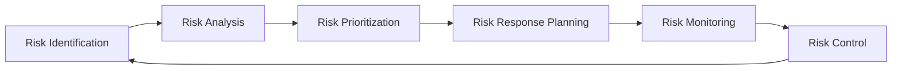

# Risk Management Plan

**Project:** Eatsential - Precision Nutrition Platform  
**Document Type:** Risk Management Plan (PMBOK Aligned)  
**Version:** 1.0  
**Date:** October 19, 2025  
**Risk Officer:** Project Manager

---

## Document Information

**Related Documents:**

- [Project Charter](../0-INITIATION/project-charter.md)
- [SPP Master](./SPP-MASTER.md)
- [Quality Management Plan](./quality-management.md)
- [Requirements Document](../2-SRS/SRS-MASTER.md)

---

## Executive Summary

This Risk Management Plan identifies, analyzes, and provides mitigation strategies for risks that could impact the Eatsential MVP development. Given the platform's health-critical nature and use of AI for nutritional recommendations, risk management is paramount to project success and user safety.

**Key Risk Categories:**

1. **Health & Safety Risks** (CRITICAL)
2. **Technical/AI Risks** (HIGH)
3. **Regulatory & Compliance Risks** (HIGH)
4. **Data Privacy & Security Risks** (HIGH)
5. **Project Management Risks** (MEDIUM)

---

## 1. Risk Management Approach

### 1.1 Risk Management Process



### 1.2 Risk Categories

| Category            | Focus Area                               | Owner           |
| ------------------- | ---------------------------------------- | --------------- |
| **Health & Safety** | Allergen detection, nutritional accuracy | Product Owner   |
| **Technical**       | AI reliability, system performance       | Tech Lead       |
| **Regulatory**      | FDA compliance, health claims            | Legal Advisor   |
| **Security**        | Data protection, user privacy            | Security Lead   |
| **Project**         | Schedule, resources, scope               | Project Manager |

### 1.3 Risk Scoring Matrix

| Probability     | Impact   | Risk Score | Action Required      |
| --------------- | -------- | ---------- | -------------------- |
| High (>70%)     | Critical | 9-10       | Immediate mitigation |
| High            | High     | 7-8        | Priority mitigation  |
| Medium (30-70%) | High     | 5-6        | Active monitoring    |
| Low (<30%)      | Medium   | 3-4        | Standard monitoring  |
| Low             | Low      | 1-2        | Accept/Watch         |

---

## 2. Critical Risk Register

### 2.1 Health & Safety Risks (ZERO TOLERANCE)

#### RISK-001: Allergen Misidentification

**Probability:** Low (with proper controls)  
**Impact:** CRITICAL (potential fatality)  
**Score:** 9  
**Description:** AI fails to identify allergens in restaurant meals or recipes

**Mitigation Strategies:**

1. Multi-layer allergen detection system
   - Primary AI scan
   - Secondary rule-based verification
   - Human expert review for high-risk allergens
2. Conservative approach: When uncertain, flag as "may contain"
3. Mandatory allergen data from restaurant partners
4. User confirmation prompts for severe allergies
5. Emergency contact system integration

**Contingency Plan:**

- Immediate notification system
- Direct hotline to medical professionals
- Liability insurance coverage
- Incident response team activation

---

#### RISK-002: Nutritional Misinformation

**Probability:** Medium  
**Impact:** High  
**Score:** 7  
**Description:** Incorrect nutritional calculations leading to health issues

**Mitigation Strategies:**

1. Validated nutritional database (USDA approved)
2. Regular audits by registered dietitians
3. Margin of error disclosure
4. Professional review for medical conditions
5. Clear disclaimers on AI-generated content

---

### 2.2 Technical/AI Risks

#### RISK-003: LLM Hallucination

**Probability:** Medium  
**Impact:** High  
**Score:** 6  
**Description:** AI generates false or misleading nutritional advice

**Mitigation Strategies:**

1. RAG implementation with verified sources only
2. Confidence scoring on all recommendations
3. Fact-checking layer before output
4. Limited scope of AI responses
5. Human-in-the-loop for critical decisions

**Technical Controls:**

```python
# Example validation pipeline
def validate_ai_response(response):
    confidence_score = calculate_confidence(response)
    if confidence_score < 0.85:
        return require_human_review(response)
    if contains_medical_advice(response):
        return block_and_redirect_to_professional()
    return verify_against_database(response)
```

---

#### RISK-004: System Downtime

**Probability:** Medium  
**Impact:** Medium  
**Score:** 5  
**Description:** Service unavailability affecting meal planning

**Mitigation Strategies:**

1. Multi-region deployment (AWS)
2. 99.9% uptime SLA
3. Offline mode for critical features
4. Redundant systems
5. Real-time monitoring and alerts

---

### 2.3 Regulatory & Compliance Risks

#### RISK-005: FDA/FTC Violations

**Probability:** Medium  
**Impact:** CRITICAL  
**Score:** 8  
**Description:** Unsubstantiated health claims or medical advice

**Mitigation Strategies:**

1. Legal review of all health-related content
2. Clear distinction between suggestions and medical advice
3. Mandatory disclaimers
4. Regular compliance audits
5. Healthcare professional partnerships

**Compliance Checklist:**

- [ ] No disease treatment claims
- [ ] No unsubstantiated weight loss promises
- [ ] Clear "not medical advice" disclaimers
- [ ] Transparent AI disclosure
- [ ] Accurate nutritional labeling

---

#### RISK-006: International Data Regulations

**Probability:** High  
**Impact:** High  
**Score:** 7  
**Description:** GDPR, CCPA, and other privacy law violations

**Mitigation Strategies:**

1. Privacy-by-design architecture
2. Explicit consent mechanisms
3. Data minimization practices
4. Right to deletion implementation
5. Regular privacy audits

---

### 2.4 Security & Privacy Risks

#### RISK-007: Health Data Breach

**Probability:** Low  
**Impact:** CRITICAL  
**Score:** 7  
**Description:** Unauthorized access to sensitive health information

**Mitigation Strategies:**

1. End-to-end encryption
2. HIPAA-compliant infrastructure
3. Zero-trust security model
4. Regular penetration testing
5. Incident response plan

**Security Architecture:**

```yaml
security_layers:
  - authentication: Multi-factor required
  - authorization: Role-based access control
  - encryption: AES-256 at rest, TLS 1.3 in transit
  - monitoring: Real-time threat detection
  - compliance: SOC2, HIPAA standards
```

---

### 2.5 Project Management Risks

#### RISK-008: Scope Creep

**Probability:** High  
**Impact:** Medium  
**Score:** 6  
**Description:** Feature additions delaying MVP launch

**Mitigation Strategies:**

1. Strict MVP definition
2. Change control board
3. Weekly scope reviews
4. Feature prioritization matrix
5. Post-MVP roadmap planning

---

## 3. Risk Response Strategies

### 3.1 Risk Response Matrix

| Risk Level   | Response Strategy | Example Actions                              |
| ------------ | ----------------- | -------------------------------------------- |
| **Critical** | Avoid/Transfer    | Insurance, eliminate feature, external audit |
| **High**     | Mitigate          | Additional controls, redundancy, testing     |
| **Medium**   | Monitor/Mitigate  | Regular reviews, contingency plans           |
| **Low**      | Accept/Monitor    | Document and track                           |

### 3.2 Contingency Reserves

**Budget Contingency:** 20% of total budget ($200K)  
**Schedule Contingency:** 2 weeks per release  
**Resource Contingency:** 2 additional developers on standby

---

## 4. Risk Monitoring & Control

### 4.1 Risk Review Schedule

| Review Type          | Frequency | Participants                |
| -------------------- | --------- | --------------------------- |
| **Daily Standup**    | Daily     | Dev team risk flags         |
| **Risk Review**      | Weekly    | Risk officer, PM, Tech lead |
| **Compliance Audit** | Bi-weekly | Legal, Security, PM         |
| **Executive Review** | Monthly   | All stakeholders            |

### 4.2 Risk Indicators (KRIs)

**Health & Safety KRIs:**

- Allergen detection accuracy: >99.9%
- False negative rate: <0.01%
- User incident reports: 0 tolerance

**Technical KRIs:**

- AI confidence scores: >85% average
- System uptime: >99.9%
- Response time: <200ms p95

**Compliance KRIs:**

- Audit findings: <3 minor per quarter
- User consent rate: 100%
- Data deletion requests: <48hr completion

### 4.3 Risk Escalation Path

```
Level 1: Development Team
    ↓ (If unresolved in 4 hours)
Level 2: Technical/Product Lead
    ↓ (If impact > Medium)
Level 3: Project Manager
    ↓ (If impact = High/Critical)
Level 4: Executive Sponsor
    ↓ (If legal/safety risk)
Level 5: Crisis Management Team
```

---

## 5. Risk Communication Plan

### 5.1 Internal Communication

**Risk Dashboard:** Real-time Jira dashboard showing:

- Active risks by category
- Risk score trends
- Mitigation progress
- Upcoming risk reviews

**Slack Channels:**

- #risk-critical: Immediate attention required
- #risk-monitoring: Daily updates
- #risk-resolved: Closed risks

### 5.2 External Communication

**User Communication:**

- In-app risk notifications
- Email alerts for safety issues
- Transparent incident reports

**Stakeholder Updates:**

- Weekly email summaries
- Monthly executive briefings
- Quarterly board reports

---

## 6. Specific Risk Scenarios

### 6.1 Allergen Crisis Scenario

**Trigger:** User reports allergic reaction

**Response Protocol:**

1. **Immediate (0-15 min):**
   - Contact user emergency contacts
   - Notify medical team
   - Preserve all data
   - Disable affected features

2. **Short-term (15min-4hr):**
   - Root cause analysis
   - Legal team notification
   - PR team activation
   - System-wide audit

3. **Long-term (4hr+):**
   - Fix implementation
   - User communication
   - Process improvement
   - Regulatory filing if required

### 6.2 Data Breach Scenario

**Trigger:** Unauthorized data access detected

**Response Protocol:**

1. **Immediate:** Isolate affected systems
2. **Within 1 hour:** Assess scope
3. **Within 24 hours:** User notification
4. **Within 72 hours:** Regulatory notification
5. **Ongoing:** Remediation and monitoring

---

## 7. Risk Acceptance Criteria

### 7.1 Acceptable Risks

1. **Minor UI inconsistencies** across platforms
2. **Limited cuisine coverage** in initial launch
3. **Basic analytics** vs advanced in MVP

### 7.2 Unacceptable Risks

1. **Any allergen detection failure**
2. **Medical advice generation**
3. **Unencrypted health data**
4. **Discriminatory recommendations**
5. **Child safety violations**

---

## 8. Risk Management Tools

### 8.1 Technology Stack

- **Risk Tracking:** Jira Risk Register
- **Monitoring:** Datadog, Sentry
- **Security:** AWS Security Hub
- **Compliance:** OneTrust
- **Communication:** Slack, PagerDuty

### 8.2 Documentation Requirements

All risks must include:

- Unique ID (RISK-XXX)
- Category and subcategory
- Detailed description
- Probability/Impact scores
- Mitigation strategies
- Owner assignment
- Review dates
- Status updates

---

## 9. Training & Awareness

### 9.1 Risk Management Training

**All Team Members:**

- Risk identification basics
- Escalation procedures
- Tool usage

**Risk Owners:**

- Advanced risk analysis
- Mitigation planning
- Regulatory requirements

### 9.2 Safety Culture

- **Blameless Culture:** Focus on system improvement
- **Psychological Safety:** Encourage risk reporting
- **Continuous Learning:** Regular risk retrospectives
- **User First:** Always prioritize user safety

---

## 10. Success Metrics

### 10.1 Risk Management KPIs

| Metric                   | Target  | Current |
| ------------------------ | ------- | ------- |
| Critical risks mitigated | 100%    | -       |
| Risk identification rate | >5/week | -       |
| Risk closure rate        | >80%    | -       |
| Mean time to mitigation  | <5 days | -       |
| Compliance violations    | 0       | -       |

### 10.2 Program Maturity

**Phase 1 (Weeks 1-2):** Risk framework establishment  
**Phase 2 (Weeks 3-4):** Active risk identification  
**Phase 3 (Weeks 5-8):** Continuous improvement

---

## Appendix A: Risk Log Template

```markdown
## RISK-XXX: [Risk Title]

**Date Identified:** YYYY-MM-DD  
**Category:** Health/Technical/Regulatory/Security/Project  
**Owner:** [Name]  
**Status:** Active/Mitigating/Monitoring/Closed

**Description:**
[Detailed description of the risk]

**Probability:** Low/Medium/High  
**Impact:** Low/Medium/High/Critical  
**Risk Score:** [1-10]

**Mitigation Strategy:**

1. [Action 1]
2. [Action 2]

**Updates:**

- YYYY-MM-DD: [Update]
```

---

## Appendix B: Emergency Contacts

**Medical Advisory:** Dr. Sarah Chen - +1-XXX-XXX-XXXX  
**Legal Counsel:** Johnson & Associates - legal@example.com  
**Security Team:** security@eatsential.com  
**PR Crisis Team:** crisis@eatsential.com

---

**Document Status:** ACTIVE  
**Next Review:** Weekly (Every Monday 10 AM)  
**Distribution:** All Team Members, Stakeholders
