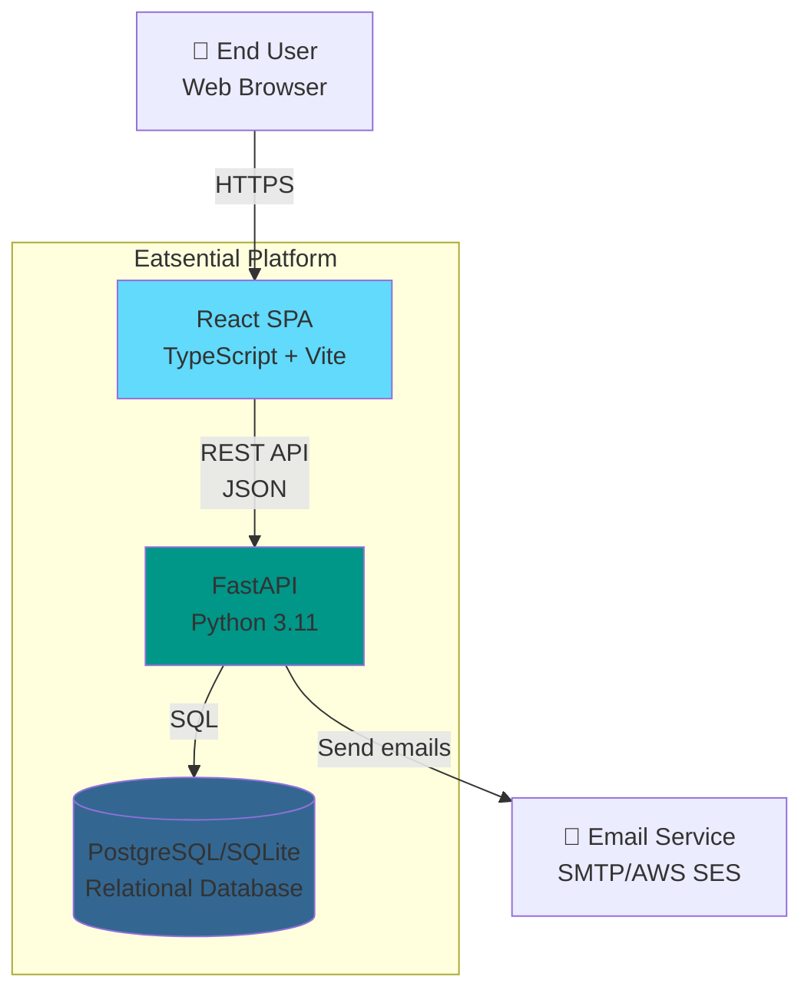
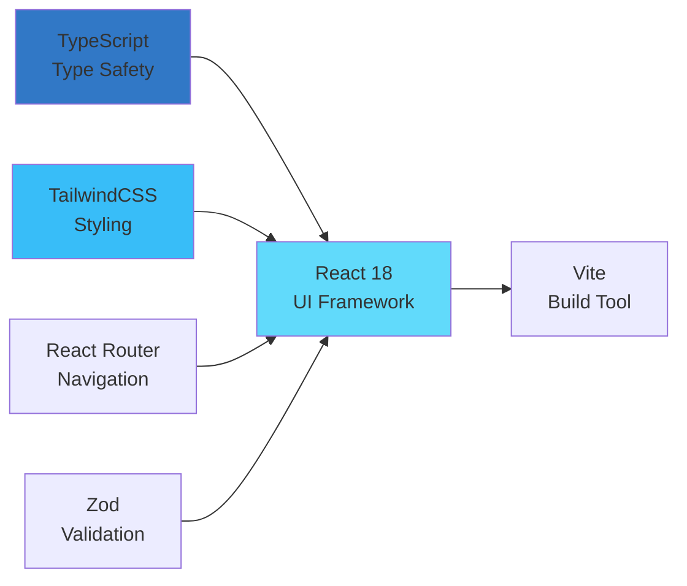
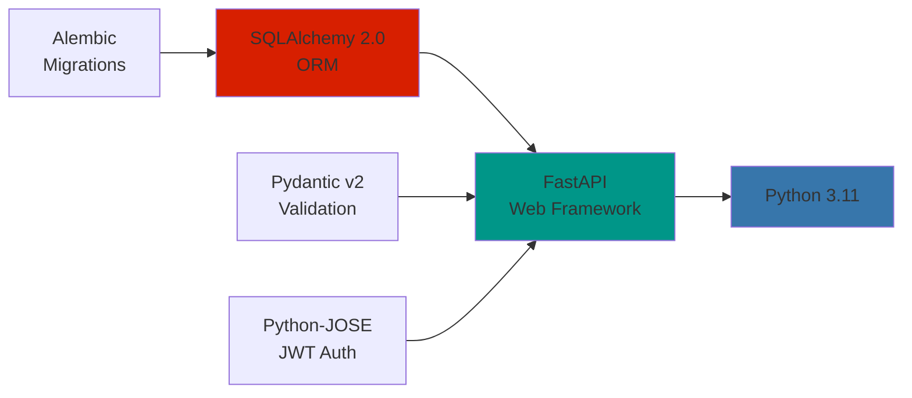
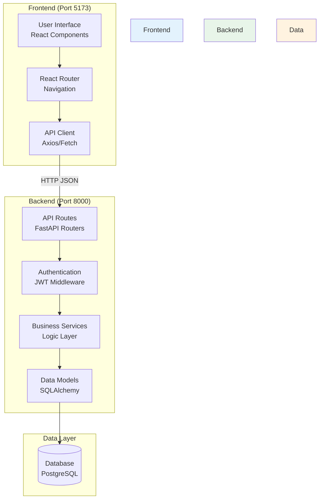
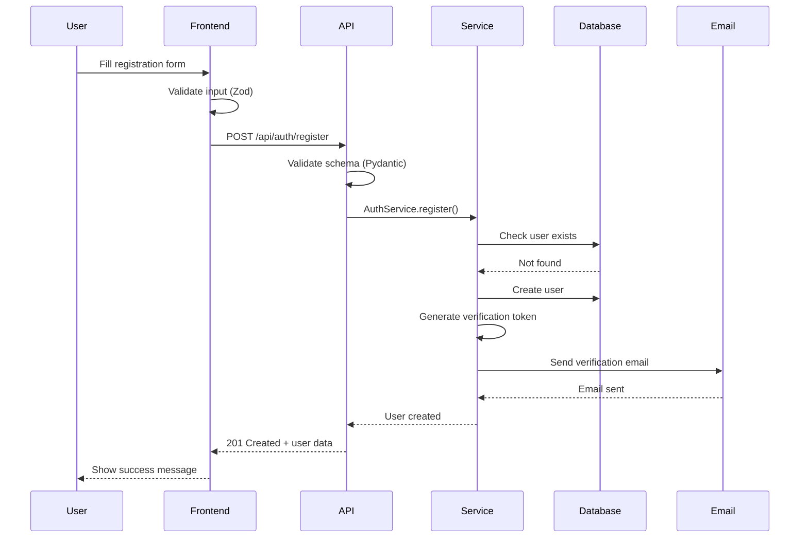
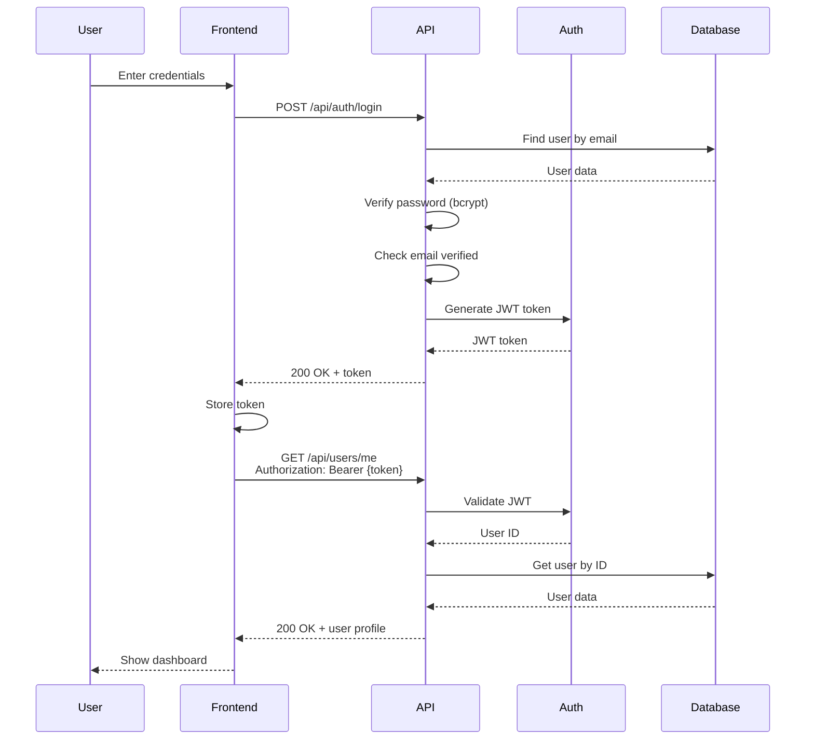
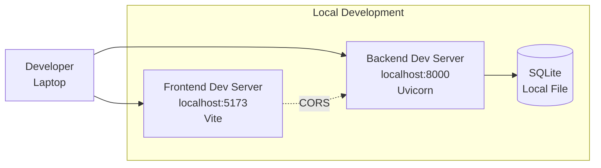
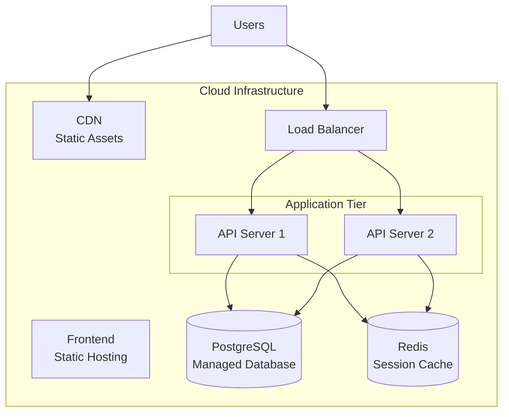

# Architecture Overview

**Document Version**: 2.0 (Dual-Dimension Health Platform)  
**Last Updated**: October 25, 2025  
**Project**: Eatsential - Physical Health + Mental Wellness  
**Status**: Active Development (Physical Health MVP), Mental Wellness Planned

**Version 2.0 Updates**:

- Extended architecture to support Dual-Dimension Health (Physical + Mental Wellness)
- Added Mental Wellness Services architecture (Section 12)
- Added Dual-Dimension Recommendation Engine design (Section 12.3)
- Added AI Health Concierge with LLM integration (Section 12.4)
- Updated technology stack with AI/ML components
- Enhanced security architecture for mental health data

---

## 1. Introduction

### 1.1 Purpose

This document provides a high-level architectural overview of the Eatsential platform. It describes the system structure, key components, technology choices, and deployment architecture for the current MVP implementation.

### 1.2 Scope

This architecture covers the **current MVP Phase (Physical Health)** and **planned Mental Wellness features** for Eatsential - a Dual-Dimension Health platform combining:

**Currently Implemented (Physical Health MVP)**:

- User authentication (signup, login, email verification, JWT tokens)
- User management (profile CRUD)
- Health profile management (create, read, update, delete)
- Allergy management (user allergies with severity levels)
- Dietary preference management (dietary restrictions tracking)
- RESTful API infrastructure (3 routers, 5 services)
- Database layer (SQLAlchemy ORM, PostgreSQL/SQLite)
- Rate limiting and JWT middleware

**Planned (Mental Wellness - v2.0)**:

- Mental wellness goal tracking (mood, stress, sleep, mindfulness)
- Mood, stress, and sleep logging with pattern analysis
- Health tagging system (#StressRelief, #MoodBoost, #SleepAid)
- Dual-dimension recommendation engine (Physical + Mental wellness scoring)
- AI Health Concierge with LLM integration (GPT-4/Claude)

### 1.3 Audience

- Software developers
- System architects
- Project stakeholders
- DevOps engineers
- Quality assurance team

---

## 2. System Context

### 2.1 System Context Diagram



### 2.2 External Interfaces

| Interface     | Type             | Protocol  | Purpose             |
| ------------- | ---------------- | --------- | ------------------- |
| Web Browser   | User Interface   | HTTPS     | User interaction    |
| REST API      | Backend Service  | HTTP/JSON | Data operations     |
| Email Service | External Service | SMTP/SES  | Email notifications |
| Database      | Data Storage     | SQL       | Persistent storage  |

---

## 3. Architectural Style

### 3.1 Current Architecture: Monolithic Layered

The system follows a **3-tier monolithic architecture** for MVP simplicity:

```
┌─────────────────────────────────────┐
│     Presentation Layer              │  React SPA
│     (User Interface)                │  TypeScript, Vite
└─────────────────────────────────────┘
              ↓ HTTP/REST
┌─────────────────────────────────────┐
│     Application Layer               │  FastAPI
│     (Business Logic)                │  Python 3.11
└─────────────────────────────────────┘
              ↓ SQL/ORM
┌─────────────────────────────────────┐
│     Data Layer                      │  PostgreSQL/SQLite
│     (Persistence)                   │  Alembic migrations
└─────────────────────────────────────┘
```

### 3.2 Design Principles

1. **Separation of Concerns**: Clear boundaries between layers
2. **Single Responsibility**: Each component has one job
3. **DRY (Don't Repeat Yourself)**: Reusable components
4. **Security First**: Authentication and validation at every layer
5. **API-First**: Backend exposes REST API for frontend

### 3.3 Architectural Patterns

| Pattern                  | Application        | Benefit                      |
| ------------------------ | ------------------ | ---------------------------- |
| **MVC**                  | Frontend & Backend | Clear separation of concerns |
| **Repository**           | Data Access        | Abstract database operations |
| **Service Layer**        | Business Logic     | Encapsulate domain logic     |
| **Dependency Injection** | FastAPI            | Testable, modular code       |
| **JWT Authentication**   | Security           | Stateless authentication     |

---

## 4. Technology Stack

### 4.1 Frontend Stack



**Key Libraries:**

- **React 18**: UI component framework
- **TypeScript**: Static typing and IDE support
- **Vite**: Fast build tool and dev server
- **TailwindCSS**: Utility-first CSS framework
- **React Router**: Client-side routing
- **React Hook Form**: Form management
- **Zod**: Schema validation
- **Axios**: HTTP client

### 4.2 Backend Stack



**Key Libraries:**

- **FastAPI**: Modern web framework with auto docs
- **SQLAlchemy 2.0**: ORM for database operations
- **Pydantic v2**: Data validation and serialization
- **python-jose**: JWT token generation/validation
- **passlib + bcrypt**: Password hashing
- **Alembic**: Database migration tool
- **pytest**: Testing framework

### 4.3 Database

| Environment | Database           | Purpose                     |
| ----------- | ------------------ | --------------------------- |
| Development | SQLite             | Local development, no setup |
| Testing     | SQLite (in-memory) | Fast test execution         |
| Production  | PostgreSQL 14+     | Production-grade RDBMS      |

**Schema Management:**

- Alembic for version-controlled migrations
- SQLAlchemy models define schema
- Automatic migration generation

### 4.4 DevOps & Tools

| Tool               | Purpose            | Status        |
| ------------------ | ------------------ | ------------- |
| **Git**            | Version control    | ✅ Active     |
| **GitHub Actions** | CI/CD pipeline     | ✅ Configured |
| **pytest**         | Testing            | ✅ Active     |
| **Ruff**           | Python linting     | ✅ Configured |
| **ESLint**         | TypeScript linting | ✅ Configured |
| **Docker**         | Containerization   | 🚧 Planned    |

---

## 5. Component Architecture

### 5.1 High-Level Components



### 5.2 Backend Component Structure

```
backend/src/eatsential/
│
├── index.py              # FastAPI app initialization
│
├── routers/              # API endpoints (3 routers)
│   ├── auth.py           # Authentication routes (/api/auth/*)
│   ├── users.py          # User management (/api/users/*)
│   └── health.py         # Health profile CRUD (/api/health/*)
│
├── services/             # Business logic (5 services)
│   ├── auth_service.py   # Authentication logic (login, register, verify)
│   ├── user_service.py   # User CRUD operations
│   ├── health_service.py # Health profile, allergies, dietary prefs
│   ├── emailer.py        # Email sending (SMTP)
│   └── emailer_ses.py    # Email sending (AWS SES)
│
├── models/               # Database models (SQLAlchemy)
│   └── models.py         # All models: User, HealthProfile, Allergy, DietaryPreference
│
├── schemas/              # Request/Response schemas (Pydantic)
│   └── schemas.py        # All DTOs: UserCreate, UserLogin, HealthProfileUpdate, etc.
│
├── middleware/           # Middleware components (3 middleware)
│   ├── jwt_auth.py       # JWT authentication middleware
│   └── rate_limit.py     # Rate limiting middleware
│
├── db/                   # Database setup
│   └── database.py       # Database session, engine, Base
│
└── utils/                # Utilities
    └── auth_util.py      # Auth helpers (password hashing, token generation)
```

**Key Design Decisions:**

- **Unified models.py**: All SQLAlchemy models in single file (simpler for MVP)
- **Unified schemas.py**: All Pydantic schemas in single file (consistent validation)
- **Middleware layer**: JWT auth and rate limiting as middleware (security first)
- **Dual emailer**: Support both SMTP (dev) and AWS SES (production)

### 5.3 Frontend Component Structure

```
frontend/src/
│
├── main.tsx              # App entry point
├── App.tsx               # Root component (routing setup)
│
├── pages/                # Route pages (13 pages)
│   ├── Welcome.tsx       # Landing page (/)
│   ├── Signup.tsx        # Registration (/signup)
│   ├── Login.tsx         # Login (/login)
│   ├── VerifyEmail.tsx   # Email verification (/verify-email)
│   ├── Dashboard.tsx     # User dashboard (/dashboard)
│   ├── HealthProfile.tsx # Health profile view (/health-profile)
│   ├── HealthProfileWizard.tsx # Health setup wizard (/health-profile/wizard)
│   ├── NotFound.tsx      # 404 page
│   └── admin/            # Admin pages (AdminDashboard, etc.)
│
├── components/           # Reusable components
│   ├── ui/               # Base UI components (shadcn/ui)
│   │   ├── button.tsx    # Button component
│   │   ├── slider.tsx    # Slider component (Radix UI)
│   │   └── ...           # Other shadcn/ui components
│   │
│   ├── SignupField.tsx   # Signup form field component
│   ├── LoginField.tsx    # Login form field component
│   ├── AllergyInput.tsx  # Allergy input with autocomplete
│   ├── AllergySeverityWarning.tsx # Severity warning display
│   ├── DashboardNavbar.tsx # Dashboard navigation bar
│   ├── AdminLayout.tsx   # Admin layout wrapper
│   ├── AdminRoute.tsx    # Admin route protection
│   │
│   ├── health-profile/   # Health profile components (static config)
│   │   ├── AllergiesCard.tsx      # Allergy management
│   │   ├── BasicInfoCard.tsx      # Basic health info
│   │   └── DietaryPreferencesCard.tsx # Dietary settings
│   │
│   ├── wellness/         # Wellness tracking components (dynamic logs)
│   │   ├── mental/       # Mental wellness tracking (Issue #99, v0.3 ✅)
│   │   │   ├── MoodLogWidget.tsx    # Mood logging
│   │   │   ├── StressLogWidget.tsx  # Stress tracking
│   │   │   └── SleepLogWidget.tsx   # Sleep logging
│   │   ├── physical/     # Physical wellness widgets (reserved for future)
│   │   │   └── (future quick-log widgets, if needed)
│   │   └── shared/       # Shared wellness components (Issue #99, v0.3)
│   │       ├── GoalForm.tsx         # Goal management (both types)
│   │       ├── GoalsList.tsx        # Goals display
│   │       └── WellnessChart.tsx    # Trend charts (planned)
│   │
│   ├── wizard-step/      # Wizard step components
│   ├── profile/          # Profile display components
│   └── admin/            # Admin-specific components
│
├── hooks/                # Custom React hooks
│   └── (custom hooks)    # useAuth, useHealthProfile, etc.
│
├── lib/                  # Utilities & configuration
│   └── utils.ts          # Utility functions (cn, etc.)
│
└── assets/               # Static assets
    └── images/           # Image files
```

**Key Design Decisions:**

- **Page-based routing**: Each major feature has dedicated page component
- **Wizard pattern**: HealthProfileWizard for onboarding flow (multi-step)
- **shadcn/ui components**: Base UI components from shadcn/ui library
- **Feature-based components**: Health profile, wizard, admin organized by feature
- **Admin separation**: Admin pages and components in separate directories
- **Dual-dimension wellness**: Separate `health-profile/` (static config) and `wellness/` (dynamic tracking)
- **Mental/Physical separation**: `wellness/mental/` and `wellness/physical/` for clear domain boundaries

---

## 6. Data Flow

### 6.1 User Registration Flow



### 6.2 Authentication Flow



---

## 7. Security Architecture

### 7.1 Security Layers

```mermaid
graph TB
    subgraph "Frontend Security"
        InputVal[Input Validation<br/>Zod Schemas]
        CSP[Content Security Policy]
        HTTPS[HTTPS Only]
    end

    subgraph "API Security"
        CORS[CORS Configuration]
        RateLimit[Rate Limiting<br/>TODO]
        Auth[JWT Authentication]
        Validation[Pydantic Validation]
    end

    subgraph "Data Security"
        Encryption[Password Hashing<br/>bcrypt]
        SQL[SQL Injection<br/>Prevention - ORM]
        Sanitization[Input Sanitization]
    end

    InputVal --> Validation
    Auth --> Encryption
    Validation --> Sanitization

    style "Frontend Security" fill:#e3f2fd
    style "API Security" fill:#fff3e0
    style "Data Security" fill:#f3e5f5
```

### 7.2 Security Measures

| Security Aspect        | Implementation                         | Status             |
| ---------------------- | -------------------------------------- | ------------------ |
| **Password Security**  | bcrypt hashing (12 rounds)             | ✅ Implemented     |
| **Authentication**     | JWT tokens (HS256)                     | ✅ Implemented     |
| **Email Verification** | Required before login                  | ✅ Implemented     |
| **Input Validation**   | Pydantic schemas (backend)             | ✅ Implemented     |
| **SQL Injection**      | SQLAlchemy ORM (parameterized queries) | ✅ Protected       |
| **CORS**               | Configured origins                     | ✅ Configured      |
| **HTTPS**              | TLS/SSL                                | 🚧 Production only |
| **Rate Limiting**      | Registration endpoint (5 req/min)      | ✅ Implemented     |
| **JWT Middleware**     | Token validation on protected routes   | ✅ Implemented     |
| **2FA**                | Two-factor authentication              | ❌ Not implemented |

### 7.3 Authentication & Authorization

**JWT Token Structure:**

```json
{
  "sub": "user_id", // Subject (user identifier)
  "exp": 1234567890, // Expiration timestamp
  "iat": 1234567000 // Issued at timestamp
}
```

**Token Lifecycle:**

1. User logs in with credentials
2. Backend validates and generates JWT
3. Frontend stores token (memory/localStorage)
4. Token sent in `Authorization: Bearer {token}` header
5. Backend validates token on protected routes
6. Token expires after configured duration

**Role-Based Access Control (RBAC):**

- `USER` role: Standard user access
- `ADMIN` role: Administrative access (future)

---

## 8. Deployment Architecture

### 8.1 Development Environment



**Local Setup:**

- Frontend: `npm run dev` (Vite dev server)
- Backend: `uvicorn src.eatsential.index:app --reload`
- Database: SQLite file in `backend/` directory
- Hot reload enabled for both frontend and backend

### 8.2 Production Architecture (Planned)



**Production Stack (Future):**

- **Frontend**: Vercel/Netlify (Static hosting + CDN)
- **Backend**: AWS EC2/Elastic Beanstalk or Heroku
- **Database**: AWS RDS PostgreSQL or Supabase
- **Cache**: Redis for session management
- **Monitoring**: CloudWatch/Datadog
- **CI/CD**: GitHub Actions

---

## 9. Scalability Considerations

### 9.1 Current Limitations (MVP)

| Aspect               | Current           | Bottleneck    | Solution                         |
| -------------------- | ----------------- | ------------- | -------------------------------- |
| **Concurrent Users** | ~100              | Single server | Horizontal scaling               |
| **Database**         | SQLite (dev)      | File-based    | PostgreSQL + connection pooling  |
| **Sessions**         | JWT only          | No revocation | Add Redis for session management |
| **Static Files**     | Served by backend | Bandwidth     | Move to CDN                      |

### 9.2 Future Scalability Path

**Phase 1 (Current MVP):**

- Monolithic architecture
- Single server deployment
- PostgreSQL database

**Phase 2 (Scale-Up):**

- Add database connection pooling
- Implement caching (Redis)
- CDN for static assets
- Multiple API server instances

**Phase 3 (Scale-Out):**

- Microservices architecture
- Service mesh (Istio)
- Event-driven communication (Kafka/RabbitMQ)
- Container orchestration (Kubernetes)

---

## 10. Performance Targets

### 10.1 Current Performance Metrics

| Metric                      | Target | Current    | Status     |
| --------------------------- | ------ | ---------- | ---------- |
| **API Response Time (p95)** | <500ms | ~200ms     | ✅ Exceeds |
| **Page Load Time**          | <2s    | ~1.5s      | ✅ Meets   |
| **Database Query Time**     | <100ms | ~50ms      | ✅ Exceeds |
| **Concurrent Users**        | 100    | Tested: 50 | ✅ Meets   |

### 10.2 Optimization Strategies

**Backend:**

- SQLAlchemy lazy loading for relationships
- Database indexes on frequently queried fields
- Connection pooling for database
- Response caching for static data

**Frontend:**

- Code splitting with React.lazy()
- Asset optimization (images, fonts)
- Tree shaking (Vite)
- Lazy loading of components

---

## 11. Monitoring & Observability

### 11.1 Logging Strategy

| Layer    | Logging Tool     | Log Level  | Purpose              |
| -------- | ---------------- | ---------- | -------------------- |
| Frontend | Console + Sentry | Error      | Client-side errors   |
| Backend  | Python logging   | Info/Error | API requests, errors |
| Database | PostgreSQL logs  | Warning    | Slow queries         |

### 11.2 Key Metrics to Monitor

**Application Metrics:**

- Request rate (requests/second)
- Response time (p50, p95, p99)
- Error rate (4xx, 5xx)
- Active users (concurrent sessions)

**Infrastructure Metrics:**

- CPU usage
- Memory usage
- Database connections
- Disk I/O

---

## 12. Technology Decisions & Rationale

### 12.1 Key Technology Choices

| Technology      | Alternatives Considered   | Why Chosen                             |
| --------------- | ------------------------- | -------------------------------------- |
| **FastAPI**     | Django, Flask             | Modern, fast, auto docs, async support |
| **React**       | Vue, Angular              | Large ecosystem, team expertise        |
| **TypeScript**  | JavaScript                | Type safety, better IDE support        |
| **PostgreSQL**  | MySQL, MongoDB            | ACID compliance, JSON support          |
| **SQLAlchemy**  | Raw SQL, Django ORM       | Pythonic, flexible, migration support  |
| **Vite**        | Webpack, Create React App | Faster dev server, better DX           |
| **TailwindCSS** | Bootstrap, Material-UI    | Utility-first, customizable            |

### 12.2 Decision Log

**Decision 1: Monolithic over Microservices**

- **Date**: October 2025
- **Rationale**: Faster MVP delivery, simpler deployment, smaller team
- **Trade-off**: Less scalable initially, but can refactor later

**Decision 2: SQLite for Development**

- **Date**: October 2025
- **Rationale**: Zero setup, fast local dev, easy testing
- **Trade-off**: Production uses PostgreSQL (different DB)

**Decision 3: JWT for Authentication**

- **Date**: October 2025
- **Rationale**: Stateless, scalable, simple implementation
- **Trade-off**: Cannot revoke tokens without additional infrastructure

---

## 13. Mental Wellness Services Architecture (NEW - v2.0)

> **⚠️ PLANNED ARCHITECTURE - NOT YET IMPLEMENTED**  
> This section documents the **planned** architecture for Mental Wellness features (v2.0). Implementation timeline: 16-20 weeks (see Section 14.1). Current implementation status: Physical Health MVP only (see Section 1.2).

### 13.1 Mental Wellness Service Layer

**Service Components:**

```
┌─────────────────────────────────────────────────────────────────┐
│                   Mental Wellness Service Layer                  │
├─────────────────────────────────────────────────────────────────┤
│                                                                   │
│  ┌──────────────────┐  ┌──────────────────┐  ┌───────────────┐ │
│  │ Goal Tracking    │  │ Mood/Stress      │  │ Sleep Tracking│ │
│  │ Service          │  │ Logging Service  │  │ Service       │ │
│  │                  │  │                  │  │               │ │
│  │ - CRUD goals     │  │ - Log entries    │  │ - Sleep logs  │ │
│  │ - Progress calc  │  │ - Pattern detect │  │ - Quality calc│ │
│  │ - Streak track   │  │ - Correlations   │  │ - Sleep debt  │ │
│  └──────────────────┘  └──────────────────┘  └───────────────┘ │
│                                                                   │
│  ┌──────────────────────────────────────────────────────────┐   │
│  │          Health Tagging System Service                    │   │
│  │  - Tag management (#StressRelief, #MoodBoost, #SleepAid) │   │
│  │  - Food-tag associations with confidence scoring          │   │
│  │  - Tag effectiveness ratings                              │   │
│  │  - Scientific basis tracking                              │   │
│  └──────────────────────────────────────────────────────────┘   │
│                                                                   │
│  ┌──────────────────────────────────────────────────────────┐   │
│  │          AI Health Concierge Service                      │   │
│  │  - Chat session management                                │   │
│  │  - LLM integration (GPT-4/Claude-3)                       │   │
│  │  - Context aggregation (mood/stress/sleep/goals)          │   │
│  │  - Proactive insight generation                           │   │
│  │  - Token usage tracking                                   │   │
│  └──────────────────────────────────────────────────────────┘   │
│                                                                   │
└─────────────────────────────────────────────────────────────────┘
```

**Service Dependencies:**

- **Database Layer**: `health.mental_wellness_goals`, `health.mood_logs`, `health.stress_logs`, `health.sleep_logs`, `health.health_tags`, `health.food_tags`, `health.ai_chat_sessions`
- **Security Layer**: AES-256 encryption for sensitive mental health data, separate encryption key management
- **Authentication**: JWT tokens required for all Mental Wellness endpoints
- **Rate Limiting**: 100 req/hr for tracking services, 20 req/hr for AI Concierge

### 13.2 Dual-Dimension Recommendation Engine

**Architecture Overview:**

```
┌─────────────────────────────────────────────────────────────────┐
│          Dual-Dimension Recommendation Engine                    │
└─────────────────────────────────────────────────────────────────┘
                              │
                              ▼
        ┌─────────────────────────────────────────────┐
        │       Context Aggregation Service           │
        │  - User physical health goals               │
        │  - User mental wellness goals               │
        │  - Recent mood/stress/sleep data            │
        │  - Current time & meal type                 │
        │  - User preferences & restrictions          │
        └─────────────────────────────────────────────┘
                              │
                              ▼
        ┌─────────────────────────────────────────────┐
        │       Scoring Engine (Parallel)             │
        └─────────────────────────────────────────────┘
                 │                    │
         ┌───────┴────────┐   ┌──────┴────────┐
         ▼                 ▼   ▼               ▼
   ┌──────────┐     ┌──────────┐     ┌──────────┐
   │ Physical │     │  Mental  │     │Preference│
   │  Health  │     │ Wellness │     │  Score   │
   │  Score   │     │  Score   │     │          │
   │          │     │          │     │          │
   │ - Cals   │     │ - Tags   │     │ - Taste  │
   │ - Macros │     │ - Mood   │     │ - Cost   │
   │ - Allerg │     │ - Stress │     │ - Time   │
   │ - Nutri  │     │ - Sleep  │     │          │
   └──────────┘     └──────────┘     └──────────┘
         │                 │               │
         └────────┬────────┴───────────────┘
                  ▼
        ┌─────────────────────────────────┐
        │   Weighted Score Calculation    │
        │                                 │
        │ total_score = (physical * 0.4) │
        │             + (mental * 0.4)   │
        │             + (preference * 0.2)│
        └─────────────────────────────────┘
                  │
                  ▼
        ┌─────────────────────────────────┐
        │   Context-Aware Boosting        │
        │  - High stress → +15% #StressRelief │
        │  - Low energy  → +20% #EnergyBoost  │
        │  - Poor sleep  → +15% #SleepAid     │
        └─────────────────────────────────┘
                  │
                  ▼
        ┌─────────────────────────────────┐
        │   Ranked Recommendations        │
        │   with Explanations             │
        └─────────────────────────────────┘
```

**Mental Wellness Scoring Algorithm:**

```python
def calculate_mental_wellness_score(food, user_context):
    score = 0.0

    # Tag-based scoring (40% weight)
    if user_context.high_stress and "#StressRelief" in food.tags:
        score += 4.0 * food.tag_confidence("#StressRelief")
    if user_context.low_mood and "#MoodBoost" in food.tags:
        score += 4.0 * food.tag_confidence("#MoodBoost")
    if user_context.poor_sleep and "#SleepAid" in food.tags:
        score += 4.0 * food.tag_confidence("#SleepAid")

    # Nutrient-based scoring (40% weight)
    mental_nutrients = {
        "omega3_g": (2.0, user_context.stress_level > 7),  # Anti-inflammatory
        "magnesium_mg": (150, user_context.stress_level > 6),  # Relaxation
        "tryptophan_mg": (300, user_context.mood_score < 6),  # Serotonin precursor
        "vitamin_b6_mg": (1.5, user_context.low_energy),  # Neurotransmitter synthesis
        "folate_mcg": (400, user_context.mood_score < 6),  # Mood regulation
        "vitamin_d_iu": (600, user_context.seasonal_depression),  # Mood support
    }

    for nutrient, (threshold, relevant) in mental_nutrients.items():
        if relevant and food.nutrients[nutrient] >= threshold:
            score += 4.0 * (food.nutrients[nutrient] / threshold)

    # Context-based boosting (20% weight)
    if user_context.meal_time == "evening" and "#SleepAid" in food.tags:
        score *= 1.15  # +15% boost for sleep aids at dinner
    if user_context.meal_time == "morning" and "#EnergyBoost" in food.tags:
        score *= 1.20  # +20% boost for energy foods at breakfast

    return min(score, 10.0)  # Cap at 10.0
```

**Integration with Physical Health Scoring:**

- Both scoring engines run in parallel (async/await)
- Results combined with weighted formula: `(physical * 0.4) + (mental * 0.4) + (preference * 0.2)`
- Ensures balanced recommendations addressing both dimensions
- User can adjust weights in settings (e.g., prioritize mental wellness: 0.5/0.3/0.2)

### 13.3 AI Health Concierge Architecture

**LLM Integration Pipeline:**

```
┌──────────────────────────────────────────────────────────────────┐
│                  AI Health Concierge Service                      │
└──────────────────────────────────────────────────────────────────┘
                              │
                              ▼
        ┌─────────────────────────────────────────────┐
        │      Request Processing                     │
        │  1. Authenticate user (JWT)                 │
        │  2. Rate limit check (20 req/hr)            │
        │  3. Load session context                    │
        │  4. Sanitize user input                     │
        └─────────────────────────────────────────────┘
                              │
                              ▼
        ┌─────────────────────────────────────────────┐
        │      Context Aggregation                    │
        │  - Last 30 days mood/stress/sleep data      │
        │  - Active mental wellness goals             │
        │  - Recent food logs (with tags)             │
        │  - Physical health profile                  │
        │  - Past chat history (last 10 messages)     │
        └─────────────────────────────────────────────┘
                              │
                              ▼
        ┌─────────────────────────────────────────────┐
        │      Prompt Engineering                     │
        │  System Prompt:                             │
        │  - Role: Nutrition & mental wellness expert │
        │  - Guardrails: No medical diagnosis         │
        │  - Data: User context summary               │
        │  - Constraints: Evidence-based only         │
        │  - Output: Conversational + structured data │
        └─────────────────────────────────────────────┘
                              │
                              ▼
        ┌─────────────────────────────────────────────┐
        │      LLM Selection & Invocation             │
        │  - Primary: GPT-4-Turbo (faster)            │
        │  - Fallback: Claude-3-Sonnet (if quota)     │
        │  - Streaming: Server-Sent Events (SSE)      │
        │  - Token limit: 4,096 tokens/response       │
        └─────────────────────────────────────────────┘
                              │
                              ▼
        ┌─────────────────────────────────────────────┐
        │      Safety & Validation Layer              │
        │  - Medical advice detection (regex + ML)    │
        │  - Disclaimer injection                     │
        │  - Harmful content filtering                │
        │  - Citation verification                    │
        └─────────────────────────────────────────────┘
                              │
                              ▼
        ┌─────────────────────────────────────────────┐
        │      Response Processing                    │
        │  - Parse structured data (JSON)             │
        │  - Extract food recommendations             │
        │  - Log interaction (audit trail)            │
        │  - Update session metadata                  │
        │  - Stream response to client                │
        └─────────────────────────────────────────────┘
```

**System Prompt Template:**

```markdown
You are an expert nutrition and mental wellness coach for Eatsential, a dual-dimension health platform.

**User Context:**

- Recent mood trend: {mood_trend} (avg: {avg_mood_score}/10)
- Recent stress level: {stress_trend} (avg: {avg_stress_level}/10)
- Sleep quality: {sleep_quality} (avg: {avg_sleep_hours}h, quality: {avg_sleep_score}/10)
- Active goals: {active_goals}
- Dietary restrictions: {allergies}, {dietary_preferences}

**Your Role:**

1. Provide evidence-based nutritional guidance for mental wellness
2. Recommend foods from our database tagged with #StressRelief, #MoodBoost, #SleepAid, etc.
3. Explain the scientific basis (cite studies when relevant)
4. Encourage sustainable habits, not quick fixes

**Strict Guardrails:**

- NEVER diagnose medical conditions
- NEVER prescribe medications or supplements
- ALWAYS include disclaimer for serious concerns: "Please consult a healthcare professional."
- ONLY recommend foods available in our database
- Be empathetic and supportive, not judgmental

**Output Format:**

- Conversational tone (friendly, encouraging)
- Include 2-3 specific food recommendations with reasoning
- Cite scientific sources when making claims
- End with actionable next step

User message: {user_message}
```

**Proactive Insights Generation:**

```python
# Cron job runs daily at 8 AM for each user
async def generate_proactive_insights(user_id):
    # Gather last 30 days of data
    data = await aggregate_user_data(user_id, days=30)

    # Pattern detection
    patterns = detect_patterns(data)
    # Examples:
    # - "Mood drops 20% on days with < 7h sleep"
    # - "Stress peaks on Mondays and Wednesdays"
    # - "Sleep quality improves when avoiding caffeine after 2 PM"

    if not patterns:
        return None  # No insights to deliver

    # Generate insight via LLM (smaller model, cached prompt)
    insight = await llm.generate_insight(
        patterns=patterns,
        user_context=data.summary,
        max_tokens=200
    )

    # Store insight for display in dashboard
    await db.insights.create({
        "user_id": user_id,
        "type": "pattern_detected",
        "title": insight.title,
        "message": insight.message,
        "confidence": insight.confidence,
        "suggested_action": insight.action,
        "data_points": len(data.entries)
    })
```

**Token Management:**

- **Streaming responses**: Reduce perceived latency, allow user to read while generating
- **Token budgets**:
  - Chat messages: 4,096 tokens/response (avg: 600-800 tokens)
  - Proactive insights: 200 tokens/insight
  - Context window: 16,000 tokens (GPT-4-Turbo), 200,000 tokens (Claude-3)
- **Cost optimization**:
  - Cache system prompts (80% token reduction)
  - Summarize chat history after 20 messages
  - Use smaller model (GPT-4-mini) for simple queries

### 13.4 Data Flow: Mental Wellness Feature

**Example: User Logs Mood → Gets AI Recommendation**

```
[User] Logs mood via mobile app
  │
  ▼
[API] POST /api/mood-tracking/logs
  │   - Validate request (schema, auth)
  │   - Encrypt sensitive notes (AES-256)
  ▼
[Service] Mood Logging Service
  │   - Store in health.mood_logs
  │   - Check if streak updated
  │   - Trigger pattern detection (if 30+ entries)
  ▼
[Service] Pattern Detection Service
  │   - Analyze correlations (mood-sleep, mood-food, mood-stress)
  │   - Detect anomalies (sudden mood drop)
  ▼
[Service] AI Health Concierge Service (if anomaly detected)
  │   - Aggregate user context (last 7 days)
  │   - Generate proactive insight via LLM
  │   - "I noticed your mood dropped from 8 to 5 in 3 days. Would you like
  │      food recommendations to help? Foods rich in omega-3 and magnesium
  │      like salmon and dark chocolate may help."
  ▼
[Service] Notification Service
  │   - Send push notification (if enabled)
  │   - Store insight in dashboard
  ▼
[User] Clicks notification
  │
  ▼
[API] GET /api/recommendations/dual-dimension
  │   - Input: context=low_mood, meal_type=dinner, max_calories=600
  ▼
[Service] Dual-Dimension Recommendation Engine
  │   - Physical Health Score: Calculate for 500 foods
  │   - Mental Wellness Score: Prioritize #MoodBoost, omega-3, magnesium
  │   - Combine: (physical * 0.4) + (mental * 0.5) + (preference * 0.1)
  │   - Context boost: +15% to #MoodBoost foods (due to low mood context)
  │   - Rank top 10
  ▼
[API] Returns ranked recommendations with explanations
  │   - Each food includes: scores, tags, nutrients, reasoning
  ▼
[User] Selects "Grilled Salmon with Quinoa & Spinach"
  │
  ▼
[Service] Food Logging Service
  │   - Store food log
  │   - Link to mood log (for correlation analysis)
  ▼
[Service] Goal Progress Service
  │   - Update mental wellness goal progress
  │   - Check if milestone reached (e.g., 7-day streak)
  ▼
[User] Receives congratulatory message 🎉
```

### 13.5 Security Architecture for Mental Health Data

**Encryption Strategy:**

```
┌─────────────────────────────────────────────────────────────┐
│                 Application Layer (FastAPI)                  │
│  - User authenticates (JWT)                                  │
│  - Role check: mental_health_reader or mental_health_writer │
└─────────────────────────────────────────────────────────────┘
                              │
                              ▼ (Encryption Key from KMS)
┌─────────────────────────────────────────────────────────────┐
│                 Service Layer                                │
│  - Encrypt notes/context before DB write (AES-256)           │
│  - Decrypt data after DB read (column-level decryption)      │
└─────────────────────────────────────────────────────────────┘
                              │
                              ▼
┌─────────────────────────────────────────────────────────────┐
│                 Database Layer (PostgreSQL)                  │
│  - mood_logs: encrypted_notes BYTEA                          │
│  - stress_logs: encrypted_notes BYTEA, encrypted_triggers    │
│  - ai_chat_sessions: encrypted_context_summary BYTEA         │
│  - Separate tablespace for mental wellness tables            │
│  - Row-level security (RLS) policies enabled                 │
└─────────────────────────────────────────────────────────────┘
```

**Key Management:**

- **Encryption keys** stored in AWS KMS or HashiCorp Vault (production)
- **Separate keys** for mental wellness data (rotate every 90 days)
- **Key hierarchy**:
  - Master key (KMS): Never leaves KMS
  - Data Encryption Keys (DEK): Generated per-user, encrypted by master key
  - User cannot access raw DEK

**Access Control:**

- **Database roles**:
  - `mental_health_reader`: SELECT on mental wellness tables (for analytics)
  - `mental_health_writer`: INSERT, UPDATE on mental wellness tables (app backend)
  - **No DELETE** access for anyone except admin (soft delete only)
- **Row-Level Security** (RLS):
  ```sql
  CREATE POLICY user_mental_health_isolation ON health.mood_logs
      FOR ALL
      TO mental_health_reader, mental_health_writer
      USING (user_id = current_setting('app.current_user_id')::UUID);
  ```
- **Audit logging**: All queries to mental wellness tables logged to `audit.mental_health_access`

**Data Retention & Deletion:**

- **User-controlled deletion**: User can request data deletion (NFR-007A)
- **24-hour guarantee**: Data fully purged within 24 hours of deletion request
- **Deletion process**:
  1. User requests deletion via API
  2. Data marked as `deleted_at = NOW()` (soft delete)
  3. Cron job runs every 6 hours to purge soft-deleted data
  4. Encryption keys rotated after purge
- **Anonymous aggregation**: De-identified data (no user_id) retained for research (opt-in only)

**Compliance:**

- **HIPAA** (if applicable): Mental health data treated as Protected Health Information (PHI)
- **GDPR**: Right to erasure, data portability, access logs
- **COPPA**: No mental wellness features for users under 13

### 13.6 Integration Patterns: Physical + Mental Services

**Shared Context Service:**

```
┌─────────────────────────────────────────────────────────────┐
│              Shared User Context Service                     │
│  - Single source of truth for user state                     │
│  - Aggregates data from Physical + Mental services           │
│  - Used by Dual-Dimension Engine and AI Concierge            │
└─────────────────────────────────────────────────────────────┘
         │                                    │
         ▼                                    ▼
┌──────────────────────┐         ┌──────────────────────┐
│ Physical Health Data │         │ Mental Wellness Data │
│ - Food logs          │         │ - Mood logs          │
│ - Nutrition goals    │         │ - Stress logs        │
│ - Allergies          │         │ - Sleep logs         │
│ - Health profile     │         │ - Mental goals       │
└──────────────────────┘         └──────────────────────┘
```

**Event-Driven Integration:**

```python
# Example: Mood log triggers food recommendation update

@event_handler("mood_log_created")
async def on_mood_log_created(event):
    mood_log = event.data

    # Check if mood is low (< 5)
    if mood_log.mood_score < 5:
        # Trigger AI Concierge proactive insight
        await ai_concierge.generate_insight(
            user_id=mood_log.user_id,
            trigger="low_mood_detected",
            context={"mood_score": mood_log.mood_score}
        )

        # Update recommendation weights (boost mental wellness)
        await recommendation_engine.update_user_weights(
            user_id=mood_log.user_id,
            weights={"physical": 0.3, "mental": 0.5, "preference": 0.2}
        )

@event_handler("sleep_log_created")
async def on_sleep_log_created(event):
    sleep_log = event.data

    # Check sleep quality and duration
    if sleep_log.quality_score < 5 or sleep_log.duration_hours < 6:
        # Update evening meal recommendations (boost #SleepAid)
        await recommendation_engine.set_context_boost(
            user_id=sleep_log.user_id,
            boost_tags=["#SleepAid"],
            boost_percentage=0.20,
            expires_at=datetime.now() + timedelta(days=3)
        )
```

**API Gateway Pattern:**

- Single API gateway (`/api/*`) serves both Physical + Mental endpoints
- Shared middleware: Auth, rate limiting, request validation, error handling
- Separate service layers: `PhysicalHealthService`, `MentalWellnessService`
- Cross-cutting concerns: `RecommendationEngineService`, `AIConciergeService`

### 13.7 Performance Considerations

**Mental Wellness Service Latency Targets:**

- **Mood/Stress/Sleep logging**: < 200ms (p95)
- **Pattern detection**: < 2 seconds (async, runs in background)
- **Dual-Dimension recommendations**: < 1 second (p95)
- **AI Concierge chat** (streaming):
  - Time to first token: < 1 second
  - Total response time: 5-10 seconds (streaming, user sees partial response)
- **Proactive insights**: Batch generation (cron job, not real-time)

**Caching Strategy:**

- **Health tags**: Redis cache (TTL: 24 hours) - tags rarely change
- **User context summary**: Redis cache (TTL: 5 minutes) - frequently accessed by AI Concierge
- **LLM system prompts**: Application-level cache (never expires unless updated)
- **Recommendation scores**: Redis cache (TTL: 1 hour, invalidate on new food log)

**Database Query Optimization:**

- **Indexes**: All Mental Wellness tables have indexes on `user_id`, `logged_at`, `status`
- **Partitioning**: `mood_logs`, `stress_logs`, `sleep_logs` partitioned by month (for faster queries)
- **Materialized views**: Pre-aggregated 30-day mood/stress/sleep summaries (refreshed hourly)
- **Read replicas**: Mental Wellness analytics queries route to read replica (reduce load on primary)

**LLM API Optimization:**

- **Batch proactive insights**: Generate for 100 users at once (reduce API overhead)
- **Prompt caching**: OpenAI/Anthropic cache system prompts (80% cost reduction)
- **Model selection**:
  - Simple queries (e.g., "What foods help with stress?"): GPT-4-mini (faster, cheaper)
  - Complex queries (e.g., "Analyze my 30-day mood patterns"): GPT-4-Turbo or Claude-3-Sonnet
- **Fallback strategy**: If primary LLM fails, retry with fallback model (graceful degradation)

---

## 14. Future Architecture Evolution

### 14.1 Planned Enhancements

**Near Term (Physical Health MVP Completion):**

- Add Redis for caching (health tags, user context)
- Implement WebSocket for real-time features
- Add file upload for profile pictures
- Containerize with Docker
- Complete Physical Health feature set (75 FRs)

**Mid Term (Mental Wellness Implementation - v2.0):**

- ✅ **Architecture designed** (see Section 13)
- Implement Mental Wellness services (Goal Tracking, Mood/Stress/Sleep Logging)
- Build Health Tagging System (#StressRelief, #MoodBoost, #SleepAid)
- Deploy Dual-Dimension Recommendation Engine
- Integrate AI Health Concierge (GPT-4/Claude-3)
- Implement pattern detection and proactive insights
- Deploy encryption infrastructure for mental health data (AES-256, KMS)
- **Timeline**: 16-20 weeks (see Milestones M9-M12)

**Long Term (Platform Scaling):**

- Migrate to microservices architecture (separate Physical + Mental services)
- Add mobile apps (React Native)
- Implement GraphQL API for flexible data querying
- Add real-time notifications (push notifications)
- Scale to multi-region deployment
- Implement advanced ML models (mood prediction, personalized insights)
- Add community features (support groups, peer sharing - opt-in)

### 14.2 Migration Path: Monolith → Microservices

**Phase 1: Service Boundaries (Current)**

- Monolithic application with logical service layers
- Clear separation: Physical Health, Mental Wellness, Recommendation Engine, AI Concierge
- Shared database with schema namespacing (`food.*`, `health.*`, `users.*`)

**Phase 2: Data Decoupling**

- Separate databases: `eatsential_physical_db`, `eatsential_mental_db`, `eatsential_users_db`
- Event-driven communication (message queue: RabbitMQ or Kafka)
- API gateway for routing

**Phase 3: Full Microservices**

- Independent deployment of each service
- Service mesh (Istio/Linkerd) for observability
- Distributed tracing (Jaeger)

---

## 15. Related Documents

**Design Documentation:**

- [Database Design](./database-design.md) - Detailed database schema (Physical + Mental Wellness tables)
- [API Design](./api-design.md) - API endpoint specifications (Physical + Mental Wellness endpoints)
- [Component Diagram](./component-diagram.md) - Detailed component interactions

**Requirements Documentation:**

- [Functional Requirements](../1-REQUIREMENTS/functional-requirements.md) - 95 FRs (75 Physical + 20 Mental Wellness)
- [Use Cases](../1-REQUIREMENTS/use-cases.md) - 32 UCs (20 Physical + 12 Mental Wellness)
- [Non-Functional Requirements](../1-REQUIREMENTS/non-functional-requirements.md) - Performance, security, privacy

**Testing & Implementation:**

- [Test Strategy](../4-TESTING/test-strategy.md) - Testing approach for Dual-Dimension Health
- [Test Cases](../4-TESTING/test-cases.md) - 40 TCs (22 Physical + 18 Mental Wellness)
- [Implementation Status](../3-IMPLEMENTATION/implementation-status.md) - Current progress and roadmap

---

## 16. Appendix

### 16.1 Glossary

| Term     | Definition                                   |
| -------- | -------------------------------------------- |
| **MVP**  | Minimum Viable Product                       |
| **ORM**  | Object-Relational Mapping                    |
| **JWT**  | JSON Web Token                               |
| **CORS** | Cross-Origin Resource Sharing                |
| **CDN**  | Content Delivery Network                     |
| **SPA**  | Single Page Application                      |
| **API**  | Application Programming Interface            |
| **REST** | Representational State Transfer              |
| **LLM**  | Large Language Model (e.g., GPT-4, Claude-3) |
| **RAG**  | Retrieval-Augmented Generation               |
| **SSE**  | Server-Sent Events (for streaming)           |
| **KMS**  | Key Management Service (for encryption keys) |
| **RLS**  | Row-Level Security (PostgreSQL feature)      |
| **PHI**  | Protected Health Information (HIPAA term)    |

### 16.2 References

**Technology Documentation:**

- [FastAPI Documentation](https://fastapi.tiangolo.com/)
- [React Documentation](https://react.dev/)
- [SQLAlchemy Documentation](https://docs.sqlalchemy.org/)
- [PostgreSQL Documentation](https://www.postgresql.org/docs/)
- [OpenAI API Documentation](https://platform.openai.com/docs/)
- [Anthropic Claude API Documentation](https://docs.anthropic.com/)

**Scientific References (Mental Wellness):**

- Journal of Clinical Sleep Medicine (2020) - Magnesium and Sleep Quality
- Nutrients (2019) - Omega-3 Fatty Acids and Stress Reduction
- American Journal of Clinical Nutrition (2021) - Tryptophan and Mood Regulation

---

**Document Revision History:**

| Version | Date         | Author    | Changes                                                                                                                                                           |
| ------- | ------------ | --------- | ----------------------------------------------------------------------------------------------------------------------------------------------------------------- |
| 1.0     | October 2025 | Tech Team | Initial architecture overview for Physical Health MVP                                                                                                             |
| 2.0     | October 2025 | Tech Team | Added Mental Wellness Services Architecture (Section 13), Dual-Dimension Recommendation Engine, AI Health Concierge, Security Architecture for Mental Health Data |

---

**Document Status**: ✅ Complete and Current (v2.0 - Dual-Dimension Health Architecture Designed)  
**Implementation Status**: Physical Health MVP in progress, Mental Wellness planned (see Section 14.1)  
**Next Review**: End of Mental Wellness Sprint 1 (M9)
