# Component Diagram

**Document Version**: 2.0 (Dual-Dimension Health Platform)  
**Last Updated**: October 25, 2025  
**Project**: Eatsential - Physical Health + Mental Wellness

**Version 2.0 Updates**:

- Added Mental Wellness sequence diagrams (5 new diagrams)
- Goal Tracking flow
- Mood Logging → AI Recommendation flow
- Dual-Dimension Engine scoring flow
- AI Concierge chat session flow
- Pattern Detection pipeline

---

## 1. Overview

This document provides detailed component interaction diagrams for the Eatsential platform, showing how different parts of the system communicate and collaborate.

**Current Implementation**: Physical Health MVP (Sections 2-9)  
**Planned Architecture**: Mental Wellness v2.0 (Sections 11-15)

---

## 2. System Component Overview

---

## 3. Authentication Flow

---

## 4. Protected Resource Access

---

## 5. Health Profile Management

---

## 6. Allergy Management

---

## 7. Data Model Relationships

---

## 8. Component Dependencies

---

## 9. Error Handling Flow

---

## 10. Mental Wellness Component Interactions (NEW - v2.0)

> **⚠️ PLANNED ARCHITECTURE - NOT YET IMPLEMENTED**  
> The following diagrams document the **planned** Mental Wellness feature flows (v2.0). Implementation timeline: 16-20 weeks. Current status: Physical Health MVP only.

---

## 11. Mental Wellness Goal Tracking Flow

```mermaid
sequenceDiagram
    participant U as User
    participant F as Frontend
    participant API as API Gateway
    participant MW as Mental Wellness Router
    participant Service as Goal Tracking Service
    participant DB as Database

    Note over U,DB: Create Mental Wellness Goal

    U->>F: Fill goal form (mood improvement, stress reduction, sleep quality)
    F->>F: Validate goal data (Zod schema)
    F->>API: POST /api/mental-wellness/goals<br/>+ JWT token
    API->>MW: Route to mental wellness router
    MW->>MW: Pydantic validation
    MW->>Service: create_goal()
    Service->>DB: Check existing active goals
    DB-->>Service: No conflicting goals
    Service->>DB: Create mental_wellness_goal record
    Service->>Service: Initialize progress tracking
    Service-->>MW: Goal created
    MW-->>API: 201 Created + goal data
    API-->>F: Goal response
    F-->>U: Show goal in dashboard

    Note over U,DB: Update Goal Progress (Daily Check-in)

    U->>F: Log mood/stress/sleep data
    F->>API: POST /api/mood-tracking/logs<br/>+ JWT token
    API->>MW: Route to mood tracking
    MW->>Service: log_mood()
    Service->>DB: Insert mood_log record
    Service->>Service: Calculate daily progress
    Service->>DB: Update goal progress
    Service->>Service: Check if milestone reached
    alt Milestone Reached
        Service->>DB: Update goal status
        Service-->>MW: Milestone notification
        MW-->>API: 200 OK + milestone data
        API-->>F: Success + celebration message
        F-->>U: Show achievement 🎉
    else Progress Continues
        Service-->>MW: Progress updated
        MW-->>API: 200 OK
        API-->>F: Success
        F-->>U: Update progress bar
    end

    Note over U,DB: Get Goal Dashboard

    U->>F: Navigate to dashboard
    F->>API: GET /api/mental-wellness/dashboard<br/>+ JWT token
    API->>MW: Route to dashboard
    MW->>Service: get_dashboard_summary()
    Service->>DB: Get active goals
    Service->>DB: Get last 7 days logs
    Service->>Service: Calculate weekly summaries
    Service->>Service: Detect streaks
    DB-->>Service: Data aggregated
    Service-->>MW: Dashboard data
    MW-->>API: 200 OK + dashboard
    API-->>F: Dashboard response
    F-->>U: Display goals, progress, streaks, insights
```

---

## 12. Mood Logging → AI Recommendation Flow

```mermaid
sequenceDiagram
    participant U as User
    participant F as Frontend
    participant API as API Gateway
    participant ML as Mood Logging Service
    participant PD as Pattern Detection Service
    participant AIC as AI Concierge Service
    participant REC as Dual-Dimension Engine
    participant LLM as LLM Service (GPT-4)
    participant DB as Database

    Note over U,DB: User Logs Low Mood

    U->>F: Log mood (score: 4/10, context: "work stress")
    F->>API: POST /api/mood-tracking/logs<br/>+ JWT token
    API->>ML: Route to mood tracking
    ML->>DB: Insert mood_log (encrypted notes)
    ML->>PD: Trigger pattern detection

    Note over PD,DB: Pattern Detection (Async)

    PD->>DB: Get last 30 days mood/sleep/stress data
    DB-->>PD: Historical data (150 entries)
    PD->>PD: Calculate correlations<br/>- Mood-Sleep: r=0.76<br/>- Mood-Stress: r=-0.68
    PD->>PD: Detect anomaly (mood dropped 40% in 3 days)

    alt Anomaly Detected
        PD->>AIC: Generate proactive insight
        AIC->>DB: Get user context (goals, preferences, allergies)
        DB-->>AIC: Context data
        AIC->>LLM: Generate insight prompt
        LLM-->>AIC: "I noticed your mood dropped significantly..."
        AIC->>DB: Store insight in dashboard
        AIC->>F: Push notification (if enabled)
        F-->>U: "New insight available 💡"
    end

    Note over U,DB: User Requests Food Recommendations

    U->>F: Click "Get food recommendations"
    F->>API: POST /api/recommendations/dual-dimension<br/>{context: "low_mood", meal_type: "lunch"}
    API->>REC: Route to recommendation engine

    REC->>DB: Get user preferences, allergies
    REC->>DB: Get recent mood/stress/sleep data
    REC->>DB: Get food database (500 foods)

    par Physical Health Scoring
        REC->>REC: Calculate physical scores<br/>- Calories, macros, allergies
    and Mental Wellness Scoring
        REC->>REC: Calculate mental scores<br/>- #MoodBoost tags<br/>- Omega-3, Tryptophan
    end

    REC->>REC: Combine scores<br/>(physical*0.4 + mental*0.5 + pref*0.1)
    REC->>REC: Apply context boost<br/>(+15% to #MoodBoost foods)
    REC->>REC: Rank top 10 foods
    REC-->>API: Ranked recommendations + explanations
    API-->>F: Recommendation list
    F-->>U: Display foods with "Why recommended" explanations
```

---

## 13. Dual-Dimension Recommendation Engine Scoring

---

## 14. AI Health Concierge Chat Session

---

## 15. Pattern Detection Pipeline (Background Job)

```mermaid
sequenceDiagram
    participant CRON as Cron Job (Daily 8 AM)
    participant PD as Pattern Detection Service
    participant DB as Database
    participant ML as ML Service
    participant AIC as AI Concierge Service
    participant LLM as LLM Service
    participant NOTIF as Notification Service
    participant U as User

    Note over CRON,U: Daily Pattern Analysis (Batch)

    CRON->>PD: Run pattern_detection_job()
    PD->>DB: Get all active users
    DB-->>PD: user_ids (1,000 users)

    loop For each user (batch of 100)
        PD->>DB: Get last 30 days mood/stress/sleep data
        DB-->>PD: User data (90 entries)

        alt Sufficient Data (>30 entries)
            PD->>PD: Calculate statistics<br/>- Mean, std dev, trends
            PD->>ML: Detect correlations
            ML->>ML: Run correlation analysis<br/>- Mood-Sleep: Pearson r<br/>- Mood-Stress: Pearson r<br/>- Sleep-Food: Pattern matching
            ML-->>PD: Correlations found

            alt Strong Correlation Found (r > 0.7)
                PD->>PD: Extract pattern insights<br/>"Mood improves 20% with 7+ hours sleep"
                PD->>AIC: Generate proactive insight
                AIC->>LLM: POST /v1/chat/completions<br/>{model: "gpt-4-mini", max_tokens: 200}
                LLM-->>AIC: Insight message<br/>"I noticed your mood improves significantly..."
                AIC-->>PD: Insight generated
                PD->>DB: Store insight in insights table
                PD->>NOTIF: Send push notification
                NOTIF-->>U: "New insight available 💡"
            end

            Note over PD: Anomaly Detection

            PD->>ML: Detect anomalies (sudden drops)
            ML->>ML: Z-score analysis (>2 std dev)
            alt Anomaly Detected
                ML-->>PD: Mood dropped 40% in 3 days
                PD->>AIC: Generate alert insight
                AIC->>LLM: Generate supportive message
                LLM-->>AIC: "I noticed a sudden change..."
                AIC-->>PD: Alert insight
                PD->>DB: Store insight (high priority)
                PD->>NOTIF: Send urgent notification
                NOTIF-->>U: "Check-in recommended"
            end

            Note over PD: Goal Progress Analysis

            PD->>DB: Get active mental wellness goals
            DB-->>PD: Goals list
            PD->>PD: Calculate progress vs. target
            alt Goal Progress > 80%
                PD->>DB: Update goal status (approaching)
                PD->>NOTIF: Send encouragement notification
                NOTIF-->>U: "You're close to your goal! 🎯"
            else Goal Progress < 20% (after 2 weeks)
            PD->>AIC: Generate adjustment suggestion
                AIC->>LLM: Suggest goal adjustments
                LLM-->>AIC: "Consider adjusting your goal..."
                AIC-->>PD: Suggestion generated
                PD->>DB: Store suggestion
                PD->>NOTIF: Send suggestion notification
                NOTIF-->>U: "Goal adjustment suggestion available"
            end
        else Insufficient Data
            PD->>PD: Log: Insufficient data for analysis
        end
    end

    PD->>DB: Update last_analysis_at timestamp
    PD->>DB: Log batch job completion
    PD-->>CRON: Job completed (processed 1,000 users)
```

---

## 16. Mental Wellness Data Model Relationships

---

## 17. Related Documents

**Design Documentation:**

- [Architecture Overview](./architecture-overview.md) - System architecture (Physical + Mental Wellness)
- [Database Design](./database-design.md) - Database schema (12 tables)
- [API Design](./api-design.md) - API specifications (50 endpoints)

**Requirements Documentation:**

- [Functional Requirements](../1-REQUIREMENTS/functional-requirements.md) - 95 FRs (75 Physical + 20 Mental)
- [Use Cases](../1-REQUIREMENTS/use-cases.md) - 32 UCs (20 Physical + 12 Mental)
- [Non-Functional Requirements](../1-REQUIREMENTS/non-functional-requirements.md) - Performance, security, privacy

**Testing & Implementation:**

- [Test Cases](../4-TESTING/test-cases.md) - 40 TCs (22 Physical + 18 Mental)
- [Implementation Status](../3-IMPLEMENTATION/implementation-status.md) - Current progress and roadmap

---

**Document Revision History:**

| Version | Date             | Author    | Changes                                                                                                                                                                                            |
| ------- | ---------------- | --------- | -------------------------------------------------------------------------------------------------------------------------------------------------------------------------------------------------- |
| 1.0     | October 2025     | Tech Team | Initial component diagrams for Physical Health MVP (9 diagrams)                                                                                                                                    |
| 2.0     | October 25, 2025 | Tech Team | Added Mental Wellness sequence diagrams (5 new diagrams): Goal Tracking, Mood→AI Recommendation, Dual-Dimension Scoring, AI Concierge Chat, Pattern Detection Pipeline. Added Mental Wellness ERD. |

---

**Document Status**: ✅ Complete (v2.0 - Dual-Dimension Health Component Interactions Documented)  
**Implementation Status**: Physical Health MVP in progress, Mental Wellness planned (16-20 weeks)  
**Next Review**: End of Mental Wellness Sprint 1 (M9)
