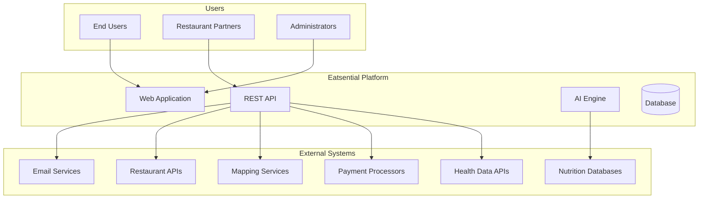
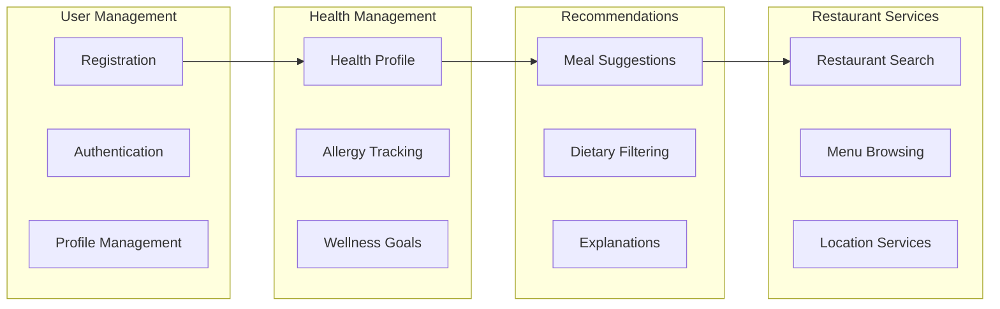
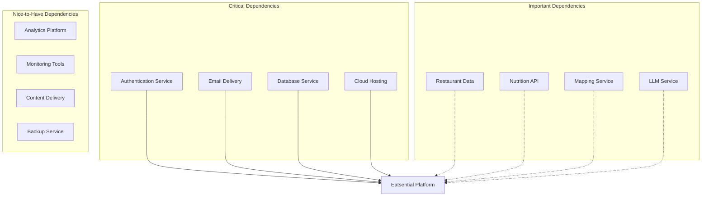
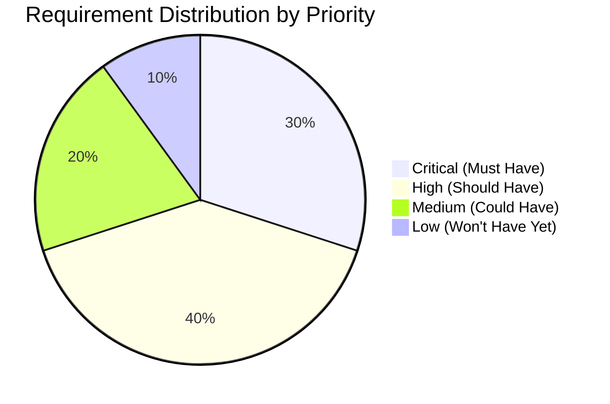

# Section 2: Overall Description

**Document:** Software Requirements Specification  
**Section:** 2 - Overall Description  
**Version:** 1.0  
**Date:** October 21, 2025

---

## 2.1 Product Perspective

### 2.1.1 System Context

Eatsential operates as a standalone web-based platform that integrates with various external systems to provide comprehensive nutrition recommendations. The system exists within a broader ecosystem of health, nutrition, and restaurant services.



### 2.1.2 Product Evolution

**Phase 1: MVP (Current)**

- User authentication and profiles
- Basic health profile management
- Manual meal recommendations
- Limited restaurant database

**Phase 2: AI Integration (3-6 months)**

- LLM-powered recommendations
- RAG pipeline implementation
- Expanded restaurant partnerships
- Nutritional analysis

**Phase 3: Full Platform (6-12 months)**

- Mobile applications
- Wearable device integration
- Meal planning and tracking
- Social features

**Phase 4: Ecosystem (12+ months)**

- Healthcare provider integration
- Insurance partnerships
- Grocery delivery integration
- Personalized coaching

### 2.1.3 System Interfaces

1. **Web Browser Interface**
   - Modern browsers (Chrome, Firefox, Safari, Edge)
   - Responsive design for mobile browsers
   - Progressive Web App capabilities

2. **External API Integrations**
   - Restaurant data providers
   - Nutrition databases (USDA)
   - Mapping services (Google Maps)
   - Email services (SMTP/AWS SES)

3. **Future Interfaces**
   - Mobile app APIs
   - Healthcare system integrations
   - Wearable device APIs
   - Voice assistants

## 2.2 Product Functions

### 2.2.1 Core Functions



### 2.2.2 Function Summary

| Function Category        | Primary Functions                                    | Status         |
| ------------------------ | ---------------------------------------------------- | -------------- |
| **Account Management**   | Registration, Login, Password Reset, Profile Updates | ✅ Implemented |
| **Health Profile**       | Allergies, Conditions, Medications, Biometrics       | ⏳ In Progress |
| **Meal Recommendations** | AI Suggestions, Filtering, Explanations              | 📅 Planned     |
| **Restaurant Discovery** | Search, Browse, Filter by Diet                       | 📅 Planned     |
| **Meal Planning**        | Weekly Plans, Shopping Lists, Tracking               | 🔮 Future      |
| **Social Features**      | Sharing, Reviews, Community                          | 🔮 Future      |

### 2.2.3 User Workflows

**Primary Workflow: Getting a Meal Recommendation**

1. User logs into account
2. System loads health profile
3. User requests meal recommendation
4. AI analyzes profile and preferences
5. System generates personalized suggestions
6. User reviews options with explanations
7. User selects restaurant/meal
8. System provides directions/ordering info

## 2.3 User Characteristics

### 2.3.1 User Types

1. **Primary Users (Health-Conscious Individuals)**
   - Age: 25-55 years
   - Tech-savvy, owns smartphone
   - Has specific dietary needs/goals
   - Values health and nutrition
   - Busy lifestyle, limited meal prep time
   - Expected: 80% of user base

2. **Secondary Users (Medical Referrals)**
   - Referred by healthcare providers
   - Managing chronic conditions
   - Requires strict dietary compliance
   - May need caregiver assistance
   - Expected: 15% of user base

3. **Tertiary Users (Fitness Enthusiasts)**
   - Athletes and gym-goers
   - Specific macro/micro tracking
   - Performance-oriented goals
   - High engagement users
   - Expected: 5% of user base

### 2.3.2 User Personas

**See [Appendix B: User Personas](./5-appendices/B-user-personas.md) for detailed personas:**

1. **Sarah Chen** - Busy Professional with Food Allergies
2. **Marcus Johnson** - Retiree Managing Diabetes
3. **Emily Rodriguez** - Fitness Enthusiast Mom
4. **David Kim** - College Student on Budget

### 2.3.3 User Expertise Levels

| Level            | Characteristics                                 | Design Implications                           |
| ---------------- | ----------------------------------------------- | --------------------------------------------- |
| **Novice**       | Limited nutrition knowledge, basic tech skills  | Simple UI, educational content, guided flows  |
| **Intermediate** | Some nutrition awareness, comfortable with apps | Balanced features, optional complexity        |
| **Expert**       | Deep nutrition knowledge, power user            | Advanced features, customization, data export |

## 2.4 Constraints

### 2.4.1 Regulatory Constraints

1. **HIPAA Compliance**
   - Health data must be encrypted
   - Access controls required
   - Audit trails mandatory
   - User consent needed

2. **FDA Regulations**
   - No medical claims
   - Disclaimer requirements
   - Supplement regulations
   - Allergen warnings

3. **Data Privacy (GDPR/CCPA)**
   - User data rights
   - Consent management
   - Data portability
   - Right to deletion

### 2.4.2 Technical Constraints

1. **Performance**
   - Page load < 2 seconds
   - API response < 200ms
   - 99.9% uptime requirement
   - Support 10,000 concurrent users

2. **Compatibility**
   - Browser support (last 2 versions)
   - Mobile responsive design
   - Progressive enhancement
   - Accessibility (WCAG 2.1 AA)

3. **Infrastructure**
   - Cloud hosting required
   - Scalable architecture
   - Disaster recovery plan
   - Data backup requirements

### 2.4.3 Business Constraints

1. **Budget**
   - $1M development budget
   - $100K/year operational budget
   - Limited marketing budget
   - Phased feature rollout

2. **Timeline**
   - 8-week MVP deadline
   - 6-month full launch
   - Quarterly feature releases
   - Annual major updates

3. **Resources**
   - 4-person development team
   - 1 QA engineer
   - 1 Product manager
   - Limited support staff

## 2.5 Assumptions and Dependencies

### 2.5.1 Assumptions

1. **User Assumptions**
   - Users have internet access
   - Users own smartphones/computers
   - Users can read English
   - Users provide accurate health data
   - Users have email addresses

2. **Technical Assumptions**
   - Cloud services remain available
   - Third-party APIs remain stable
   - Browser standards continue support
   - Security protocols remain effective
   - Database can scale as needed

3. **Business Assumptions**
   - Restaurant partners will participate
   - Users will trust AI recommendations
   - Market demand exists
   - Funding remains available
   - Regulations remain stable

### 2.5.2 Dependencies



### 2.5.3 Dependency Risks

| Dependency         | Risk Level | Impact                  | Mitigation Strategy               |
| ------------------ | ---------- | ----------------------- | --------------------------------- |
| Cloud Hosting      | High       | System unavailable      | Multi-region deployment, failover |
| Email Service      | Medium     | No user verification    | Multiple provider support         |
| Restaurant Data    | High       | Limited recommendations | Build own database                |
| LLM Service        | Medium     | No AI features          | Fallback algorithms               |
| Payment Processing | Low        | No revenue              | Multiple processors               |

## 2.6 Apportioning of Requirements

### 2.6.1 Release Planning

**MVP Release (Sprint 1-2)**

- User registration and authentication ✅
- Basic profile management ⏳
- Email verification ✅
- Password security ✅
- Basic UI/UX framework ✅

**Release 1.0 (Sprint 3-4)**

- Complete health profile
- Allergy management
- Basic recommendations
- Restaurant search
- Location services

**Release 2.0 (Sprint 5-8)**

- AI-powered recommendations
- Meal planning features
- Advanced filtering
- Performance optimization
- Mobile optimization

**Future Releases**

- Mobile applications
- Social features
- Healthcare integration
- Advanced analytics
- International expansion

### 2.6.2 Requirement Priorities



### 2.6.3 Feature Postponement

**Deferred to Post-MVP:**

1. **Complex Features**
   - AI/ML recommendations
   - Meal plan generation
   - Social networking
   - Gamification

2. **Integrations**
   - Wearable devices
   - Healthcare systems
   - Grocery delivery
   - Insurance providers

3. **Advanced Capabilities**
   - Voice interface
   - Offline mode
   - Multi-language support
   - White-label options

## 2.7 Technical Environment

### 2.7.1 Development Environment

```yaml
Frontend:
  Language: TypeScript 5.6
  Framework: React 18.3
  Build Tool: Vite 6.0
  Styling: TailwindCSS 3.4
  Testing: Vitest, React Testing Library

Backend:
  Language: Python 3.11+
  Framework: FastAPI 0.115
  ORM: SQLAlchemy 2.0
  Testing: Pytest, pytest-asyncio
  Structure:
    - routers/: API endpoints
    - services/: Business logic
    - models/: Database models
    - schemas/: Pydantic schemas
    - db/: Database configuration
    - core/: Core configurations and dependencies
    - utils/: Utility functions
    - middleware/: Request processing

Database:
  Development: SQLite
  Production: PostgreSQL 15
  Migration: Alembic

Infrastructure:
  Version Control: Git/GitHub
  CI/CD: GitHub Actions
  Container: Docker
  Monitoring: TBD
```

### 2.7.2 Production Environment

```yaml
Hosting:
  Platform: AWS (planned)
  Regions: US-East-1 (primary)
  CDN: CloudFront
  Load Balancer: Application Load Balancer

Security:
  SSL/TLS: Let's Encrypt
  WAF: AWS WAF
  Secrets: AWS Secrets Manager
  Encryption: AES-256

Scaling:
  Auto-scaling: Horizontal
  Cache: Redis (planned)
  Queue: SQS (planned)
  Search: Elasticsearch (planned)
```

---

**Document Status:** COMPLETE  
**Last Review:** October 21, 2025  
**Next Review:** With SRS Master Document
