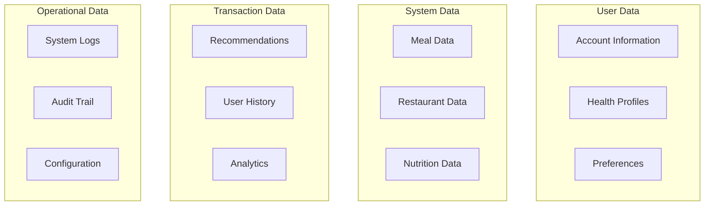

# Section 3.6: Data Requirements

**Document:** Software Requirements Specification  
**Section:** 3.6 - Data Requirements  
**Version:** 1.0  
**Date:** October 21, 2025

---

## 3.6.1 Data Overview

### 3.6.1.1 Data Categories

The Eatsential platform manages several categories of data, each with specific requirements for storage, security, and retention:



### 3.6.1.2 Data Classification

| Classification | Description | Examples | Security Level |
|----------------|-------------|----------|----------------|
| **Critical** | Health and payment data | Allergies, medical conditions, credit cards | Encrypted at rest and in transit |
| **Sensitive** | Personal identifiable information | Email, name, address, phone | Encrypted, access controlled |
| **Internal** | System and operational data | User preferences, recommendations | Standard protection |
| **Public** | Non-sensitive shared data | Restaurant info, general nutrition | Minimal protection |

## 3.6.2 Data Entities

### 3.6.2.1 User Account Data

**DR-001: User Entity**
```sql
CREATE TABLE users (
    -- Primary Key
    id UUID PRIMARY KEY DEFAULT gen_random_uuid(),
    
    -- Authentication
    username VARCHAR(20) UNIQUE NOT NULL,
    email VARCHAR(255) UNIQUE NOT NULL,
    password_hash VARCHAR(255) NOT NULL,
    
    -- Verification
    is_email_verified BOOLEAN DEFAULT FALSE NOT NULL,
    verification_token VARCHAR(255),
    verification_token_expires TIMESTAMP,
    
    -- Account Status
    is_active BOOLEAN DEFAULT TRUE NOT NULL,
    account_type VARCHAR(20) DEFAULT 'free' NOT NULL,
    
    -- Timestamps
    created_at TIMESTAMP NOT NULL DEFAULT CURRENT_TIMESTAMP,
    updated_at TIMESTAMP NOT NULL DEFAULT CURRENT_TIMESTAMP,
    last_login_at TIMESTAMP,
    
    -- Constraints
    CONSTRAINT username_format CHECK (username ~ '^[a-zA-Z0-9_-]+$'),
    CONSTRAINT email_format CHECK (email ~ '^[^@]+@[^@]+\.[^@]+$'),
    CONSTRAINT account_type_valid CHECK (account_type IN ('free', 'premium', 'admin'))
);
```

**DR-002: User Profile Data**
```sql
CREATE TABLE user_profiles (
    id UUID PRIMARY KEY DEFAULT gen_random_uuid(),
    user_id UUID NOT NULL REFERENCES users(id) ON DELETE CASCADE,
    
    -- Personal Information
    first_name VARCHAR(50),
    last_name VARCHAR(50),
    birth_date DATE,
    gender VARCHAR(20),
    phone VARCHAR(20),
    
    -- Location
    address_line1 VARCHAR(255),
    address_line2 VARCHAR(255),
    city VARCHAR(100),
    state VARCHAR(50),
    postal_code VARCHAR(20),
    country VARCHAR(2) DEFAULT 'US',
    
    -- Preferences
    timezone VARCHAR(50) DEFAULT 'America/New_York',
    language VARCHAR(5) DEFAULT 'en-US',
    currency VARCHAR(3) DEFAULT 'USD',
    
    -- Privacy Settings
    profile_visibility VARCHAR(20) DEFAULT 'private',
    data_sharing_consent BOOLEAN DEFAULT FALSE,
    marketing_consent BOOLEAN DEFAULT FALSE,
    
    created_at TIMESTAMP NOT NULL DEFAULT CURRENT_TIMESTAMP,
    updated_at TIMESTAMP NOT NULL DEFAULT CURRENT_TIMESTAMP,
    
    CONSTRAINT one_profile_per_user UNIQUE(user_id),
    CONSTRAINT valid_gender CHECK (gender IN ('male', 'female', 'other', 'prefer_not_to_say')),
    CONSTRAINT valid_visibility CHECK (profile_visibility IN ('public', 'private', 'friends'))
);
```

### 3.6.2.2 Health Profile Data

**DR-003: Health Profile Entity**
```sql
CREATE TABLE health_profiles (
    id UUID PRIMARY KEY DEFAULT gen_random_uuid(),
    user_id UUID NOT NULL REFERENCES users(id) ON DELETE CASCADE,
    
    -- Biometric Data (Encrypted)
    height_cm DECIMAL(5,2),
    weight_kg DECIMAL(5,2),
    activity_level VARCHAR(20),
    metabolic_rate INTEGER,
    
    -- Health Status
    health_status JSONB DEFAULT '{}',
    medications JSONB DEFAULT '[]',
    supplements JSONB DEFAULT '[]',
    
    -- Encrypted Medical Data
    medical_conditions_encrypted TEXT,
    medical_notes_encrypted TEXT,
    
    -- Metadata
    last_updated_by UUID REFERENCES users(id),
    verified_by_professional BOOLEAN DEFAULT FALSE,
    verification_date TIMESTAMP,
    
    created_at TIMESTAMP NOT NULL DEFAULT CURRENT_TIMESTAMP,
    updated_at TIMESTAMP NOT NULL DEFAULT CURRENT_TIMESTAMP,
    
    CONSTRAINT one_health_profile_per_user UNIQUE(user_id),
    CONSTRAINT valid_height CHECK (height_cm > 0 AND height_cm < 300),
    CONSTRAINT valid_weight CHECK (weight_kg > 0 AND weight_kg < 500),
    CONSTRAINT valid_activity CHECK (activity_level IN ('sedentary', 'light', 'moderate', 'active', 'very_active'))
);
```

**DR-004: Allergy Data**
```sql
CREATE TABLE user_allergies (
    id UUID PRIMARY KEY DEFAULT gen_random_uuid(),
    user_id UUID NOT NULL REFERENCES users(id) ON DELETE CASCADE,
    
    -- Allergy Information
    allergen_type VARCHAR(50) NOT NULL,
    allergen_name VARCHAR(100) NOT NULL,
    severity VARCHAR(20) NOT NULL,
    
    -- Medical Details
    diagnosed_date DATE,
    diagnosed_by VARCHAR(255),
    reaction_type VARCHAR(50),
    notes TEXT,
    
    -- Verification
    is_verified BOOLEAN DEFAULT FALSE,
    verification_method VARCHAR(50),
    
    created_at TIMESTAMP NOT NULL DEFAULT CURRENT_TIMESTAMP,
    updated_at TIMESTAMP NOT NULL DEFAULT CURRENT_TIMESTAMP,
    
    CONSTRAINT valid_severity CHECK (severity IN ('mild', 'moderate', 'severe', 'life_threatening')),
    CONSTRAINT valid_allergen_type CHECK (allergen_type IN ('food', 'drug', 'environmental', 'other')),
    CONSTRAINT unique_user_allergen UNIQUE(user_id, allergen_name)
);

-- Common food allergens reference table
CREATE TABLE allergen_database (
    id UUID PRIMARY KEY DEFAULT gen_random_uuid(),
    category VARCHAR(50) NOT NULL,
    name VARCHAR(100) NOT NULL UNIQUE,
    alternate_names TEXT[],
    description TEXT,
    
    -- FDA Big 9 Allergens flag
    is_major_allergen BOOLEAN DEFAULT FALSE,
    
    -- Related allergens (e.g., tree nuts group)
    related_allergens TEXT[],
    
    created_at TIMESTAMP NOT NULL DEFAULT CURRENT_TIMESTAMP
);
```

**DR-005: Dietary Preferences**
```sql
CREATE TABLE dietary_preferences (
    id UUID PRIMARY KEY DEFAULT gen_random_uuid(),
    user_id UUID NOT NULL REFERENCES users(id) ON DELETE CASCADE,
    
    -- Preference Details
    preference_type VARCHAR(50) NOT NULL,
    preference_name VARCHAR(100) NOT NULL,
    is_strict BOOLEAN DEFAULT TRUE,
    
    -- Reason and Notes
    reason VARCHAR(50),
    notes TEXT,
    
    created_at TIMESTAMP NOT NULL DEFAULT CURRENT_TIMESTAMP,
    updated_at TIMESTAMP NOT NULL DEFAULT CURRENT_TIMESTAMP,
    
    CONSTRAINT valid_preference_type CHECK (preference_type IN ('diet', 'cuisine', 'ingredient', 'preparation')),
    CONSTRAINT valid_reason CHECK (reason IN ('health', 'religious', 'ethical', 'personal', 'cultural')),
    CONSTRAINT unique_user_preference UNIQUE(user_id, preference_type, preference_name)
);
```

### 3.6.2.3 Meal and Restaurant Data

**DR-006: Restaurant Entity**
```sql
CREATE TABLE restaurants (
    id UUID PRIMARY KEY DEFAULT gen_random_uuid(),
    
    -- Basic Information
    name VARCHAR(255) NOT NULL,
    description TEXT,
    cuisine_types TEXT[],
    price_range INTEGER,
    
    -- Location
    address VARCHAR(500) NOT NULL,
    latitude DECIMAL(10, 8) NOT NULL,
    longitude DECIMAL(11, 8) NOT NULL,
    phone VARCHAR(20),
    website VARCHAR(255),
    
    -- Operating Hours (JSONB for flexibility)
    hours JSONB,
    
    -- Verification Status
    is_verified BOOLEAN DEFAULT FALSE,
    is_active BOOLEAN DEFAULT TRUE,
    partner_since DATE,
    
    -- Dietary Support
    dietary_accommodations TEXT[],
    allergen_protocols JSONB,
    
    created_at TIMESTAMP NOT NULL DEFAULT CURRENT_TIMESTAMP,
    updated_at TIMESTAMP NOT NULL DEFAULT CURRENT_TIMESTAMP,
    
    CONSTRAINT valid_price_range CHECK (price_range BETWEEN 1 AND 4),
    CONSTRAINT valid_coordinates CHECK (
        latitude BETWEEN -90 AND 90 AND 
        longitude BETWEEN -180 AND 180
    )
);

-- Restaurant search optimization
CREATE INDEX idx_restaurants_location ON restaurants USING GIST (
    point(longitude, latitude)
);
CREATE INDEX idx_restaurants_cuisine ON restaurants USING GIN (cuisine_types);
CREATE INDEX idx_restaurants_dietary ON restaurants USING GIN (dietary_accommodations);
```

**DR-007: Meal Entity**
```sql
CREATE TABLE meals (
    id UUID PRIMARY KEY DEFAULT gen_random_uuid(),
    restaurant_id UUID NOT NULL REFERENCES restaurants(id) ON DELETE CASCADE,
    
    -- Meal Information
    name VARCHAR(255) NOT NULL,
    description TEXT,
    category VARCHAR(50),
    tags TEXT[],
    
    -- Pricing
    price DECIMAL(10, 2) NOT NULL,
    currency VARCHAR(3) DEFAULT 'USD',
    
    -- Availability
    is_available BOOLEAN DEFAULT TRUE,
    availability_schedule JSONB,
    
    -- Images
    image_urls TEXT[],
    
    created_at TIMESTAMP NOT NULL DEFAULT CURRENT_TIMESTAMP,
    updated_at TIMESTAMP NOT NULL DEFAULT CURRENT_TIMESTAMP,
    
    CONSTRAINT valid_price CHECK (price >= 0),
    CONSTRAINT valid_category CHECK (category IN ('appetizer', 'entree', 'dessert', 'beverage', 'side', 'special'))
);
```

**DR-008: Meal Nutrition Data**
```sql
CREATE TABLE meal_nutrition (
    id UUID PRIMARY KEY DEFAULT gen_random_uuid(),
    meal_id UUID NOT NULL REFERENCES meals(id) ON DELETE CASCADE,
    
    -- Macronutrients (per serving)
    calories DECIMAL(6, 2),
    protein_g DECIMAL(6, 2),
    carbohydrates_g DECIMAL(6, 2),
    fat_g DECIMAL(6, 2),
    fiber_g DECIMAL(6, 2),
    sugar_g DECIMAL(6, 2),
    
    -- Key Micronutrients
    sodium_mg DECIMAL(8, 2),
    cholesterol_mg DECIMAL(6, 2),
    
    -- Serving Information
    serving_size VARCHAR(100),
    servings_per_container DECIMAL(4, 2),
    
    -- Additional Nutrition (JSONB for flexibility)
    vitamins JSONB,
    minerals JSONB,
    
    -- Data Source
    data_source VARCHAR(50),
    last_verified DATE,
    confidence_score DECIMAL(3, 2),
    
    created_at TIMESTAMP NOT NULL DEFAULT CURRENT_TIMESTAMP,
    updated_at TIMESTAMP NOT NULL DEFAULT CURRENT_TIMESTAMP,
    
    CONSTRAINT one_nutrition_per_meal UNIQUE(meal_id),
    CONSTRAINT valid_confidence CHECK (confidence_score BETWEEN 0 AND 1)
);
```

### 3.6.2.4 Recommendation Data

**DR-009: Recommendation Entity**
```sql
CREATE TABLE recommendations (
    id UUID PRIMARY KEY DEFAULT gen_random_uuid(),
    user_id UUID NOT NULL REFERENCES users(id) ON DELETE CASCADE,
    
    -- Recommendation Details
    recommendation_type VARCHAR(50) NOT NULL,
    meal_type VARCHAR(20),
    
    -- Context
    requested_at TIMESTAMP NOT NULL DEFAULT CURRENT_TIMESTAMP,
    location_latitude DECIMAL(10, 8),
    location_longitude DECIMAL(11, 8),
    
    -- Parameters Used
    parameters JSONB NOT NULL,
    
    -- Results
    recommendations JSONB NOT NULL,
    total_results INTEGER,
    
    -- AI Metadata
    model_version VARCHAR(20),
    confidence_scores JSONB,
    processing_time_ms INTEGER,
    
    -- User Feedback
    user_rating INTEGER,
    user_feedback TEXT,
    
    created_at TIMESTAMP NOT NULL DEFAULT CURRENT_TIMESTAMP,
    
    CONSTRAINT valid_recommendation_type CHECK (recommendation_type IN ('meal', 'restaurant', 'meal_plan', 'grocery')),
    CONSTRAINT valid_meal_type CHECK (meal_type IN ('breakfast', 'lunch', 'dinner', 'snack')),
    CONSTRAINT valid_rating CHECK (user_rating BETWEEN 1 AND 5)
);

-- Optimize recommendation queries
CREATE INDEX idx_recommendations_user_date ON recommendations(user_id, created_at DESC);
CREATE INDEX idx_recommendations_type ON recommendations(recommendation_type, meal_type);
```

### 3.6.2.5 System and Audit Data

**DR-010: Audit Log**
```sql
CREATE TABLE audit_logs (
    id UUID PRIMARY KEY DEFAULT gen_random_uuid(),
    
    -- Actor Information
    user_id UUID REFERENCES users(id),
    ip_address INET,
    user_agent TEXT,
    
    -- Action Details
    action VARCHAR(100) NOT NULL,
    entity_type VARCHAR(50) NOT NULL,
    entity_id UUID,
    
    -- Change Information
    old_values JSONB,
    new_values JSONB,
    
    -- Metadata
    request_id UUID,
    session_id VARCHAR(255),
    
    created_at TIMESTAMP NOT NULL DEFAULT CURRENT_TIMESTAMP,
    
    -- Compliance: Audit logs are immutable
    CONSTRAINT audit_logs_no_update CHECK (false) NO INHERIT
);

-- Optimize audit queries
CREATE INDEX idx_audit_logs_user ON audit_logs(user_id, created_at DESC);
CREATE INDEX idx_audit_logs_entity ON audit_logs(entity_type, entity_id, created_at DESC);
CREATE INDEX idx_audit_logs_action ON audit_logs(action, created_at DESC);
```

## 3.6.3 Data Volumes

### 3.6.3.1 Storage Estimates

| Data Category | Records (Year 1) | Avg Size | Total Size | Growth Rate |
|---------------|------------------|----------|------------|-------------|
| Users | 100,000 | 1 KB | 100 MB | 20%/month |
| Health Profiles | 100,000 | 5 KB | 500 MB | 20%/month |
| Allergies | 300,000 | 0.5 KB | 150 MB | 15%/month |
| Restaurants | 10,000 | 10 KB | 100 MB | 5%/month |
| Meals | 500,000 | 2 KB | 1 GB | 10%/month |
| Recommendations | 10,000,000 | 3 KB | 30 GB | 50%/month |
| Audit Logs | 50,000,000 | 0.5 KB | 25 GB | 100%/month |
| **Total** | | | **~57 GB** | |

### 3.6.3.2 Performance Requirements

**DR-011: Query Performance**
| Query Type | Target Response Time | Optimization Strategy |
|------------|---------------------|----------------------|
| User Login | < 100ms | Indexed email/username |
| Profile Load | < 200ms | Eager loading, caching |
| Allergy Check | < 50ms | Indexed allergen lookup |
| Restaurant Search | < 500ms | Spatial index, full-text search |
| Recommendation | < 1000ms | Pre-computed scores, caching |

## 3.6.4 Data Retention and Archival

### 3.6.4.1 Retention Policies

**DR-012: Data Retention Requirements**
| Data Type | Active Retention | Archive Period | Deletion Policy |
|-----------|------------------|----------------|-----------------|
| User Accounts | Indefinite | N/A | On user request |
| Health Data | 7 years | 3 years | HIPAA compliant |
| Recommendations | 1 year | 2 years | Auto-delete |
| Audit Logs | 2 years | 5 years | Compliance archive |
| Session Data | 30 days | N/A | Auto-delete |
| Temp Files | 24 hours | N/A | Auto-delete |

### 3.6.4.2 Archival Strategy

```sql
-- Partitioning strategy for large tables
CREATE TABLE recommendations_2025 PARTITION OF recommendations
    FOR VALUES FROM ('2025-01-01') TO ('2026-01-01');

CREATE TABLE audit_logs_2025 PARTITION OF audit_logs
    FOR VALUES FROM ('2025-01-01') TO ('2026-01-01');

-- Archive old partitions to cold storage
-- Move partitions older than 1 year to archive schema
```

## 3.6.5 Data Security Requirements

### 3.6.5.1 Encryption Requirements

**DR-013: Encryption Standards**
```yaml
At Rest:
  Algorithm: AES-256-GCM
  Key Management: AWS KMS or HashiCorp Vault
  Scope:
    - All PII fields
    - Health data
    - Payment information
    
In Transit:
  Protocol: TLS 1.3
  Certificate: EV SSL
  HSTS: Enabled
  
Field Level:
  - medical_conditions: Always encrypted
  - medical_notes: Always encrypted
  - payment_tokens: Always encrypted
```

### 3.6.5.2 Access Control

**DR-014: Data Access Matrix**
| Data Category | Public | User | Admin | System |
|---------------|--------|------|-------|---------|
| Public Data | Read | Read | Full | Full |
| User Profile | None | Own | Read | Full |
| Health Data | None | Own | None* | Read |
| Recommendations | None | Own | Stats | Full |
| Audit Logs | None | None | Read | Read |

*Admin access to health data requires explicit audit trail

### 3.6.5.3 Data Masking

**DR-015: PII Masking Rules**
```python
# Email masking: j***@example.com
def mask_email(email: str) -> str:
    user, domain = email.split('@')
    return f"{user[0]}***@{domain}"

# Phone masking: ***-***-1234
def mask_phone(phone: str) -> str:
    return f"***-***-{phone[-4:]}"

# SSN masking: ***-**-1234
def mask_ssn(ssn: str) -> str:
    return f"***-**-{ssn[-4:]}"
```

## 3.6.6 Data Quality Requirements

### 3.6.6.1 Data Validation Rules

**DR-016: Input Validation**
```python
# Email validation
EMAIL_REGEX = r'^[a-zA-Z0-9._%+-]+@[a-zA-Z0-9.-]+\.[a-zA-Z]{2,}$'

# Phone validation (US)
PHONE_REGEX = r'^\+?1?\d{10,14}$'

# Postal code validation (US)
POSTAL_CODE_REGEX = r'^\d{5}(-\d{4})?$'

# Date validation
def validate_birth_date(date: str) -> bool:
    # Must be between 1900 and current year - 13
    pass
```

### 3.6.6.2 Data Integrity

**DR-017: Referential Integrity**
- All foreign keys must have corresponding primary keys
- Cascade deletes for user-owned data
- Restrict deletes for shared data
- No orphaned records allowed

**DR-018: Business Rule Integrity**
- User cannot have conflicting allergies and preferences
- Meal prices must be positive
- Recommendations must reference existing meals
- Audit logs are immutable

## 3.6.7 Data Migration Requirements

### 3.6.7.1 Migration Strategy

**DR-019: Database Migrations**
```bash
# Alembic migration structure
alembic/
├── versions/
│   ├── 001_initial_schema.py
│   ├── 002_add_health_profiles.py
│   ├── 003_add_restaurants.py
│   └── 004_add_recommendations.py
├── alembic.ini
└── env.py

# Zero-downtime migration requirements
- All migrations must be reversible
- No breaking changes without version bump
- Column additions: nullable or default value
- Index creation: concurrent where supported
```

### 3.6.7.2 Data Import/Export

**DR-020: Bulk Data Operations**
```yaml
Import Formats:
  - CSV with headers
  - JSON (newline delimited)
  - XML (legacy systems)
  
Export Formats:
  - CSV (user data export)
  - JSON (API export)
  - PDF (reports)
  
Rate Limits:
  - Import: 1000 records/second
  - Export: 10000 records/second
  
Validation:
  - Schema validation
  - Foreign key checks
  - Business rule validation
```

## 3.6.8 Backup and Recovery

### 3.6.8.1 Backup Requirements

**DR-021: Backup Schedule**
| Backup Type | Frequency | Retention | Storage Location |
|-------------|-----------|-----------|------------------|
| Full Database | Daily | 30 days | S3 Cross-region |
| Incremental | Hourly | 7 days | S3 Standard |
| Transaction Logs | Continuous | 7 days | S3 Standard-IA |
| Critical Data | Real-time | 90 days | Multi-region |

### 3.6.8.2 Recovery Objectives

**DR-022: Recovery Targets**
- **RTO (Recovery Time Objective):** 4 hours
- **RPO (Recovery Point Objective):** 1 hour
- **Data Verification:** Automated integrity checks
- **Test Frequency:** Monthly disaster recovery drills

---

**Document Status:** COMPLETE  
**Last Review:** October 21, 2025  
**Next Review:** With SRS Master Document
