# Section 4: System Models

**Document:** Software Requirements Specification  
**Section:** 4 - System Models  
**Version:** 1.0  
**Date:** October 21, 2025

---

## 4.1 Overview

This section presents various models that describe the Eatsential system from different perspectives. These models help stakeholders understand system behavior, data flow, and interactions.

## 4.2 Behavioral Models

### 4.2.1 State Diagrams

#### User Account States

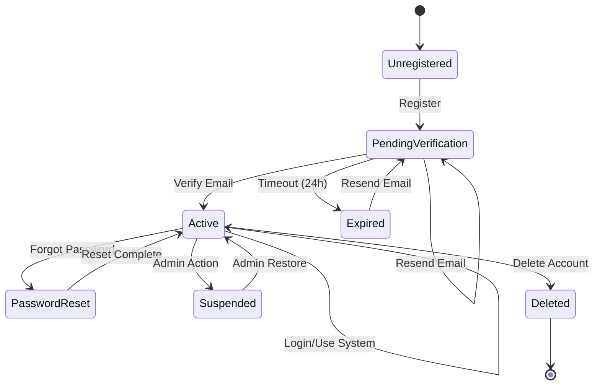

#### Meal Recommendation States

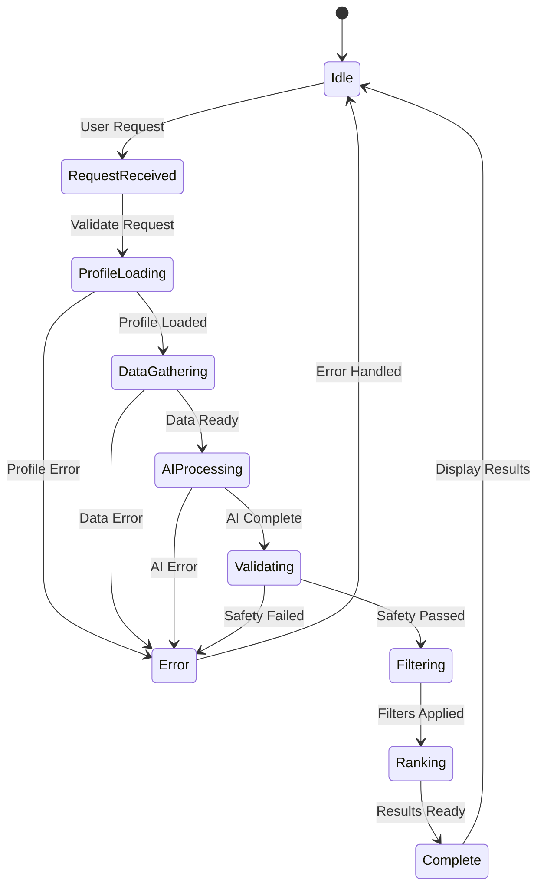

### 4.2.2 Activity Diagrams

#### User Registration Flow

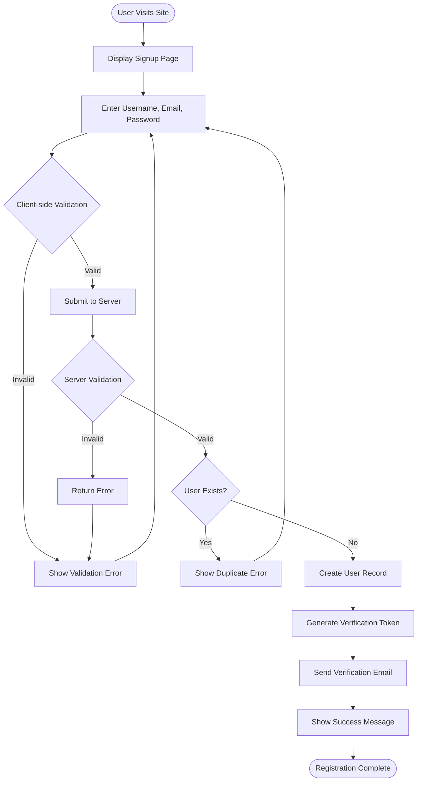

#### Meal Recommendation Flow

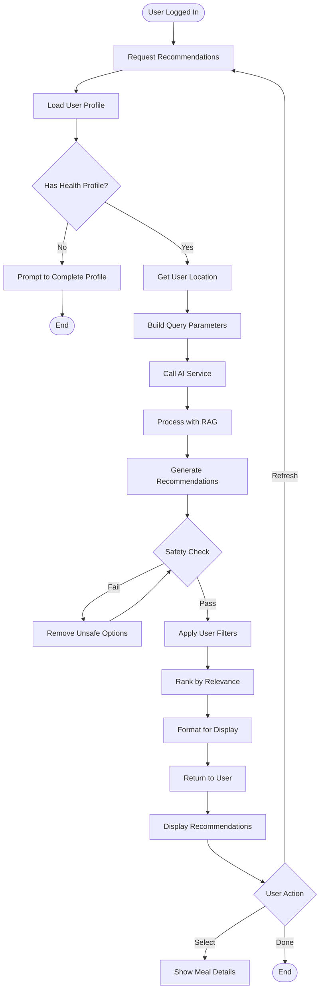

## 4.3 Data Flow Diagrams

### 4.3.1 Context Diagram (Level 0)

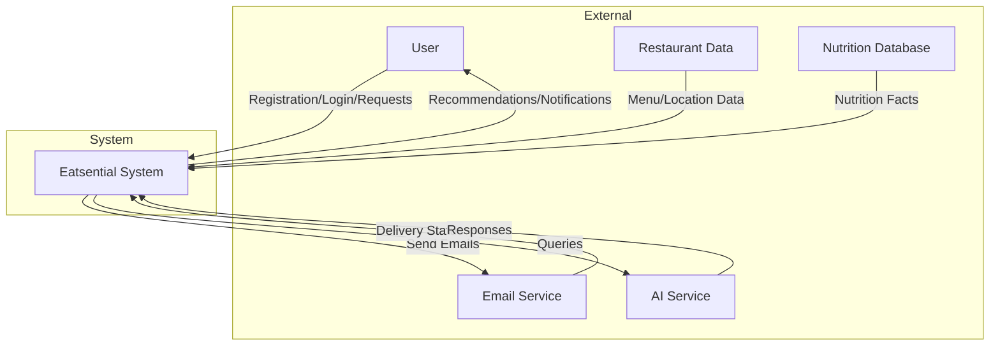

### 4.3.2 Level 1 DFD - System Components

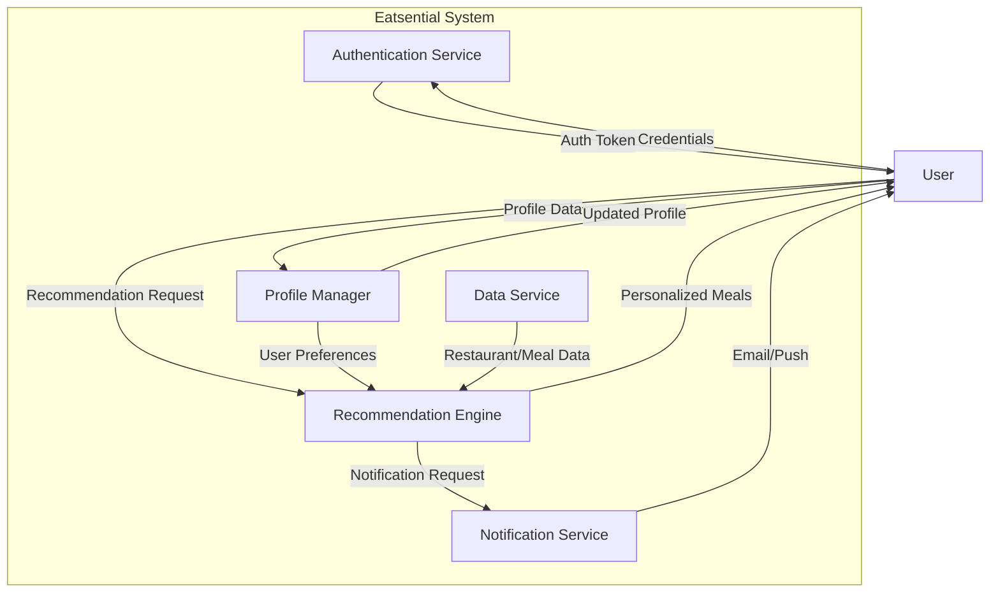

### 4.3.3 Level 2 DFD - Recommendation Process

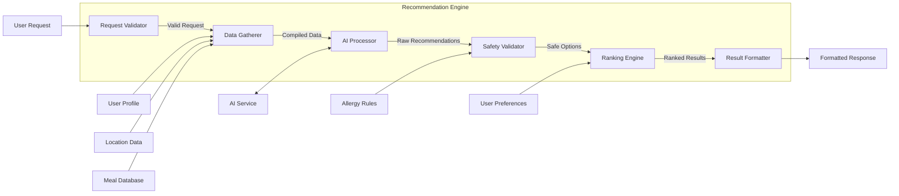

## 4.4 Object Models

### 4.4.1 Domain Model

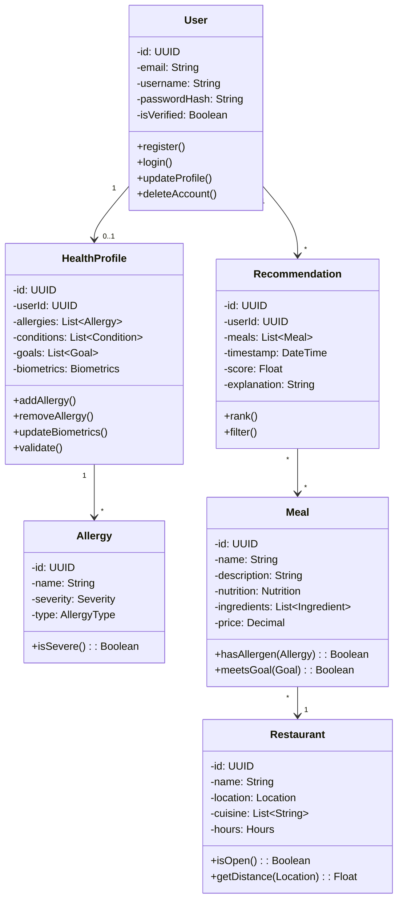

### 4.4.2 Detailed Class Relationships

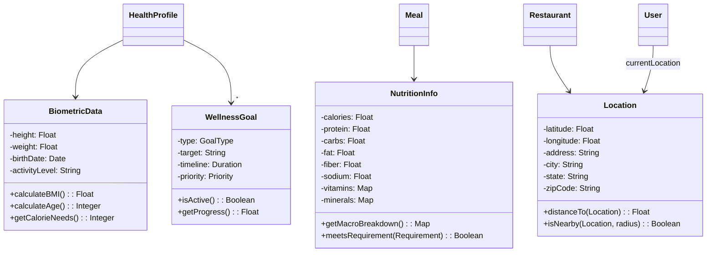

## 4.5 Sequence Diagrams

### 4.5.1 Email Verification Sequence

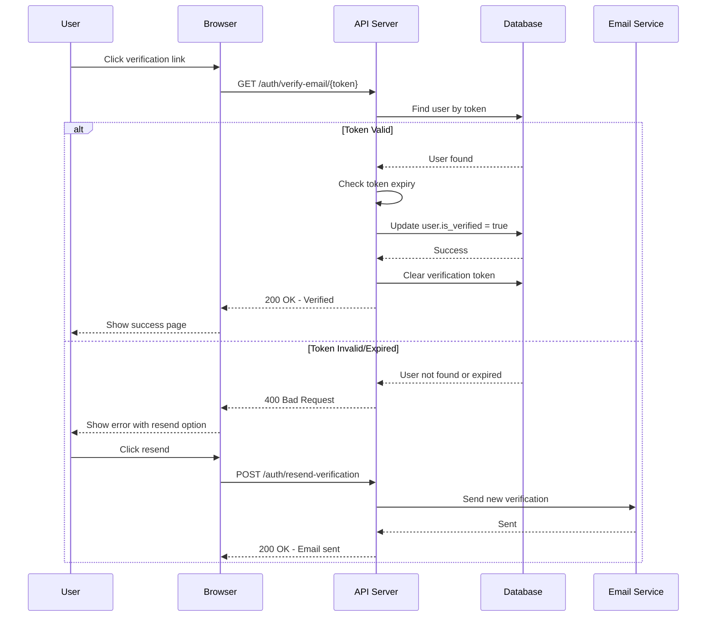

### 4.5.2 AI Recommendation Sequence

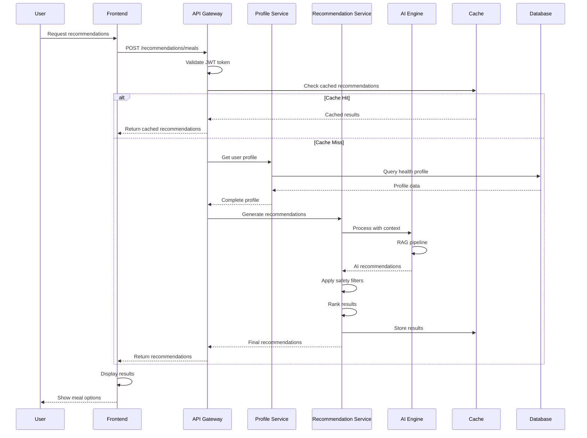

## 4.6 Use Case Realization

### 4.6.1 UC-001: User Registration Realization

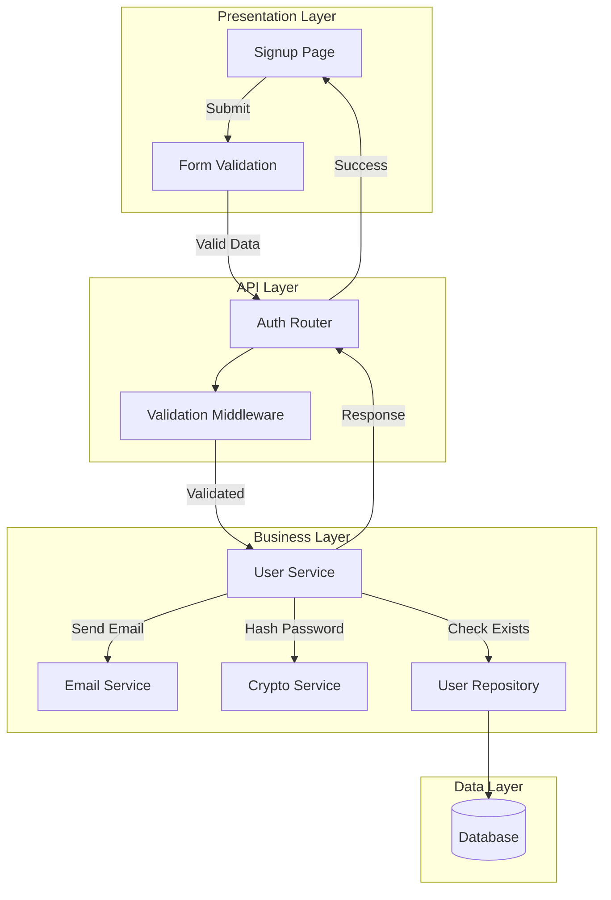

### 4.6.2 UC-016: Allergy Management Realization

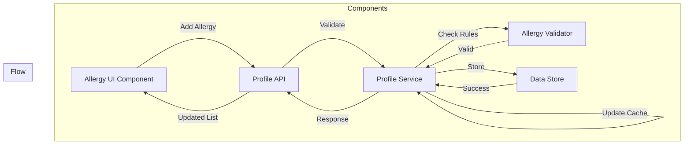

## 4.7 Deployment Model

### 4.7.1 Physical Architecture

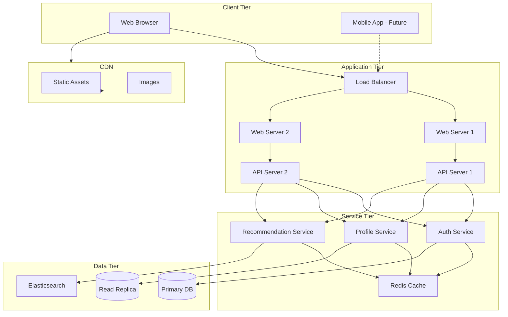

### 4.7.2 Development vs Production

| Aspect        | Development  | Production         |
| ------------- | ------------ | ------------------ |
| Database      | SQLite       | PostgreSQL Cluster |
| Cache         | In-memory    | Redis Cluster      |
| API Servers   | 1 instance   | Auto-scaling group |
| Load Balancer | None         | Application LB     |
| SSL           | Self-signed  | Let's Encrypt      |
| Monitoring    | Console logs | DataDog/CloudWatch |
| Backups       | None         | Automated daily    |

## 4.8 Security Model

### 4.8.1 Authentication Flow

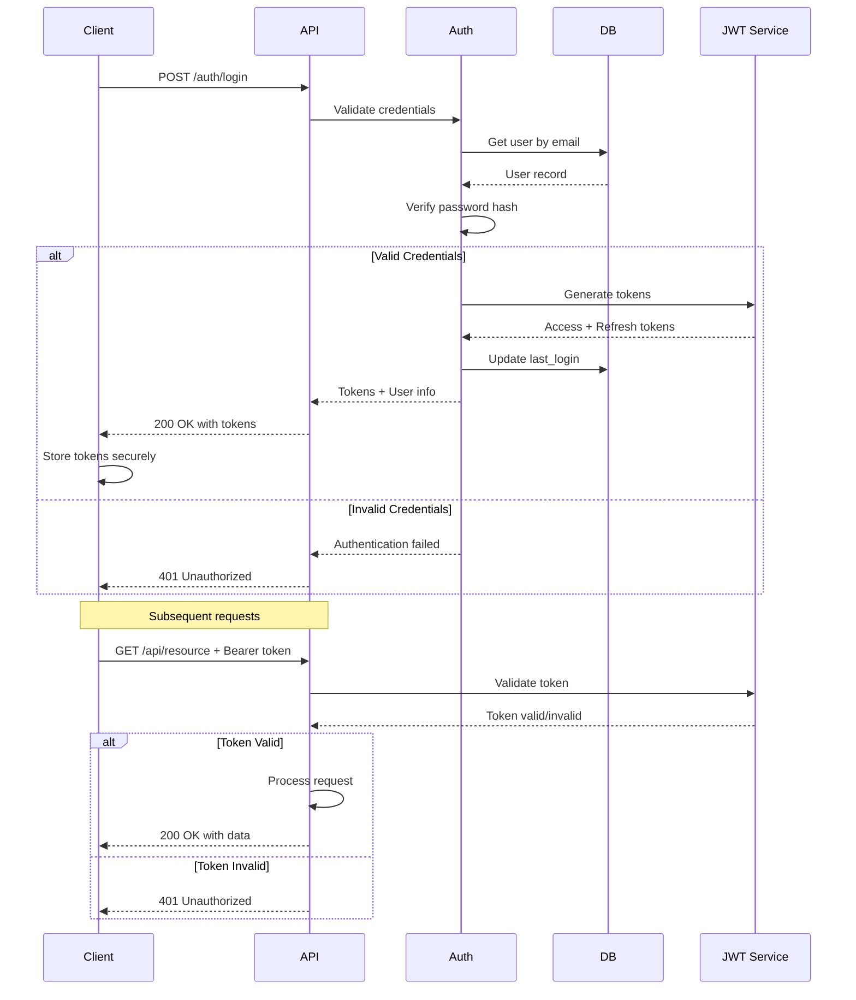

### 4.8.2 Data Access Control

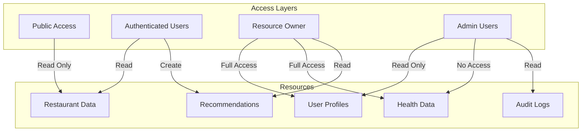

## 4.9 Performance Model

### 4.9.1 Response Time Breakdown

```mermaid
gantt
    title API Response Time Budget (200ms target)
    dateFormat X
    axisFormat %L

    section Request Path
    Network Latency      :0, 20
    Load Balancer       :20, 5
    API Gateway         :25, 10
    Service Logic       :35, 50
    Database Query      :85, 40
    Cache Lookup        :35, 5
    AI Processing       :85, 80
    Response Format     :165, 10
    Network Return      :175, 25
```

### 4.9.2 Caching Strategy

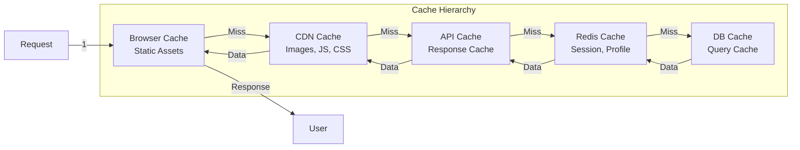

---

**Document Status:** COMPLETE  
**Last Review:** October 21, 2025  
**Next Review:** With system implementation
