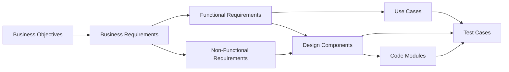
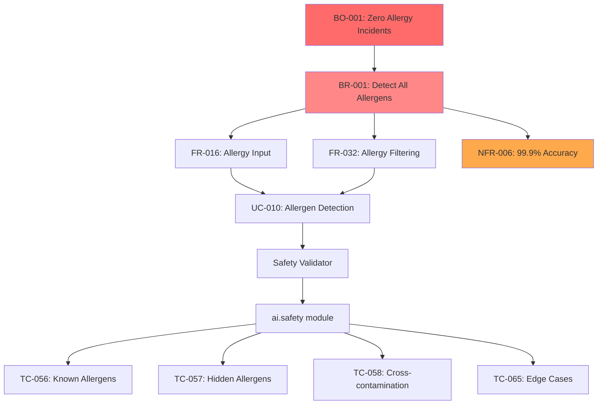
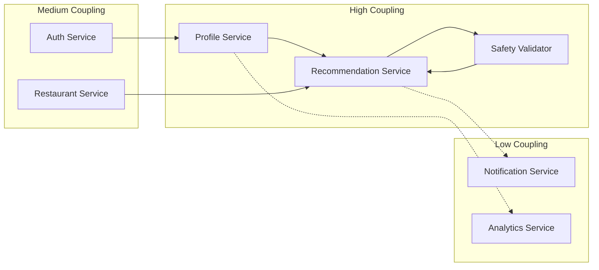
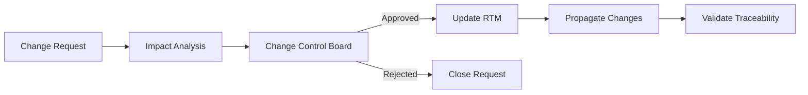

# Requirements Traceability Matrix (RTM)

**Project:** Eatsential - Precision Nutrition Platform  
**Document Type:** Requirements Traceability Matrix  
**Version:** 1.0  
**Date:** October 19, 2025  
**Purpose:** End-to-end traceability from business needs to test validation

---

## Document Information

**Related Documents:**
- [Functional Requirements](./3-specific-requirements/3.1-functional-requirements.md)
- [Non-Functional Requirements](./3-specific-requirements/3.2-non-functional-requirements.md)
- [Use Cases](./3-specific-requirements/3.4-use-cases.md)
- [Test Traceability Matrix](../5-STP/test-traceability-matrix.md)
- [SAD Master](../3-DESIGN/3.1-SAD/SAD-MASTER.md)

---

## 1. Introduction

### 1.1 Purpose

This Requirements Traceability Matrix (RTM) provides bi-directional traceability between:
- Business objectives → Requirements → Design → Implementation → Testing
- Ensures complete requirement coverage and validation
- Enables impact analysis for requirement changes
- Supports compliance and audit requirements

### 1.2 Traceability Levels



### 1.3 Matrix Legend

| Code | Meaning |
|------|---------|
| **BO** | Business Objective |
| **BR** | Business Requirement |
| **FR** | Functional Requirement |
| **NFR** | Non-Functional Requirement |
| **UC** | Use Case |
| **DC** | Design Component |
| **CODE** | Implementation Module |
| **TC** | Test Case |
| **✓** | Implemented/Complete |
| **⚡** | In Progress |
| **○** | Planned |

---

## 2. Business Objectives Traceability

| Business Objective | Description | Priority | Related BRs | Status |
|-------------------|-------------|----------|-------------|--------|
| **BO-001** | Eliminate food allergy incidents | CRITICAL | BR-001, BR-002, BR-003 | ⚡ |
| **BO-002** | Provide personalized nutrition | HIGH | BR-004, BR-005, BR-006 | ⚡ |
| **BO-003** | Enable real-time meal discovery | HIGH | BR-007, BR-008 | ○ |
| **BO-004** | Support holistic wellness | MEDIUM | BR-009, BR-010 | ○ |
| **BO-005** | Ensure data privacy compliance | HIGH | BR-011, BR-012 | ⚡ |

---

## 3. Requirements Traceability

### 3.1 Authentication & User Management

| Req ID | Requirement | Use Case | Design Component | Code Module | Test Cases | Status |
|--------|-------------|----------|------------------|-------------|------------|--------|
| **FR-001** | User Registration | UC-001 | Auth Service | `auth.register` | TC-001 to TC-005 | ⚡ UI Done |
| **FR-002** | Multi-Factor Auth | UC-002 | Auth Service | `auth.mfa` | TC-006 to TC-008 | ○ |
| **FR-003** | Social Login | UC-001 | Auth Service | `auth.oauth` | TC-009 to TC-012 | ○ |
| **FR-004** | Password Recovery | UC-003 | Auth Service | `auth.recovery` | TC-013 to TC-015 | ○ |
| **FR-005** | Session Management | UC-004 | Auth Service | `auth.session` | TC-016 to TC-018 | ○ |
| **NFR-001** | <2s Login Time | - | API Gateway | `gateway.auth` | PT-001 | ○ |
| **NFR-002** | OWASP Compliance | - | Auth Service | `auth.security` | ST-001 to ST-005 | ○ |

### 3.2 Health Profile Management

| Req ID | Requirement | Use Case | Design Component | Code Module | Test Cases | Status |
|--------|-------------|----------|------------------|-------------|------------|--------|
| **FR-016** | Allergy Input | UC-005 | Profile Service | `profile.allergies` | TC-019 to TC-025 | ⚡ |
| **FR-017** | Medical Conditions | UC-005 | Profile Service | `profile.medical` | TC-026 to TC-030 | ○ |
| **FR-018** | Fitness Goals | UC-006 | Profile Service | `profile.goals` | TC-031 to TC-035 | ○ |
| **FR-019** | Biometric Tracking | UC-007 | Profile Service | `profile.biometrics` | TC-036 to TC-040 | ○ |
| **FR-020** | Preference Setting | UC-008 | Profile Service | `profile.preferences` | TC-041 to TC-045 | ○ |
| **NFR-003** | HIPAA Compliance | - | Data Layer | `security.encryption` | ST-006 to ST-010 | ⚡ |
| **NFR-004** | <50ms Query Time | - | Database | `db.profile` | PT-002 | ○ |

### 3.3 AI Recommendation Engine

| Req ID | Requirement | Use Case | Design Component | Code Module | Test Cases | Status |
|--------|-------------|----------|------------------|-------------|------------|--------|
| **FR-031** | Meal Recommendations | UC-009 | Rec Service | `ai.recommend` | TC-046 to TC-055 | ⚡ |
| **FR-032** | Allergy Filtering | UC-010 | Safety Validator | `ai.safety` | TC-056 to TC-065 | ⚡ |
| **FR-033** | Nutrition Matching | UC-011 | ML Models | `ai.nutrition` | TC-066 to TC-070 | ○ |
| **FR-034** | Explanation Generation | UC-012 | LLM Service | `ai.explain` | TC-071 to TC-075 | ○ |
| **FR-035** | Confidence Scoring | UC-013 | ML Models | `ai.confidence` | TC-076 to TC-080 | ○ |
| **NFR-005** | <1s Generation Time | - | RAG Pipeline | `ai.performance` | PT-003 | ○ |
| **NFR-006** | 99.9% Allergy Accuracy | - | Safety Validator | `ai.validation` | ST-011 to ST-015 | ⚡ |

### 3.4 Restaurant Discovery

| Req ID | Requirement | Use Case | Design Component | Code Module | Test Cases | Status |
|--------|-------------|----------|------------------|-------------|------------|--------|
| **FR-046** | Restaurant Search | UC-014 | Restaurant Service | `restaurant.search` | TC-081 to TC-085 | ○ |
| **FR-047** | Location Filtering | UC-015 | Geo Service | `restaurant.geo` | TC-086 to TC-090 | ○ |
| **FR-048** | Menu Integration | UC-016 | Menu Parser | `restaurant.menu` | TC-091 to TC-095 | ○ |
| **FR-049** | Real-time Availability | UC-017 | Cache Service | `restaurant.availability` | TC-096 to TC-100 | ○ |
| **FR-050** | Rating System | UC-018 | Review Service | `restaurant.ratings` | TC-101 to TC-105 | ○ |
| **NFR-007** | <200ms Search | - | Elasticsearch | `search.performance` | PT-004 | ○ |
| **NFR-008** | 10K Concurrent Users | - | Load Balancer | `infra.scaling` | PT-005 | ○ |

### 3.5 Meal Planning & Tracking

| Req ID | Requirement | Use Case | Design Component | Code Module | Test Cases | Status |
|--------|-------------|----------|------------------|-------------|------------|--------|
| **FR-061** | Meal Calendar | UC-019 | Planning Service | `planner.calendar` | TC-106 to TC-110 | ○ |
| **FR-062** | Nutrition Tracking | UC-020 | Analytics Service | `tracking.nutrition` | TC-111 to TC-115 | ○ |
| **FR-063** | Progress Visualization | UC-021 | Dashboard Service | `tracking.progress` | TC-116 to TC-120 | ○ |
| **FR-064** | Goal Monitoring | UC-022 | Analytics Service | `tracking.goals` | TC-121 to TC-125 | ○ |
| **FR-065** | Export Data | UC-023 | Export Service | `tracking.export` | TC-126 to TC-130 | ○ |
| **NFR-009** | Real-time Updates | - | WebSocket | `realtime.updates` | PT-006 | ○ |
| **NFR-010** | Data Retention 7yr | - | Archive Service | `data.retention` | ST-016 | ○ |

---

## 4. Design Component Mapping

### 4.1 Microservices Mapping

| Design Component | Requirements | API Endpoints | Database Tables | Dependencies |
|-----------------|--------------|---------------|-----------------|--------------|
| **Auth Service** | FR-001 to FR-005 | `/auth/*` | users, sessions | Auth0, Redis |
| **Profile Service** | FR-016 to FR-020 | `/profile/*` | health_profiles, preferences | PostgreSQL |
| **Recommendation Service** | FR-031 to FR-035 | `/recommendations/*` | recommendations, ml_models | AI Engine, RAG |
| **Restaurant Service** | FR-046 to FR-050 | `/restaurants/*` | restaurants, menus | Elasticsearch |
| **Planning Service** | FR-061 to FR-065 | `/planning/*` | meal_plans, tracking | PostgreSQL, Redis |

### 4.2 AI Component Mapping

| AI Component | Requirements | ML Models | Data Sources | Validation |
|-------------|--------------|-----------|--------------|------------|
| **RAG Pipeline** | FR-031, FR-034 | - | Vector DB, Menus | Confidence threshold |
| **Safety Validator** | FR-032 | Allergen Detector | Ingredient DB | Rule engine |
| **Nutrition Matcher** | FR-033 | Nutrition Model | USDA DB | Accuracy metrics |
| **Personalization Engine** | FR-031, FR-035 | User Preference Model | User history | A/B testing |

---

## 5. Critical Path Traceability

### 5.1 Allergy Safety Critical Path



### 5.2 Performance Critical Path

| Performance Requirement | Component Chain | Bottleneck Risk | Mitigation |
|------------------------|-----------------|-----------------|------------|
| **<200ms API Response** | Gateway → Service → Cache → DB | Database queries | Redis caching |
| **<1s AI Generation** | API → RAG → LLM → Validation | LLM inference | GPU optimization |
| **10K Concurrent Users** | CDN → LB → Pods → Services | Pod scaling | HPA configuration |

---

## 6. Change Impact Analysis

### 6.1 High-Impact Requirements

Requirements that affect multiple components when changed:

| Requirement | Impact Scope | Affected Components | Risk Level |
|-------------|--------------|-------------------|------------|
| **FR-032** (Allergy Filtering) | System-wide | All recommendation flows | CRITICAL |
| **NFR-003** (HIPAA Compliance) | All health data | Database, APIs, UI | HIGH |
| **FR-031** (Recommendations) | Core feature | AI, Cache, UI | HIGH |
| **NFR-001** (Performance) | User experience | All services | MEDIUM |

### 6.2 Dependency Chains



---

## 7. Coverage Analysis

### 7.1 Requirements Coverage Summary

| Category | Total Reqs | Designed | Implemented | Tested | Coverage % |
|----------|------------|----------|-------------|--------|------------|
| **Authentication** | 15 | 15 | 1 | 4 | 7% |
| **Health Profile** | 20 | 20 | 0 | 0 | 0% |
| **AI/Recommendations** | 25 | 25 | 0 | 0 | 0% |
| **Restaurant** | 20 | 15 | 0 | 0 | 0% |
| **Planning** | 15 | 10 | 0 | 0 | 0% |
| **Non-Functional** | 30 | 30 | 0 | 0 | 0% |
| **TOTAL** | **125** | **115** | **1** | **4** | **0.8%** |

### 7.2 Critical Requirements Status

**Must Complete for MVP:**

| Requirement | Status | Blocker | Target Date |
|-------------|--------|---------|-------------|
| FR-001 (Registration) | ⚡ In Progress | None | Week 2 |
| FR-016 (Allergy Input) | ⚡ In Progress | UI Design | Week 2 |
| FR-032 (Allergy Filter) | ⚡ In Progress | Safety Rules | Week 3 |
| FR-031 (Recommendations) | ⚡ In Progress | RAG Setup | Week 3 |
| NFR-003 (HIPAA) | ⚡ In Progress | Legal Review | Week 2 |
| NFR-006 (Accuracy) | ○ Planned | Test Data | Week 4 |

### 7.3 Test Coverage Gaps

**Critical Gaps Requiring Immediate Attention:**

1. **Allergy Detection Tests** - No test data for rare allergies
2. **Performance Tests** - Load testing environment not ready
3. **Security Tests** - Penetration testing not scheduled
4. **Integration Tests** - Service dependencies not mocked

---

## 8. Compliance Traceability

### 8.1 Regulatory Requirements

| Regulation | Requirements | Implementation | Validation | Status |
|------------|--------------|----------------|------------|--------|
| **HIPAA** | NFR-003, FR-016-020 | Encryption, Access Control | Audit logs | ⚡ |
| **GDPR** | NFR-011, FR-065 | Data export, Deletion | Compliance scan | ○ |
| **CCPA** | NFR-012, FR-005 | Privacy policy, Consent | Legal review | ○ |
| **FDA** | NFR-013, FR-034 | No medical claims | Content review | ⚡ |

### 8.2 Standards Compliance

| Standard | Requirements | Evidence | Status |
|----------|--------------|----------|--------|
| **OWASP Top 10** | NFR-002 | Security scan results | ○ |
| **WCAG 2.1 AA** | NFR-014 | Accessibility audit | ○ |
| **ISO 27001** | NFR-015 | Security controls | ○ |
| **PCI DSS** | NFR-016 | Payment security | ○ |

---

## 9. Validation & Verification Matrix

### 9.1 V-Model Mapping

| Left Side (Design) | Right Side (Testing) | Status |
|-------------------|---------------------|--------|
| Business Requirements | Acceptance Tests | ○ Planned |
| System Requirements | System Tests | ○ Planned |
| Architecture Design | Integration Tests | ○ Planned |
| Detailed Design | Unit Tests | ⚡ In Progress |
| Implementation | Code Reviews | ⚡ In Progress |

### 9.2 Requirement Validation Methods

| Req Type | Validation Method | Responsible | Frequency |
|----------|------------------|-------------|-----------|
| **Functional** | Test execution | QA Team | Per sprint |
| **Performance** | Load testing | DevOps | Weekly |
| **Security** | Penetration testing | Security | Monthly |
| **Usability** | User testing | UX Team | Bi-weekly |
| **Compliance** | Audit | Legal | Quarterly |

---

## 10. Maintenance & Updates

### 10.1 RTM Maintenance Process

1. **Weekly Updates**
   - Requirement status changes
   - New test case mappings
   - Implementation progress

2. **Sprint Reviews**
   - Coverage analysis
   - Gap identification
   - Priority adjustments

3. **Monthly Analysis**
   - Trend reporting
   - Risk assessment
   - Stakeholder communication

### 10.2 Change Control

**Change Request Process:**


---

## Appendices

### Appendix A: Requirement Naming Convention

```
FR-XXX: Functional Requirement
NFR-XXX: Non-Functional Requirement
BR-XXX: Business Requirement
UC-XXX: Use Case
TC-XXX: Test Case
DC-XXX: Design Component
```

### Appendix B: Quick Reference Links

**Key Documents:**
- [Full Requirements List](./3-specific-requirements/3.1-functional-requirements.md)
- [Use Case Details](./3-specific-requirements/3.4-use-cases.md)
- [Test Plan](../5-STP/STP-MASTER.md)
- [Architecture](../3-DESIGN/3.1-SAD/SAD-MASTER.md)

### Appendix C: Automation Tools

**RTM Management:**
- Jira for requirement tracking
- TestRail for test case mapping
- Git hooks for code traceability
- Jenkins for automated validation

---

**Document Status:** ACTIVE  
**Completeness:** 0.8% (1/125 requirements with partial implementation)  
**Last Updated:** October 19, 2025  
**Next Review:** End of Sprint 1
