# Software Architecture Document (SAD)

**Project:** Eatsential - Precision Nutrition Platform  
**Document Type:** Master Architecture Document (IEEE 1471/ISO 42010)  
**Version:** 1.0  
**Date:** October 19, 2025  
**Architect:** Technical Lead

---

## Document Information

**Related Documents:**

- [SRS Master](../../2-SRS/SRS-MASTER.md)
- [Project Charter](../../0-INITIATION/project-charter.md)
- [Risk Management](../../1-SPP/risk-management.md)
- [SDD Master](../3.2-SDD/SDD-MASTER.md)

---

## Table of Contents

1. [Introduction](#1-introduction)
2. [Architectural Representation](#2-architectural-representation)
3. [Architectural Goals and Constraints](#3-architectural-goals-and-constraints)
4. [System Overview](#4-system-overview)
5. [Architectural Views](#5-architectural-views)
6. [System Architecture](#6-system-architecture)
7. [Data Architecture](#7-data-architecture)
8. [Security Architecture](#8-security-architecture)
9. [AI/ML Architecture](#9-aiml-architecture)
10. [Deployment Architecture](#10-deployment-architecture)
11. [Performance & Scalability](#11-performance--scalability)
12. [Architectural Decisions](#12-architectural-decisions)

---

## 1. Introduction

### 1.1 Purpose

This Software Architecture Document provides a comprehensive architectural overview of the Eatsential platform, using multiple architectural views to depict different aspects of the system. It serves as a communication medium between the software architect and other project team members regarding architecturally significant decisions.

### 1.2 Scope

This document describes the architecture of Eatsential MVP (Version 1.0), an AI-powered precision nutrition platform that provides personalized meal recommendations based on individual health profiles, dietary restrictions, and wellness goals.

### 1.3 Definitions and Acronyms

| Term      | Definition                                          |
| --------- | --------------------------------------------------- |
| **RAG**   | Retrieval-Augmented Generation                      |
| **LLM**   | Large Language Model                                |
| **API**   | Application Programming Interface                   |
| **ML**    | Machine Learning                                    |
| **HIPAA** | Health Insurance Portability and Accountability Act |
| **PII**   | Personally Identifiable Information                 |
| **CDN**   | Content Delivery Network                            |
| **WAF**   | Web Application Firewall                            |

---

## 2. Architectural Representation

### 2.1 Architecture Framework

We follow the **C4 Model** for visualizing software architecture:

- **Level 1:** System Context
- **Level 2:** Container Diagram
- **Level 3:** Component Diagram
- **Level 4:** Code/Class Diagrams (in SDD)

### 2.2 Architectural Patterns

**Primary Patterns:**

- **Microservices Architecture** - For scalability and independent deployment
- **Event-Driven Architecture** - For real-time updates and decoupling
- **RAG Pattern** - For AI-powered recommendations
- **API Gateway Pattern** - For unified API management
- **CQRS** - For read/write optimization

---

## 3. Architectural Goals and Constraints

### 3.1 Business Goals

1. **Safety First:** Zero-tolerance for allergen misidentification
2. **Personalization:** Unique recommendations per user
3. **Real-time:** <200ms response time for recommendations
4. **Scalability:** Support 1M+ active users
5. **Reliability:** 99.9% uptime SLA

### 3.2 Technical Constraints

1. **Regulatory:** HIPAA compliance for health data
2. **Security:** End-to-end encryption required
3. **Performance:** Sub-second response times
4. **Budget:** $1M development budget
5. **Timeline:** 8-week MVP delivery

### 3.3 Quality Attributes

| Attribute           | Priority | Target Metric        |
| ------------------- | -------- | -------------------- |
| **Security**        | Critical | Zero breaches        |
| **Performance**     | High     | <200ms p95           |
| **Scalability**     | High     | 10K concurrent users |
| **Reliability**     | High     | 99.9% uptime         |
| **Maintainability** | Medium   | <4hr fix time        |
| **Usability**       | High     | <5min onboarding     |

---

## 4. System Overview

### 4.1 System Context Diagram (C4 Level 1)

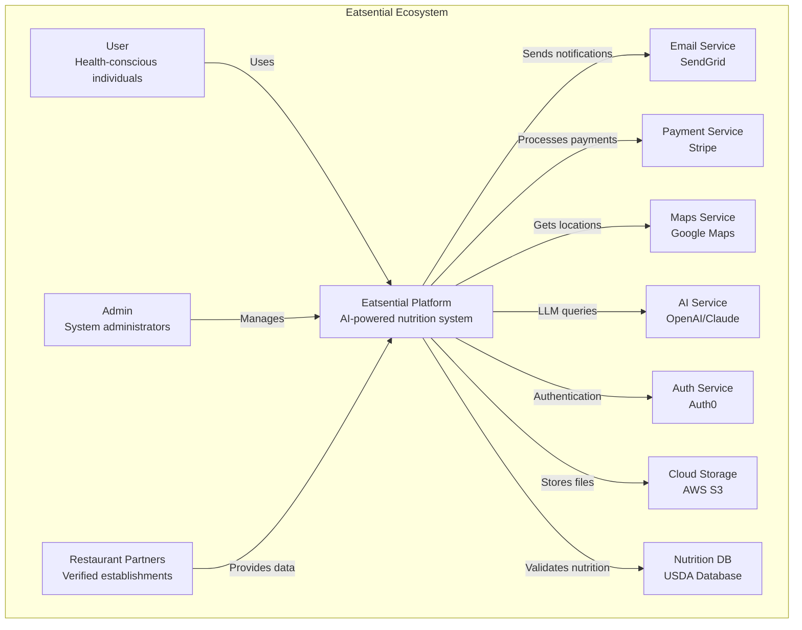

### 4.2 High-Level Architecture

**Frontend Layer:**

- React SPA with TypeScript
- Progressive Web App (PWA)
- Responsive design

**Backend Layer:**

- FastAPI (Python) microservices
- GraphQL Federation
- Event streaming (Kafka)

**Data Layer:**

- PostgreSQL (primary)
- Redis (caching)
- Elasticsearch (search)
- S3 (file storage)

**AI/ML Layer:**

- RAG pipeline
- LLM integration
- Custom ML models

---

## 5. Architectural Views

### 5.1 Logical View

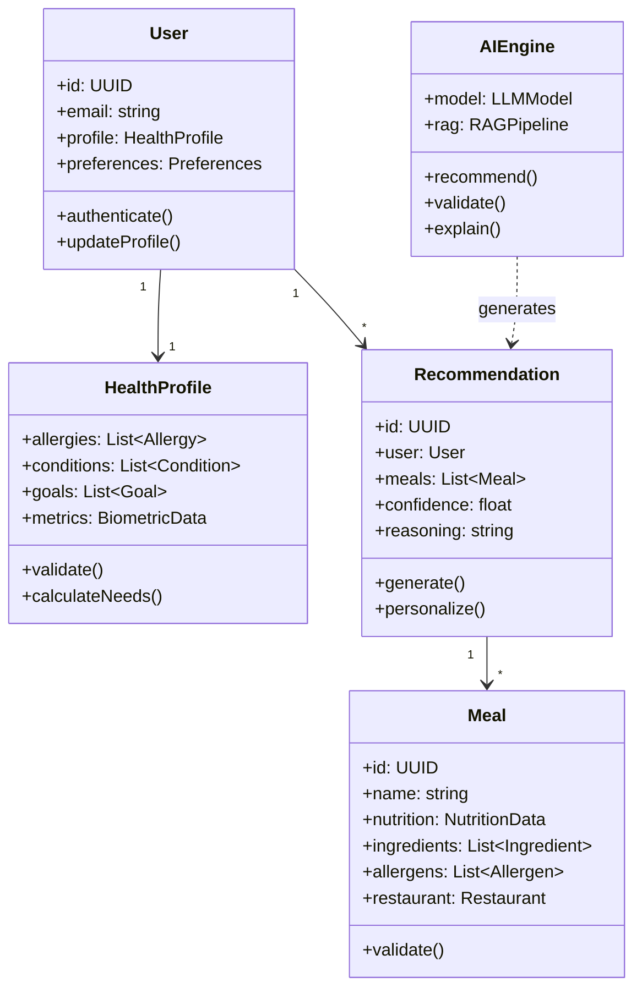

### 5.2 Process View

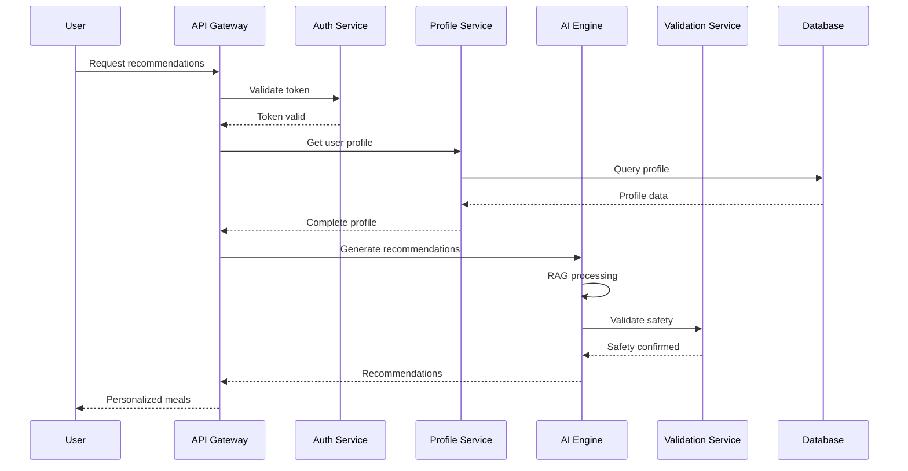

### 5.3 Development View

```
eatsential/
├── frontend/                 # React TypeScript SPA
│   ├── src/
│   │   ├── components/      # Reusable UI components
│   │   ├── pages/          # Route-based pages
│   │   ├── hooks/          # Custom React hooks
│   │   ├── services/       # API clients
│   │   ├── stores/         # State management
│   │   └── utils/          # Helper functions
│   └── public/             # Static assets
│
├── backend/                 # FastAPI microservices
│   ├── api-gateway/        # Kong/FastAPI gateway
│   ├── auth-service/       # Authentication
│   ├── profile-service/    # User profiles
│   ├── recommendation-service/ # AI recommendations
│   ├── restaurant-service/ # Restaurant data
│   ├── notification-service/ # Email/Push
│   └── shared/            # Common libraries
│
├── ai/                     # AI/ML components
│   ├── rag-pipeline/      # RAG implementation
│   ├── models/            # Custom ML models
│   ├── validators/        # Safety validators
│   └── training/          # Model training
│
├── infrastructure/         # IaC and deployment
│   ├── terraform/         # Infrastructure as Code
│   ├── kubernetes/        # K8s manifests
│   ├── docker/           # Dockerfiles
│   └── scripts/          # Deployment scripts
│
└── docs/                  # Documentation
```

---

## 6. System Architecture

### 6.1 Container Diagram (C4 Level 2)

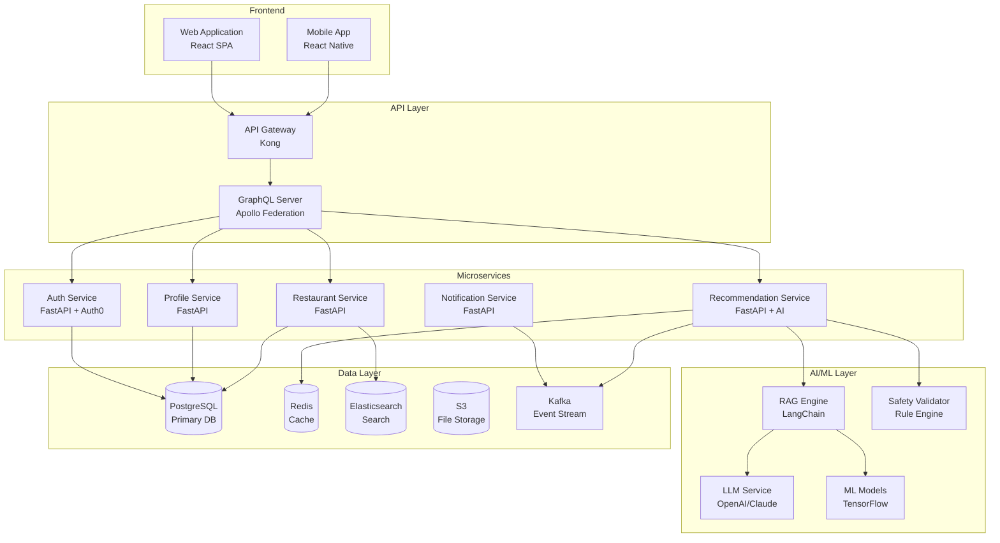

### 6.2 Component Diagram - Recommendation Service (C4 Level 3)

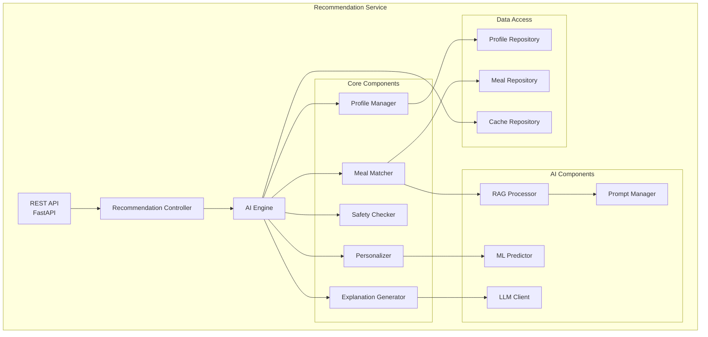

---

## 7. Data Architecture

### 7.1 Data Model Overview

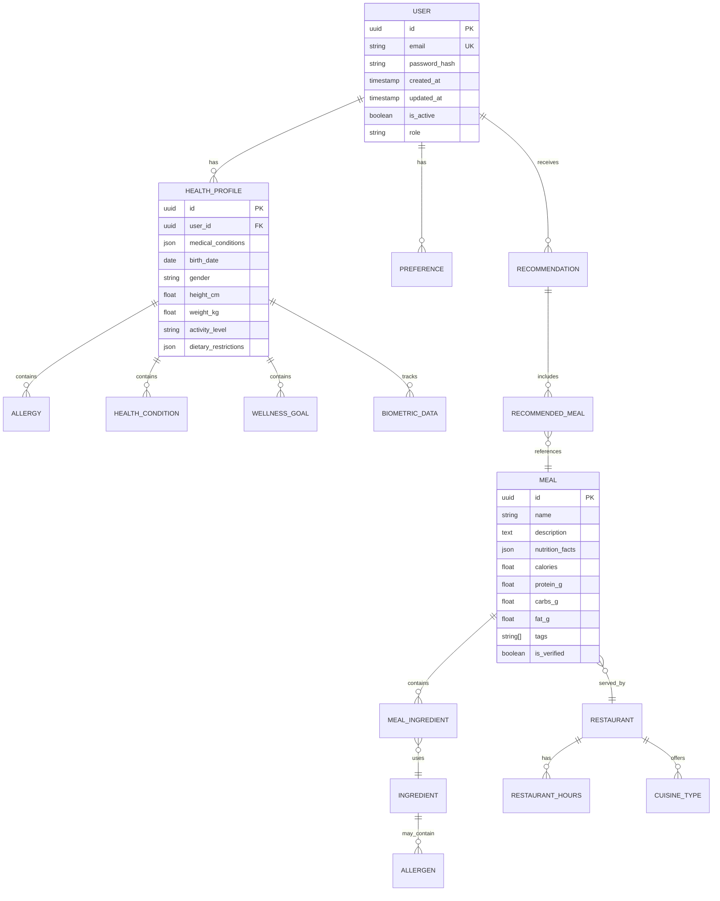

### 7.2 Data Flow Architecture

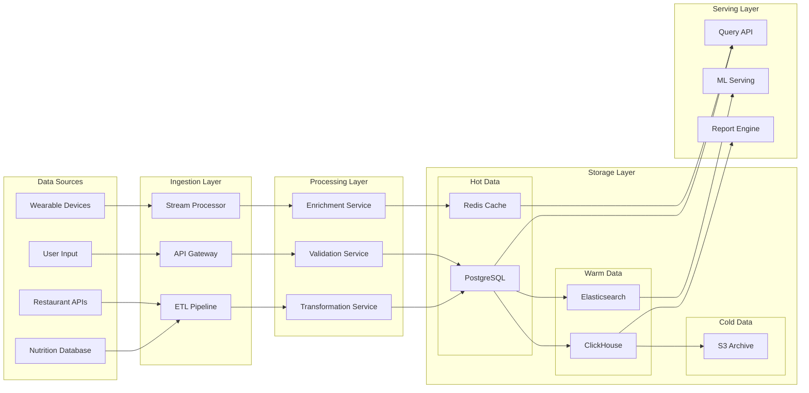

### 7.3 Data Governance

**Data Classification:**

- **Critical:** Health data, allergen info (encrypted, audited)
- **Sensitive:** PII, payment info (encrypted, restricted)
- **Internal:** Analytics, logs (pseudonymized)
- **Public:** Restaurant info, general nutrition

**Data Retention:**

- Active user data: Indefinite
- Inactive user data: 7 years
- Logs: 90 days
- Analytics: 2 years

---

## 8. Security Architecture

### 8.1 Security Layers

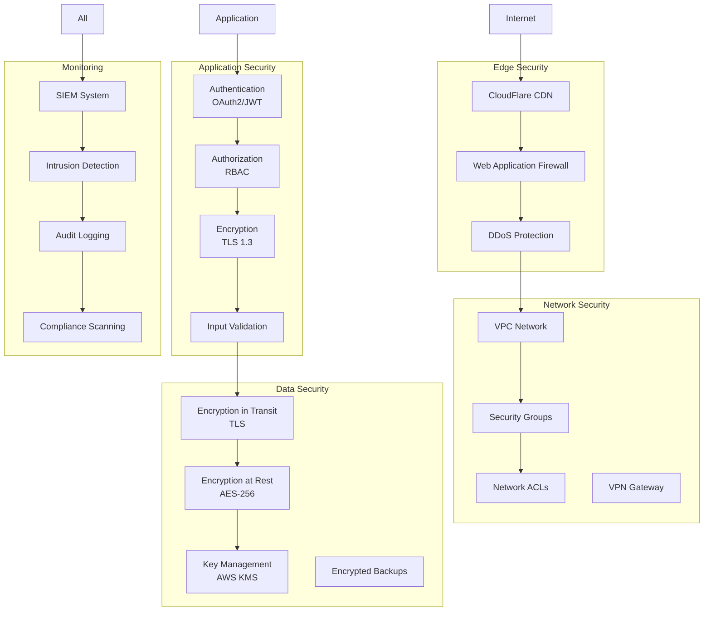

### 8.2 Authentication & Authorization

**Authentication Flow:**

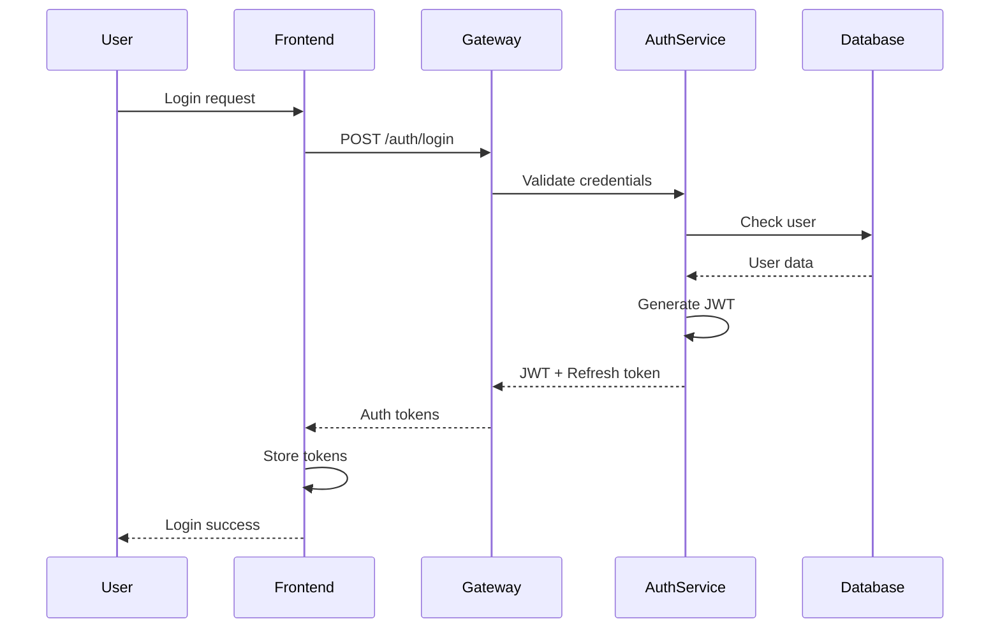

**Authorization Model:**

- **RBAC** with fine-grained permissions
- **Resource-based** access control
- **Attribute-based** policies for complex rules

### 8.3 Threat Model

| Threat            | Impact   | Mitigation                            |
| ----------------- | -------- | ------------------------------------- |
| **SQL Injection** | High     | Parameterized queries, ORMs           |
| **XSS**           | Medium   | Content Security Policy, sanitization |
| **CSRF**          | Medium   | CSRF tokens, SameSite cookies         |
| **Data Breach**   | Critical | Encryption, access controls           |
| **DDoS**          | High     | CloudFlare, rate limiting             |
| **API Abuse**     | Medium   | Rate limiting, API keys               |

---

## 9. AI/ML Architecture

### 9.1 RAG Pipeline Architecture

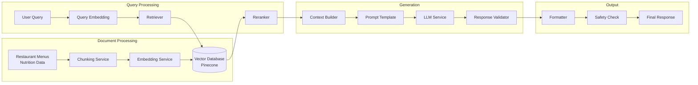

### 9.2 ML Model Architecture

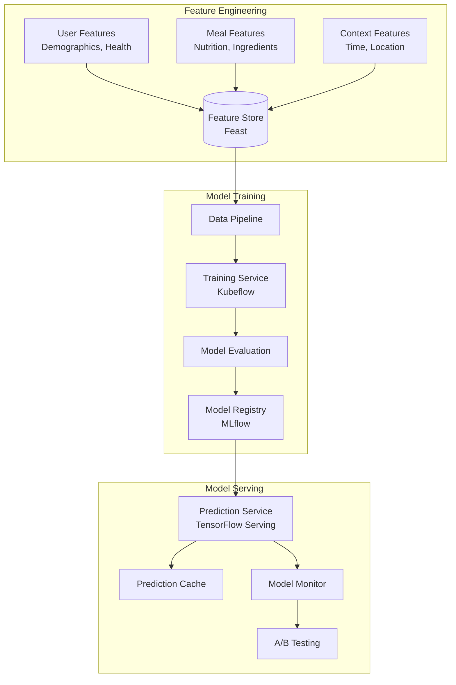

### 9.3 AI Safety Architecture

**Multi-Layer Safety System:**

1. **Input Validation**
   - Allergen keyword detection
   - Medical condition filtering
   - Age-appropriate recommendations

2. **RAG Safety**
   - Source verification
   - Fact-checking layer
   - Confidence thresholds

3. **Output Validation**
   - Rule-based checks
   - Human-in-the-loop for critical cases
   - Explanation generation

---

## 10. Deployment Architecture

### 10.1 Infrastructure Overview

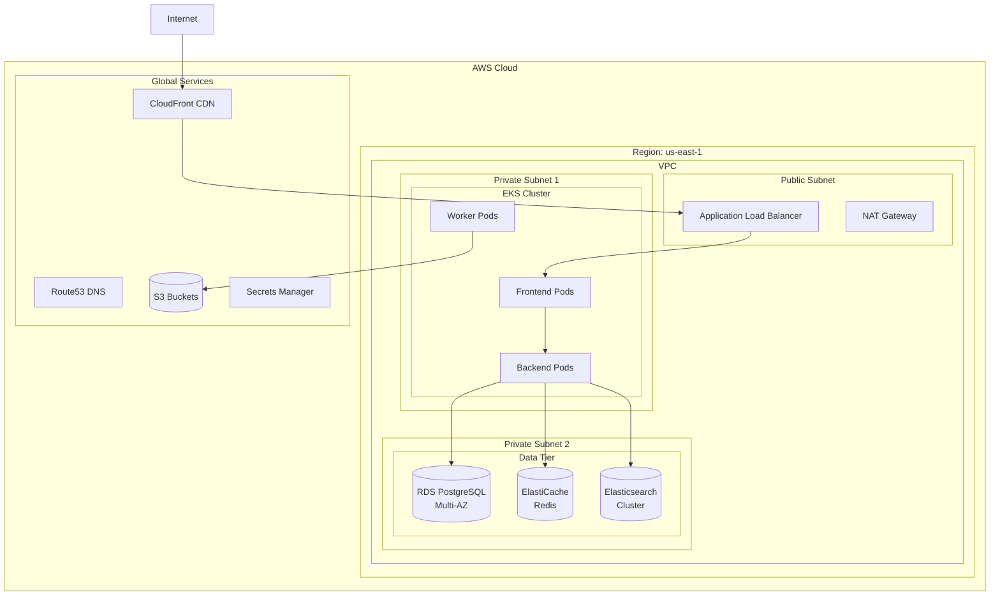

### 10.2 Kubernetes Architecture

```yaml
# Namespace Structure
namespaces:
  - eatsential-prod
  - eatsential-staging
  - eatsential-dev

# Key Deployments
deployments:
  frontend:
    replicas: 3
    resources:
      requests:
        cpu: 500m
        memory: 512Mi
      limits:
        cpu: 1000m
        memory: 1Gi

  backend-services:
    - name: auth-service
      replicas: 2
      autoscaling: true

    - name: profile-service
      replicas: 3
      autoscaling: true

    - name: recommendation-service
      replicas: 5
      autoscaling: true
      gpu: true # For ML inference

    - name: restaurant-service
      replicas: 3
      autoscaling: true

# Ingress Configuration
ingress:
  class: nginx
  tls: true
  cert-manager: letsencrypt

# Service Mesh
serviceMesh:
  provider: istio
  features:
    - mTLS
    - traffic-management
    - observability
```

### 10.3 CI/CD Pipeline

```mermaid
graph LR
    subgraph "Development"
        Dev[Developer]
        LocalTest[Local Tests]
    end

    subgraph "CI Pipeline"
        GitHub[GitHub]
        Actions[GitHub Actions]

        subgraph "Build Stage"
            Lint[Linting]
            UnitTest[Unit Tests]
            Build[Docker Build]
            Scan[Security Scan]
        end

        subgraph "Test Stage"
            IntTest[Integration Tests]
            E2ETest[E2E Tests]
            PerfTest[Performance Tests]
        end
    end

    subgraph "CD Pipeline"
        subgraph "Staging"
            StageHelm[Helm Deploy]
            StageTest[Smoke Tests]
            StageApprove[Manual Approval]
        end

        subgraph "Production"
            ProdHelm[Helm Deploy]
            ProdCanary[Canary Deploy]
            ProdMonitor[Monitoring]
            ProdRollback[Auto Rollback]
        end
    end

    Dev --> LocalTest
    LocalTest --> GitHub
    GitHub --> Actions

    Actions --> Lint
    Lint --> UnitTest
    UnitTest --> Build
    Build --> Scan

    Scan --> IntTest
    IntTest --> E2ETest
    E2ETest --> PerfTest

    PerfTest --> StageHelm
    StageHelm --> StageTest
    StageTest --> StageApprove

    StageApprove --> ProdHelm
    ProdHelm --> ProdCanary
    ProdCanary --> ProdMonitor
    ProdMonitor -.-> ProdRollback
```

---

## 11. Performance & Scalability

### 11.1 Performance Targets

| Metric                        | Target     | Current Design Capability |
| ----------------------------- | ---------- | ------------------------- |
| **API Response Time**         | <200ms p95 | 150ms (with caching)      |
| **Recommendation Generation** | <1s        | 800ms (with RAG)          |
| **Concurrent Users**          | 10,000     | 15,000                    |
| **Requests/Second**           | 5,000      | 7,500                     |
| **Database Queries**          | <50ms      | 30ms (with indexing)      |
| **Cache Hit Rate**            | >80%       | 85% (Redis)               |

### 11.2 Scalability Strategy

**Horizontal Scaling:**

- Kubernetes HPA for automatic pod scaling
- Database read replicas
- Elasticsearch cluster expansion
- CDN for static assets

**Vertical Scaling:**

- GPU nodes for ML inference
- High-memory nodes for caching
- Optimized instance types

**Data Partitioning:**

- User data sharded by user_id
- Time-series data partitioned by date
- Geographic sharding for restaurants

### 11.3 Caching Strategy

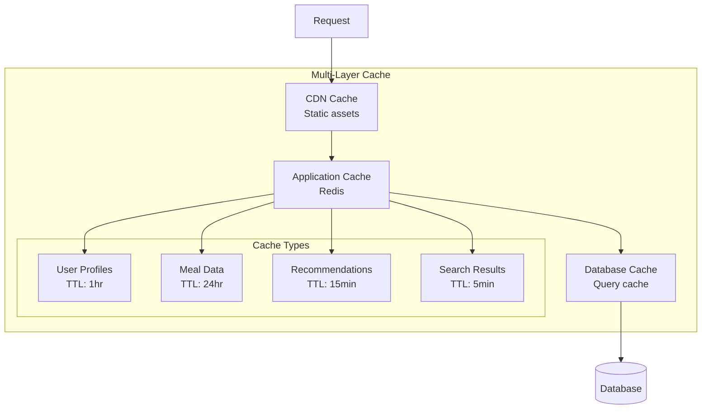

---

## 12. Architectural Decisions

### 12.1 Key Design Decisions (ADRs)

#### ADR-001: Microservices Architecture

**Status:** Accepted  
**Context:** Need for independent scaling and deployment  
**Decision:** Adopt microservices with API Gateway  
**Consequences:** Higher complexity, better scalability

#### ADR-002: RAG for Recommendations

**Status:** Accepted  
**Context:** Need accurate, explainable AI recommendations  
**Decision:** Implement RAG pipeline with vector database  
**Consequences:** Better accuracy, higher infrastructure cost

#### ADR-003: Event-Driven Communication

**Status:** Accepted  
**Context:** Need for real-time updates and decoupling  
**Decision:** Use Kafka for event streaming  
**Consequences:** Eventual consistency, better scalability

#### ADR-004: PostgreSQL as Primary Database

**Status:** Accepted  
**Context:** Need for ACID compliance and complex queries  
**Decision:** PostgreSQL with read replicas  
**Consequences:** Strong consistency, vertical scaling limits

### 12.2 Technology Stack Summary

| Layer              | Technology           | Justification                 |
| ------------------ | -------------------- | ----------------------------- |
| **Frontend**       | React + TypeScript   | Type safety, ecosystem        |
| **Mobile**         | React Native         | Code reuse, performance       |
| **API**            | FastAPI              | Performance, async support    |
| **Gateway**        | Kong                 | Features, extensibility       |
| **Database**       | PostgreSQL           | ACID, JSON support            |
| **Cache**          | Redis                | Performance, features         |
| **Search**         | Elasticsearch        | Full-text search, analytics   |
| **ML**             | TensorFlow + PyTorch | Flexibility, ecosystem        |
| **LLM**            | OpenAI/Claude        | Capability, reliability       |
| **Infrastructure** | AWS + Kubernetes     | Scalability, managed services |

### 12.3 Future Considerations

**Phase 2 Enhancements:**

- GraphQL federation for better API flexibility
- Service mesh (Istio) for advanced traffic management
- Multi-region deployment for global scale
- Edge computing for reduced latency
- Blockchain for health data integrity

---

## Appendices

### Appendix A: Component Interfaces

```python
# Example: Recommendation Service Interface
from typing import List, Optional
from pydantic import BaseModel
from datetime import datetime

class RecommendationRequest(BaseModel):
    user_id: str
    meal_type: str  # breakfast, lunch, dinner, snack
    preferences: Optional[dict] = {}
    location: Optional[dict] = {}
    time_constraint: Optional[int] = None  # minutes

class RecommendationResponse(BaseModel):
    recommendations: List[MealRecommendation]
    generated_at: datetime
    confidence_score: float
    explanation: str

class RecommendationService:
    async def get_recommendations(
        self,
        request: RecommendationRequest
    ) -> RecommendationResponse:
        """Generate personalized meal recommendations"""
        pass

    async def validate_safety(
        self,
        user_id: str,
        meal_id: str
    ) -> SafetyValidation:
        """Validate meal safety for user"""
        pass
```

### Appendix B: Database Schema Excerpts

```sql
-- Core user health profile table
CREATE TABLE health_profiles (
    id UUID PRIMARY KEY DEFAULT gen_random_uuid(),
    user_id UUID NOT NULL REFERENCES users(id),
    created_at TIMESTAMP NOT NULL DEFAULT CURRENT_TIMESTAMP,
    updated_at TIMESTAMP NOT NULL DEFAULT CURRENT_TIMESTAMP,

    -- Medical information (encrypted)
    allergies JSONB NOT NULL DEFAULT '[]',
    medical_conditions JSONB NOT NULL DEFAULT '[]',
    medications JSONB NOT NULL DEFAULT '[]',

    -- Biometric data
    birth_date DATE,
    biological_sex VARCHAR(10),
    height_cm DECIMAL(5,2),
    weight_kg DECIMAL(5,2),
    activity_level VARCHAR(20),

    -- Preferences and goals
    dietary_preferences JSONB NOT NULL DEFAULT '{}',
    wellness_goals JSONB NOT NULL DEFAULT '[]',

    -- Constraints
    CONSTRAINT valid_height CHECK (height_cm > 0 AND height_cm < 300),
    CONSTRAINT valid_weight CHECK (weight_kg > 0 AND weight_kg < 500)
);

-- Indexes for performance
CREATE INDEX idx_health_profiles_user_id ON health_profiles(user_id);
CREATE INDEX idx_health_profiles_allergies ON health_profiles USING GIN(allergies);
```

### Appendix C: Monitoring & Observability

**Key Metrics:**

- Request rate and latency (Prometheus)
- Error rates and types (Sentry)
- Resource utilization (DataDog)
- Business metrics (Custom dashboards)

**Distributed Tracing:**

- Jaeger for request tracing
- Correlation IDs across services
- Performance bottleneck identification

**Logging Strategy:**

- Structured JSON logs
- Centralized in ELK stack
- Log levels: ERROR, WARN, INFO, DEBUG
- PII redaction in logs

---

**Document Status:** APPROVED  
**Last Technical Review:** October 19, 2025  
**Next Review:** End of MVP Phase 1
