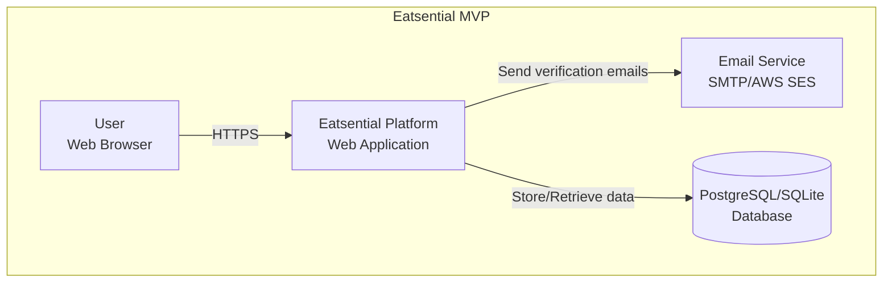
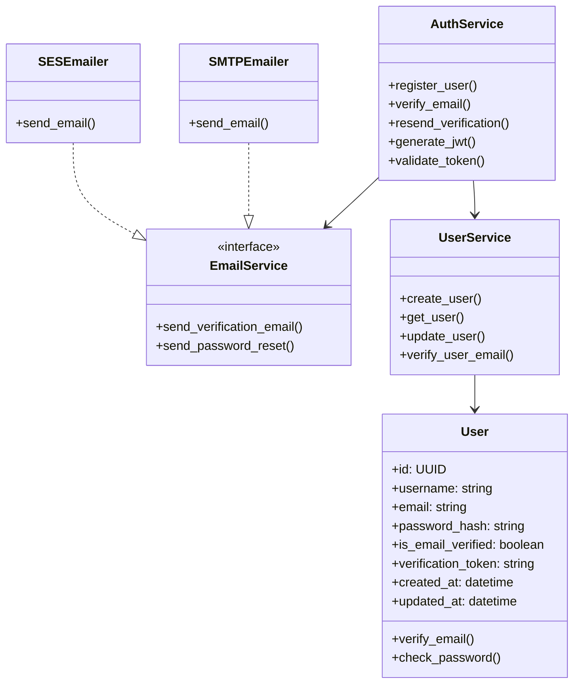
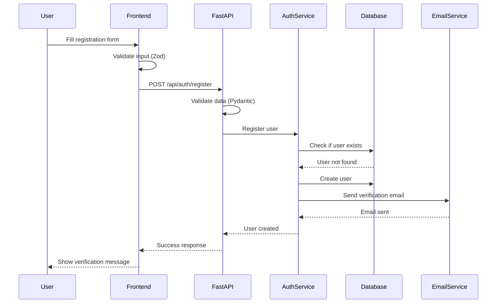
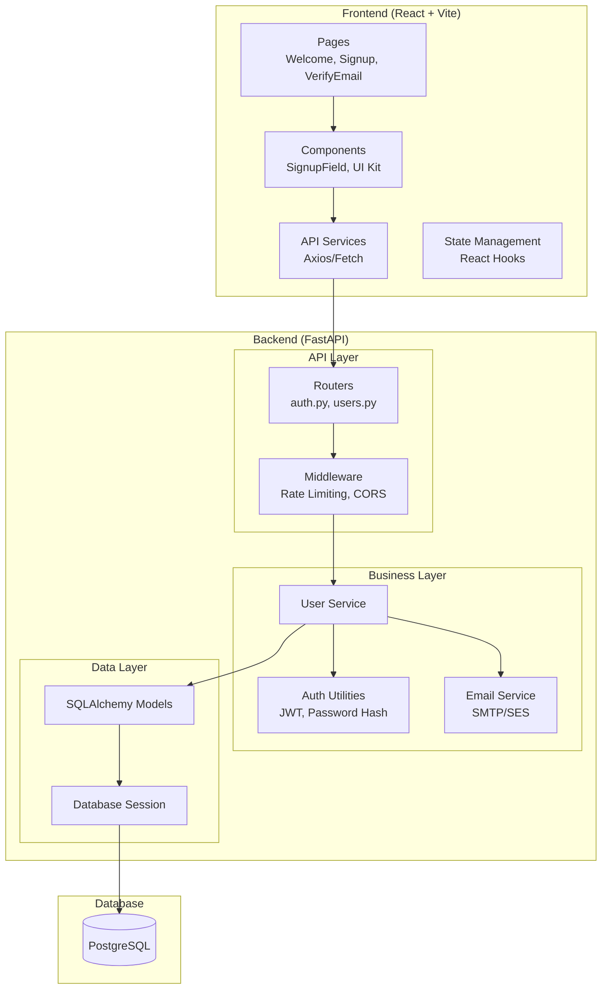
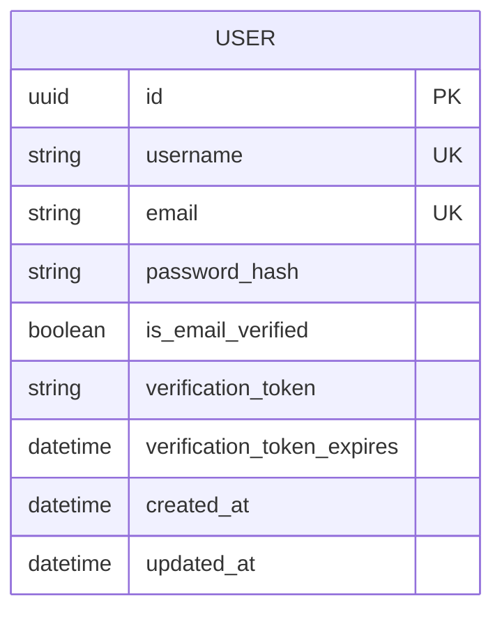
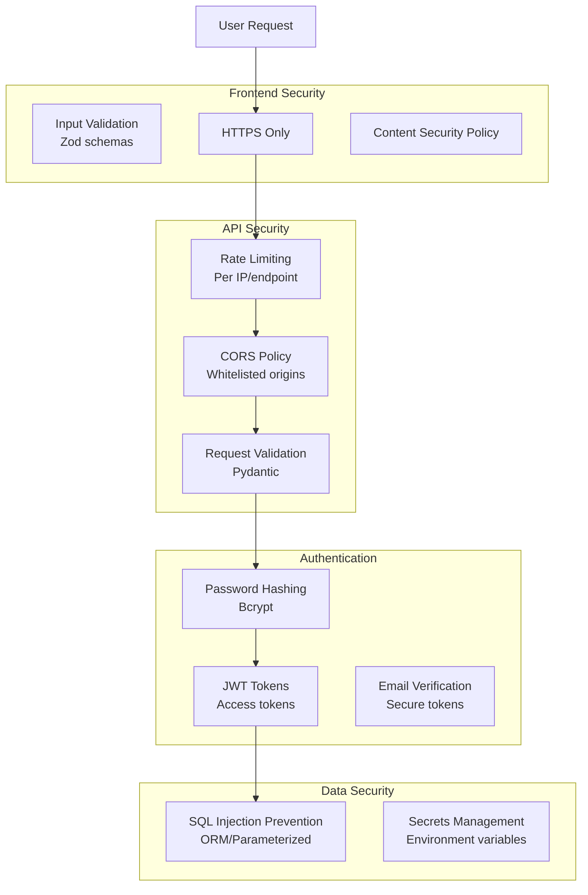
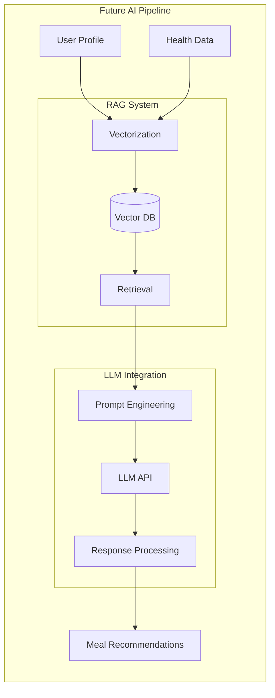
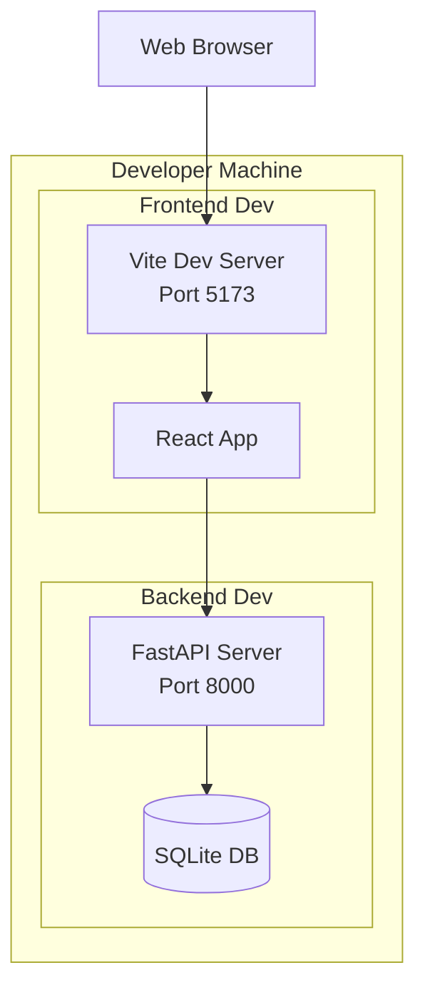
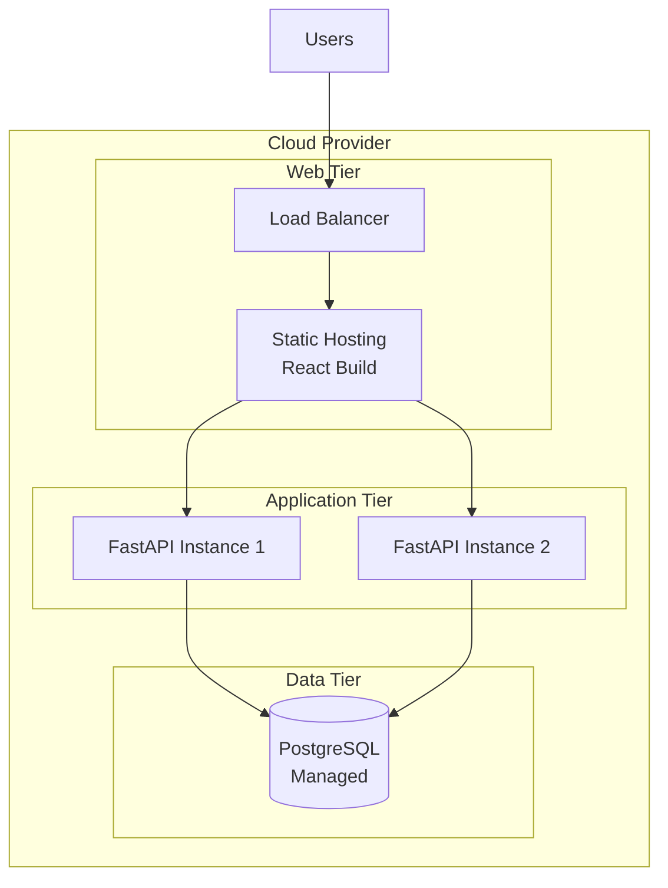

# Software Architecture Document (SAD)

**Project:** Eatsential - Precision Nutrition Platform  
**Document Type:** Master Architecture Document (IEEE 1471/ISO 42010)  
**Version:** 2.0  
**Date:** October 21, 2025  
**Architect:** Technical Lead

---

## Document Information

**Related Documents:**

- [SRS Master](../../2-SRS/SRS-MASTER.md)
- [Project Charter](../../0-INITIATION/project-charter.md)
- [Risk Management](../../1-SPP/risk-management.md)
- [Backend README](../../../backend/README.md)

---

## Table of Contents

1. [Introduction](#1-introduction)
2. [Architectural Representation](#2-architectural-representation)
3. [Architectural Goals and Constraints](#3-architectural-goals-and-constraints)
4. [System Overview](#4-system-overview)
5. [Architectural Views](#5-architectural-views)
6. [System Architecture](#6-system-architecture)
7. [Data Architecture](#7-data-architecture)
8. [Security Architecture](#8-security-architecture)
9. [AI/ML Architecture (Future)](#9-aiml-architecture-future)
10. [Deployment Architecture](#10-deployment-architecture)
11. [Performance & Scalability](#11-performance--scalability)
12. [Architectural Decisions](#12-architectural-decisions)

---

## 1. Introduction

### 1.1 Purpose

This Software Architecture Document provides a comprehensive architectural overview of the Eatsential platform, using multiple architectural views to depict different aspects of the system. It serves as a communication medium between the software architect and other project team members regarding architecturally significant decisions.

**Note:** This document has been updated to reflect the actual MVP implementation as of October 2025.

### 1.2 Scope

This document describes the architecture of Eatsential MVP (Version 1.0), currently implementing core authentication and user management features. The system is designed to eventually become an AI-powered precision nutrition platform that provides personalized meal recommendations based on individual health profiles, dietary restrictions, and wellness goals.

### 1.3 Definitions and Acronyms

| Term      | Definition                                          |
| --------- | --------------------------------------------------- |
| **RAG**   | Retrieval-Augmented Generation (Future)             |
| **LLM**   | Large Language Model (Future)                       |
| **API**   | Application Programming Interface                   |
| **ML**    | Machine Learning (Future)                           |
| **HIPAA** | Health Insurance Portability and Accountability Act |
| **PII**   | Personally Identifiable Information                 |
| **JWT**   | JSON Web Token                                      |
| **ORM**   | Object-Relational Mapping                           |

---

## 2. Architectural Representation

### 2.1 Architecture Framework

The current MVP follows a **Monolithic Architecture** with clear separation of concerns:

- **Frontend:** Single Page Application (SPA)
- **Backend:** RESTful API with layered architecture
- **Database:** Relational database with ORM

Future phases will consider migration to microservices as the system scales.

### 2.2 Architectural Patterns

**Current Patterns:**

- **Layered Architecture** - Clear separation between presentation, business, and data layers
- **MVC Pattern** - Model-View-Controller in both frontend and backend
- **Repository Pattern** - Data access abstraction
- **Service Layer Pattern** - Business logic encapsulation

**Future Patterns (Planned):**

- **Microservices Architecture** - For scalability
- **Event-Driven Architecture** - For real-time features
- **RAG Pattern** - For AI recommendations

---

## 3. Architectural Goals and Constraints

### 3.1 Business Goals

1. **Rapid MVP Delivery:** Working authentication system in 8 weeks
2. **Security First:** Secure user data and authentication
3. **Extensibility:** Easy to add new features
4. **Developer Productivity:** Simple local development
5. **Cost Efficiency:** Minimal infrastructure costs for MVP

### 3.2 Technical Constraints

1. **Team Size:** 4-person development team
2. **Timeline:** 8-week MVP deadline
3. **Budget:** Limited infrastructure budget
4. **Technology:** Python/TypeScript expertise
5. **Deployment:** Simple deployment process

### 3.3 Quality Attributes

| Attribute           | Priority | Current Target  | Future Target        |
| ------------------- | -------- | --------------- | -------------------- |
| **Security**        | Critical | Secure auth     | HIPAA compliance     |
| **Performance**     | Medium   | <500ms response | <200ms p95           |
| **Scalability**     | Low      | 100 concurrent  | 10K concurrent users |
| **Reliability**     | High     | 95% uptime      | 99.9% uptime         |
| **Maintainability** | High     | Clean code      | <4hr fix time        |
| **Usability**       | High     | Simple UI       | <5min onboarding     |

---

## 4. System Overview

### 4.1 System Context Diagram (Current Implementation)



### 4.2 High-Level Architecture (Current)

**Frontend Layer:**

- React SPA with TypeScript
- Vite build tool
- TailwindCSS for styling
- React Router for navigation
- React Hook Form + Zod for validation

**Backend Layer:**

- FastAPI monolithic application
- SQLAlchemy ORM
- Pydantic for validation
- JWT authentication
- Email service abstraction

**Data Layer:**

- PostgreSQL (production)
- SQLite (development)
- Alembic for migrations

---

## 5. Architectural Views

### 5.1 Logical View (Current Implementation)



### 5.2 Process View (Current Implementation)



### 5.3 Development View (Current Structure)

```
eatsential/
├── frontend/                 # React TypeScript SPA
│   ├── src/
│   │   ├── components/      # Reusable UI components
│   │   │   ├── ui/         # Base UI components
│   │   │   └── *.tsx       # Feature components
│   │   ├── pages/          # Route-based pages
│   │   ├── assets/         # Images and static files
│   │   ├── lib/            # Utilities
│   │   └── main.tsx        # Entry point
│   ├── index.html          # HTML template
│   └── vite.config.ts      # Vite configuration
│
├── backend/                 # FastAPI application
│   ├── src/
│   │   └── eatsential/
│   │       ├── routers/    # API endpoints
│   │       ├── services/   # Business logic
│   │       ├── middleware/ # Request processing
│   │       ├── models.py   # SQLAlchemy models
│   │       ├── schemas.py  # Pydantic schemas
│   │       ├── database.py # DB configuration
│   │       └── index.py    # FastAPI app
│   ├── alembic/            # Database migrations
│   └── tests/              # Unit and integration tests
│
└── docs/                   # Documentation
```

---

## 6. System Architecture

### 6.1 Component Diagram (Current Implementation)



### 6.2 API Structure

**Current Endpoints:**

```
GET  /api                     # Health check
POST /api/auth/register       # User registration
GET  /api/auth/verify-email/{token}  # Email verification
POST /api/auth/resend-verification   # Resend verification email
```

**Planned Endpoints:**

```
POST /api/auth/login          # User login
POST /api/auth/logout         # User logout
POST /api/auth/refresh        # Refresh JWT token
GET  /api/users/me            # Get current user
PUT  /api/users/me            # Update user profile
```

---

## 7. Data Architecture

### 7.1 Data Model (Current Implementation)



### 7.2 Database Schema

```sql
-- Current implementation
CREATE TABLE users (
    id UUID PRIMARY KEY DEFAULT gen_random_uuid(),
    username VARCHAR(20) UNIQUE NOT NULL,
    email VARCHAR(255) UNIQUE NOT NULL,
    password_hash VARCHAR(255) NOT NULL,
    is_email_verified BOOLEAN DEFAULT FALSE,
    verification_token VARCHAR(255),
    verification_token_expires TIMESTAMP,
    created_at TIMESTAMP NOT NULL DEFAULT CURRENT_TIMESTAMP,
    updated_at TIMESTAMP NOT NULL DEFAULT CURRENT_TIMESTAMP
);

-- Indexes
CREATE INDEX idx_users_email ON users(email);
CREATE INDEX idx_users_username ON users(username);
CREATE INDEX idx_users_verification_token ON users(verification_token);
```

### 7.3 Data Flow

1. **User Registration:**
   - Frontend validates input
   - Backend validates and hashes password
   - User record created with verification token
   - Email sent with verification link

2. **Email Verification:**
   - User clicks verification link
   - Backend validates token and expiry
   - User record updated to verified status

---

## 8. Security Architecture

### 8.1 Current Security Implementation



### 8.2 Security Measures

**Implemented:**

1. **Password Security:**
   - Bcrypt hashing with salt
   - Minimum 8 characters with complexity requirements
   - No password storage in plain text

2. **Authentication:**
   - JWT tokens for session management
   - Email verification required
   - Secure token generation

3. **API Security:**
   - Rate limiting (100 requests/minute)
   - CORS configuration
   - Input validation at multiple layers

4. **Data Protection:**
   - SQL injection prevention via ORM
   - Environment-based secrets
   - HTTPS in production

**Planned:**

- Two-factor authentication
- OAuth2 social login
- API key management
- Audit logging

---

## 9. AI/ML Architecture (Future)

### 9.1 Planned AI Components

This section describes the future AI architecture, not yet implemented in MVP:



---

## 10. Deployment Architecture

### 10.1 Current Development Setup



### 10.2 Production Deployment (Planned)



### 10.3 Deployment Process

**Current (Development):**

```bash
# Frontend
cd frontend
npm install
npm run dev

# Backend
cd backend
uv sync
uv run fastapi dev src/eatsential/index.py
```

**Future (Production):**

- Docker containers for both frontend and backend
- CI/CD pipeline with GitHub Actions
- Automated testing and deployment
- Environment-based configuration

---

## 11. Performance & Scalability

### 11.1 Current Performance

| Metric               | Current Performance | Target |
| -------------------- | ------------------- | ------ |
| **API Response**     | ~200-300ms          | <200ms |
| **Page Load**        | ~1-2s               | <1s    |
| **Concurrent Users** | ~50-100             | 1000+  |
| **Database Queries** | ~50-100ms           | <50ms  |

### 11.2 Optimization Strategies

**Implemented:**

- Indexed database columns
- Efficient ORM queries
- Frontend code splitting
- Development hot reload

**Planned:**

- Redis caching layer
- Database connection pooling
- CDN for static assets
- API response compression
- Database query optimization

---

## 12. Architectural Decisions

### 12.1 Key Design Decisions (ADRs)

#### ADR-001: Monolithic Architecture for MVP

**Status:** Accepted  
**Context:** Small team, tight deadline, need for rapid development  
**Decision:** Start with monolithic FastAPI application  
**Consequences:** Faster development, easier debugging, limited initial scalability

#### ADR-002: FastAPI Framework

**Status:** Accepted  
**Context:** Need for modern Python web framework with good performance  
**Decision:** Use FastAPI for backend API  
**Consequences:** Automatic API documentation, type safety, async support

#### ADR-003: React + Vite for Frontend

**Status:** Accepted  
**Context:** Need for fast development and hot reload  
**Decision:** Use Vite instead of Create React App  
**Consequences:** Faster builds, better developer experience, modern tooling

#### ADR-004: SQLAlchemy ORM

**Status:** Accepted  
**Context:** Need for database abstraction and migrations  
**Decision:** Use SQLAlchemy with Alembic  
**Consequences:** Database portability, easier queries, some performance overhead

### 12.2 Technology Stack Summary

| Layer          | Technology         | Justification                    |
| -------------- | ------------------ | -------------------------------- |
| **Frontend**   | React + TypeScript | Type safety, component ecosystem |
| **Build Tool** | Vite               | Fast builds, modern features     |
| **Styling**    | TailwindCSS        | Utility-first, rapid development |
| **Backend**    | FastAPI            | Performance, auto-documentation  |
| **Database**   | PostgreSQL/SQLite  | Reliability, SQL features        |
| **ORM**        | SQLAlchemy         | Mature, feature-rich             |
| **Email**      | SMTP/AWS SES       | Flexibility, reliability         |
| **Testing**    | Pytest/Vitest      | Comprehensive testing            |
| **Deployment** | Docker (planned)   | Consistency, portability         |

### 12.3 Future Evolution

**Phase 2 (Months 3-6):**

- Add health profile management
- Implement meal recommendation engine
- Add Redis caching
- Deploy to cloud provider

**Phase 3 (Months 6-12):**

- Integrate AI/LLM features
- Add restaurant integration
- Implement real-time features
- Consider microservices migration

---

## Appendices

### Appendix A: Current API Examples

```python
# User Registration Request
POST /api/auth/register
{
    "username": "john_doe",
    "email": "john@example.com",
    "password": "SecurePass123!"
}

# Response
{
    "id": "123e4567-e89b-12d3-a456-426614174000",
    "username": "john_doe",
    "email": "john@example.com",
    "message": "Success! Please check your email for verification instructions."
}
```

### Appendix B: Development Guidelines

1. **Code Organization:**
   - Frontend: Feature-based folders
   - Backend: Layer-based organization
   - Shared: Common types and utilities

2. **Testing Strategy:**
   - Unit tests for business logic
   - Integration tests for API endpoints
   - E2E tests for critical user flows

3. **Security Practices:**
   - Never commit secrets
   - Use environment variables
   - Validate all inputs
   - Hash sensitive data

---

**Document Status:** UPDATED  
**Last Technical Review:** October 21, 2025  
**Next Review:** End of MVP Phase 1

**Changes in Version 2.0:**

- Updated to reflect actual MVP implementation
- Removed unimplemented features (microservices, Kafka, etc.)
- Added current technology stack details
- Clarified future vs. current architecture
- Added actual code structure and examples
