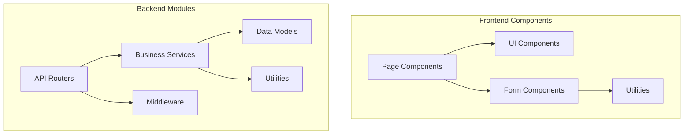

# System Design Document (SDD)

**Project:** Eatsential - Precision Nutrition Platform  
**Document Type:** System Design Document (IEEE 1016)  
**Version:** 1.0  
**Date:** October 21, 2025  
**Lead Developer:** Development Team

---

## Document Information

**Related Documents:**

- [SAD Master](../3.1-SAD/SAD-MASTER.md)
- [SRS Master](../../2-SRS/SRS-MASTER.md)
- [Backend README](../../../backend/README.md)
- [Frontend README](../../../frontend/README.md)

---

## Table of Contents

1. [Introduction](#1-introduction)
2. [System Overview](#2-system-overview)
3. [Design Considerations](#3-design-considerations)
4. [Architectural Design](#4-architectural-design)
5. [Module Design](#5-module-design)
6. [Interface Design](#6-interface-design)
7. [Database Design](#7-database-design)
8. [User Interface Design](#8-user-interface-design)
9. [Algorithm Design](#9-algorithm-design)
10. [Error Handling](#10-error-handling)

---

## 1. Introduction

### 1.1 Purpose

This System Design Document (SDD) provides a detailed description of the design and implementation of the Eatsential MVP. It translates the software architecture described in the SAD into detailed design specifications that developers can implement.

### 1.2 Scope

This document covers the detailed design of:

- User authentication and registration system
- Email verification workflow
- Frontend components and pages
- Backend API services
- Database schema and operations
- Security implementations

### 1.3 Design Principles

1. **Separation of Concerns:** Clear boundaries between layers
2. **DRY (Don't Repeat Yourself):** Reusable components and services
3. **SOLID Principles:** Maintainable object-oriented design
4. **Security by Design:** Security considerations in every component
5. **Test-Driven Development:** Testable design patterns

---

## 2. System Overview

### 2.1 Component Overview



### 2.2 Technology Stack Details

| Component          | Technology        | Version | Purpose                    |
| ------------------ | ----------------- | ------- | -------------------------- |
| Frontend Framework | React             | 18.3    | UI Components              |
| Type System        | TypeScript        | 5.6     | Type Safety                |
| Build Tool         | Vite              | 6.0     | Fast Development           |
| Styling            | TailwindCSS       | 3.4     | Utility CSS                |
| Form Handling      | React Hook Form   | 7.x     | Form Management            |
| Validation         | Zod               | 3.x     | Schema Validation          |
| Backend Framework  | FastAPI           | 0.115   | REST API                   |
| ORM                | SQLAlchemy        | 2.0     | Database Abstraction       |
| Validation         | Pydantic          | 2.x     | Data Validation            |
| Authentication     | python-jose       | 3.x     | JWT Tokens                 |
| Password Hashing   | passlib[bcrypt]   | 1.7     | Secure Passwords           |
| Email Service      | smtp/boto3        | Latest  | Email Delivery             |

---

## 3. Design Considerations

### 3.1 Assumptions

1. Users have modern web browsers (Chrome, Firefox, Safari, Edge)
2. JavaScript is enabled on client browsers
3. HTTPS is available in production
4. Email delivery is reliable (with retry mechanisms)
5. Database supports UUID generation

### 3.2 Constraints

1. Single database instance (no read replicas initially)
2. Synchronous request processing (no background jobs yet)
3. Limited to email/password authentication (no OAuth yet)
4. English language only (no i18n yet)

### 3.3 Performance Requirements

- Page load: < 2 seconds
- API response: < 500ms for auth operations
- Concurrent users: Support 100 simultaneous users
- Database connections: Pool size of 20

---

## 4. Architectural Design

### 4.1 Frontend Architecture

```typescript
// Component Hierarchy
App
├── Router
│   ├── Welcome (/)
│   ├── Signup (/signup)
│   ├── VerifyEmail (/verify-email)
│   └── Dashboard (/dashboard)
├── Providers
│   └── ErrorBoundary
└── GlobalStyles
```

### 4.2 Backend Architecture

```python
# Layer Architecture
FastAPI Application
├── Routers (Presentation Layer)
│   ├── auth.py
│   └── users.py
├── Services (Business Layer)
│   └── user_service.py
├── Models (Data Layer)
│   └── models.py
├── Middleware
│   └── rate_limit.py
└── Utilities
    ├── auth_util.py
    ├── emailer.py
    └── database.py
```

---

## 5. Module Design

### 5.1 Frontend Modules

#### 5.1.1 SignupField Component

```typescript
// Purpose: Handle user registration form
interface SignupFieldProps {
  onSuccess?: () => void;
  onError?: (error: Error) => void;
}

// Schema Definition
const signupSchema = z.object({
  username: z.string()
    .min(3, { message: 'Username must be at least 3 characters' })
    .max(20, { message: 'Username must be at most 20 characters' })
    .regex(/^[a-zA-Z0-9_-]+$/),
  email: z.string().email({ message: 'Invalid email address' }),
  password: z.string()
    .min(8, { message: 'Password must be at least 8 characters' })
    .max(48, { message: 'Password must be at most 48 characters' })
    .regex(/[A-Z]/, { message: 'Password must contain uppercase' })
    .regex(/[a-z]/, { message: 'Password must contain lowercase' })
    .regex(/[0-9]/, { message: 'Password must contain number' })
    .regex(/[!@#$%^&*(),.?":{}|<>]/, { message: 'Password must contain special character' })
});

// Component Structure
function SignupField({ onSuccess, onError }: SignupFieldProps) {
  // 1. Form state management with React Hook Form
  // 2. API call to /api/auth/register
  // 3. Success/Error handling
  // 4. Navigation to verification page
}
```

#### 5.1.2 VerifyEmail Component

```typescript
// Purpose: Handle email verification flow
interface VerifyEmailState {
  status: 'verifying' | 'success' | 'error' | 'expired';
  message: string;
}

function VerifyEmail() {
  // 1. Extract token from URL params
  // 2. Call verification API
  // 3. Display appropriate status
  // 4. Provide resend option if needed
}
```

### 5.2 Backend Modules

#### 5.2.1 Authentication Router

```python
# auth.py - API endpoints for authentication
from fastapi import APIRouter, Depends, HTTPException
from sqlalchemy.orm import Session

router = APIRouter(prefix="/auth", tags=["authentication"])

@router.post("/register", response_model=UserResponse, status_code=201)
async def register_user(
    user_data: UserCreate,
    db: Session = Depends(get_db)
):
    """
    Register a new user
    1. Validate input data
    2. Check for existing user
    3. Hash password
    4. Create user record
    5. Send verification email
    6. Return success response
    """
    pass

@router.get("/verify-email/{token}", response_model=MessageResponse)
async def verify_email(token: str, db: Session = Depends(get_db)):
    """
    Verify user email
    1. Validate token format
    2. Check token existence and expiry
    3. Update user verification status
    4. Return success/error response
    """
    pass
```

#### 5.2.2 User Service

```python
# user_service.py - Business logic for user operations
from datetime import datetime, timedelta
import secrets
from passlib.context import CryptContext

pwd_context = CryptContext(schemes=["bcrypt"], deprecated="auto")

async def create_user(db: Session, user_data: UserCreate) -> User:
    """
    Create a new user with email verification
    
    Steps:
    1. Check if username/email already exists
    2. Generate verification token
    3. Hash password
    4. Create user record
    5. Send verification email
    6. Handle errors appropriately
    """
    # Check existing user
    existing = db.query(User).filter(
        (User.email == user_data.email) | 
        (User.username == user_data.username)
    ).first()
    
    if existing:
        if existing.email == user_data.email:
            raise HTTPException(status_code=400, detail="Email already registered")
        else:
            raise HTTPException(status_code=400, detail="Username already taken")
    
    # Generate secure token
    verification_token = secrets.urlsafe_token()
    token_expires = datetime.utcnow() + timedelta(hours=24)
    
    # Hash password
    password_hash = pwd_context.hash(user_data.password)
    
    # Create user
    user = User(
        username=user_data.username,
        email=user_data.email,
        password_hash=password_hash,
        verification_token=verification_token,
        verification_token_expires=token_expires,
        is_email_verified=False
    )
    
    db.add(user)
    db.commit()
    db.refresh(user)
    
    # Send email
    await send_verification_email(user.email, verification_token)
    
    return user
```

---

## 6. Interface Design

### 6.1 API Interface Specifications

#### 6.1.1 User Registration

```yaml
endpoint: POST /api/auth/register
description: Register a new user account
request:
  content-type: application/json
  schema:
    type: object
    required: [username, email, password]
    properties:
      username:
        type: string
        minLength: 3
        maxLength: 20
        pattern: "^[a-zA-Z0-9_-]+$"
      email:
        type: string
        format: email
      password:
        type: string
        minLength: 8
        maxLength: 48
response:
  201:
    schema:
      type: object
      properties:
        id: string (UUID)
        username: string
        email: string
        message: string
  400:
    description: Validation error or duplicate user
  429:
    description: Rate limit exceeded
  500:
    description: Server error
```

#### 6.1.2 Email Verification

```yaml
endpoint: GET /api/auth/verify-email/{token}
description: Verify user email with token
parameters:
  - name: token
    in: path
    required: true
    type: string
response:
  200:
    schema:
      type: object
      properties:
        message: string
  400:
    description: Invalid or expired token
  404:
    description: Token not found
```

### 6.2 Internal Interfaces

```python
# Email Service Interface
from abc import ABC, abstractmethod

class EmailServiceInterface(ABC):
    @abstractmethod
    async def send_email(
        self,
        to_email: str,
        subject: str,
        body_html: str,
        body_text: str
    ) -> bool:
        """Send an email"""
        pass

# Implementations
class SMTPEmailer(EmailServiceInterface):
    """SMTP implementation for development/small scale"""
    pass

class SESEmailer(EmailServiceInterface):
    """AWS SES implementation for production"""
    pass
```

---

## 7. Database Design

### 7.1 Schema Design

```sql
-- Users table
CREATE TABLE users (
    id UUID PRIMARY KEY DEFAULT gen_random_uuid(),
    username VARCHAR(20) UNIQUE NOT NULL,
    email VARCHAR(255) UNIQUE NOT NULL,
    password_hash VARCHAR(255) NOT NULL,
    is_email_verified BOOLEAN DEFAULT FALSE NOT NULL,
    verification_token VARCHAR(255),
    verification_token_expires TIMESTAMP,
    created_at TIMESTAMP NOT NULL DEFAULT CURRENT_TIMESTAMP,
    updated_at TIMESTAMP NOT NULL DEFAULT CURRENT_TIMESTAMP,
    
    -- Constraints
    CONSTRAINT username_format CHECK (username ~ '^[a-zA-Z0-9_-]+$'),
    CONSTRAINT email_format CHECK (email ~ '^[^@]+@[^@]+\.[^@]+$')
);

-- Indexes for performance
CREATE INDEX idx_users_email ON users(email);
CREATE INDEX idx_users_username ON users(username);
CREATE INDEX idx_users_verification_token ON users(verification_token) 
    WHERE verification_token IS NOT NULL;

-- Updated timestamp trigger
CREATE OR REPLACE FUNCTION update_updated_at()
RETURNS TRIGGER AS $$
BEGIN
    NEW.updated_at = CURRENT_TIMESTAMP;
    RETURN NEW;
END;
$$ LANGUAGE plpgsql;

CREATE TRIGGER users_updated_at
    BEFORE UPDATE ON users
    FOR EACH ROW
    EXECUTE FUNCTION update_updated_at();
```

### 7.2 Data Access Patterns

```python
# SQLAlchemy Model
from sqlalchemy import Column, String, Boolean, DateTime
from sqlalchemy.dialects.postgresql import UUID
import uuid

class User(Base):
    __tablename__ = "users"
    
    id = Column(UUID(as_uuid=True), primary_key=True, default=uuid.uuid4)
    username = Column(String(20), unique=True, nullable=False, index=True)
    email = Column(String(255), unique=True, nullable=False, index=True)
    password_hash = Column(String(255), nullable=False)
    is_email_verified = Column(Boolean, default=False, nullable=False)
    verification_token = Column(String(255), nullable=True)
    verification_token_expires = Column(DateTime, nullable=True)
    created_at = Column(DateTime, nullable=False, default=datetime.utcnow)
    updated_at = Column(DateTime, nullable=False, default=datetime.utcnow, onupdate=datetime.utcnow)

    # Common queries
    @classmethod
    def find_by_email(cls, db: Session, email: str):
        return db.query(cls).filter(cls.email == email).first()
    
    @classmethod
    def find_by_username(cls, db: Session, username: str):
        return db.query(cls).filter(cls.username == username).first()
    
    @classmethod
    def find_by_verification_token(cls, db: Session, token: str):
        return db.query(cls).filter(
            cls.verification_token == token,
            cls.verification_token_expires > datetime.utcnow()
        ).first()
```

---

## 8. User Interface Design

### 8.1 Component Library

```typescript
// Base UI Components (following shadcn/ui patterns)

// Button Component
interface ButtonProps {
  variant?: 'default' | 'destructive' | 'outline' | 'secondary' | 'ghost' | 'link';
  size?: 'sm' | 'md' | 'lg';
  disabled?: boolean;
  loading?: boolean;
  children: React.ReactNode;
  onClick?: () => void;
}

// Field Component
interface FieldProps {
  label: string;
  error?: string;
  required?: boolean;
  children: React.ReactNode;
}

// Alert Component
interface AlertProps {
  variant?: 'default' | 'destructive';
  title: string;
  description?: string;
}
```

### 8.2 Page Layouts

```typescript
// Signup Page Layout
<div className="flex min-h-screen">
  {/* Left side - Branding */}
  <div className="hidden md:flex w-2/5 bg-white">
    <Slogan />
  </div>
  
  {/* Right side - Form */}
  <div className="flex-1 flex items-center justify-center">
    <div className="w-full max-w-md p-8">
      <h1>Create Account</h1>
      <SignupField />
      <Link to="/login">Already have an account?</Link>
    </div>
  </div>
</div>
```

### 8.3 Responsive Design

```css
/* Mobile First Approach */
/* Base (Mobile) */
.container {
  padding: 1rem;
  max-width: 100%;
}

/* Tablet (md) */
@media (min-width: 768px) {
  .container {
    padding: 2rem;
    max-width: 768px;
  }
}

/* Desktop (lg) */
@media (min-width: 1024px) {
  .container {
    padding: 3rem;
    max-width: 1024px;
  }
}
```

---

## 9. Algorithm Design

### 9.1 Password Hashing

```python
# Bcrypt Configuration
from passlib.context import CryptContext

# Configure bcrypt with sensible defaults
pwd_context = CryptContext(
    schemes=["bcrypt"],
    deprecated="auto",
    bcrypt__rounds=12  # 2^12 iterations
)

def hash_password(password: str) -> str:
    """
    Hash a password using bcrypt
    Time: O(2^12) - deliberately slow
    Space: O(1)
    """
    return pwd_context.hash(password)

def verify_password(plain_password: str, hashed_password: str) -> bool:
    """
    Verify a password against its hash
    Time: O(2^12) - deliberately slow
    Space: O(1)
    """
    return pwd_context.verify(plain_password, hashed_password)
```

### 9.2 Token Generation

```python
import secrets
import string

def generate_verification_token(length: int = 32) -> str:
    """
    Generate a cryptographically secure random token
    Time: O(n) where n is length
    Space: O(n)
    
    Uses secrets module for cryptographic randomness
    """
    return secrets.token_urlsafe(length)

def generate_temp_password(length: int = 12) -> str:
    """
    Generate a temporary password with required complexity
    """
    # Ensure at least one of each required character type
    password = [
        secrets.choice(string.ascii_uppercase),
        secrets.choice(string.ascii_lowercase),
        secrets.choice(string.digits),
        secrets.choice("!@#$%^&*()"),
    ]
    
    # Fill the rest with random characters
    all_chars = string.ascii_letters + string.digits + "!@#$%^&*()"
    password.extend(secrets.choice(all_chars) for _ in range(length - 4))
    
    # Shuffle to avoid predictable positions
    secrets.SystemRandom().shuffle(password)
    
    return ''.join(password)
```

### 9.3 Rate Limiting Algorithm

```python
from collections import defaultdict
from datetime import datetime, timedelta
import asyncio

class TokenBucketRateLimiter:
    """
    Token bucket algorithm for rate limiting
    """
    def __init__(self, rate: int = 100, per: int = 60):
        """
        Args:
            rate: Number of requests allowed
            per: Time period in seconds
        """
        self.rate = rate
        self.per = per
        self.allowance = defaultdict(lambda: rate)
        self.last_check = defaultdict(datetime.now)
        self._lock = asyncio.Lock()
    
    async def is_allowed(self, key: str) -> bool:
        """
        Check if request is allowed
        Time: O(1)
        Space: O(n) where n is number of unique keys
        """
        async with self._lock:
            now = datetime.now()
            time_passed = (now - self.last_check[key]).total_seconds()
            self.last_check[key] = now
            
            # Replenish tokens based on time passed
            self.allowance[key] += time_passed * (self.rate / self.per)
            
            # Cap at maximum rate
            if self.allowance[key] > self.rate:
                self.allowance[key] = self.rate
            
            # Check if request is allowed
            if self.allowance[key] < 1.0:
                return False
            
            # Deduct one token
            self.allowance[key] -= 1.0
            return True
```

---

## 10. Error Handling

### 10.1 Frontend Error Handling

```typescript
// Global Error Boundary
class ErrorBoundary extends React.Component<Props, State> {
  static getDerivedStateFromError(error: Error): State {
    return { hasError: true, error };
  }

  componentDidCatch(error: Error, errorInfo: ErrorInfo) {
    console.error('Error caught by boundary:', error, errorInfo);
    // Send to error reporting service
  }

  render() {
    if (this.state.hasError) {
      return <ErrorFallback error={this.state.error} />;
    }
    return this.props.children;
  }
}

// API Error Handler
async function apiCall<T>(
  url: string,
  options?: RequestInit
): Promise<T> {
  try {
    const response = await fetch(url, {
      ...options,
      headers: {
        'Content-Type': 'application/json',
        ...options?.headers,
      },
    });

    if (!response.ok) {
      const error = await response.json();
      throw new APIError(
        error.detail || 'An error occurred',
        response.status
      );
    }

    return response.json();
  } catch (error) {
    if (error instanceof APIError) {
      throw error;
    }
    throw new NetworkError('Network request failed');
  }
}
```

### 10.2 Backend Error Handling

```python
# Custom Exception Classes
class DomainError(Exception):
    """Base exception for domain errors"""
    def __init__(self, message: str, code: str = None):
        self.message = message
        self.code = code
        super().__init__(self.message)

class UserAlreadyExistsError(DomainError):
    """Raised when user already exists"""
    def __init__(self, field: str = "email"):
        super().__init__(
            f"User with this {field} already exists",
            code="USER_EXISTS"
        )

class InvalidTokenError(DomainError):
    """Raised when token is invalid"""
    def __init__(self):
        super().__init__(
            "Invalid or expired token",
            code="INVALID_TOKEN"
        )

# Global Exception Handler
from fastapi import Request
from fastapi.responses import JSONResponse

@app.exception_handler(DomainError)
async def domain_exception_handler(request: Request, exc: DomainError):
    return JSONResponse(
        status_code=400,
        content={
            "detail": exc.message,
            "code": exc.code
        }
    )

@app.exception_handler(Exception)
async def general_exception_handler(request: Request, exc: Exception):
    # Log the error
    logger.error(f"Unhandled error: {exc}", exc_info=True)
    
    return JSONResponse(
        status_code=500,
        content={
            "detail": "An internal error occurred",
            "code": "INTERNAL_ERROR"
        }
    )
```

### 10.3 Error Response Format

```json
{
  "detail": "Human-readable error message",
  "code": "MACHINE_READABLE_CODE",
  "field": "specific_field_if_applicable",
  "timestamp": "2025-10-21T10:30:00Z"
}
```

---

## Appendices

### Appendix A: Code Style Guidelines

**Python (Backend):**

```python
# Follow PEP 8 with these additions:
# 1. Use type hints for all functions
# 2. Docstrings for all public functions
# 3. Maximum line length: 88 (Black formatter)
# 4. Use async/await for I/O operations

async def example_function(
    param1: str,
    param2: Optional[int] = None
) -> Dict[str, Any]:
    """
    Brief description of function.
    
    Args:
        param1: Description of param1
        param2: Description of param2
        
    Returns:
        Description of return value
        
    Raises:
        ValueError: When param1 is invalid
    """
    pass
```

**TypeScript (Frontend):**

```typescript
// Follow Airbnb style guide with:
// 1. Prefer functional components
// 2. Use explicit return types
// 3. Destructure props
// 4. Co-locate related code

interface Props {
  title: string;
  onSubmit: (data: FormData) => Promise<void>;
}

export function ExampleComponent({ title, onSubmit }: Props): JSX.Element {
  // Component implementation
}
```

### Appendix B: Testing Guidelines

**Unit Test Structure:**

```python
# Backend test example
import pytest
from unittest.mock import Mock, patch

class TestUserService:
    @pytest.fixture
    def mock_db(self):
        """Provide mock database session"""
        return Mock()
    
    @pytest.mark.asyncio
    async def test_create_user_success(self, mock_db):
        # Arrange
        user_data = UserCreate(
            username="testuser",
            email="test@example.com",
            password="Test123!@#"
        )
        
        # Act
        result = await create_user(mock_db, user_data)
        
        # Assert
        assert result.username == user_data.username
        assert result.email == user_data.email
        assert result.is_email_verified is False
```

**Frontend test example:**

```typescript
import { render, screen, fireEvent, waitFor } from '@testing-library/react';
import { SignupField } from './SignupField';

describe('SignupField', () => {
  it('should validate password complexity', async () => {
    // Arrange
    render(<SignupField />);
    
    // Act
    const passwordInput = screen.getByLabelText('Password');
    fireEvent.change(passwordInput, { target: { value: 'weak' } });
    fireEvent.blur(passwordInput);
    
    // Assert
    await waitFor(() => {
      expect(screen.getByText(/must be at least 8 characters/i))
        .toBeInTheDocument();
    });
  });
});
```

---

**Document Status:** COMPLETE  
**Last Review:** October 21, 2025  
**Next Review:** After Sprint 1 completion
