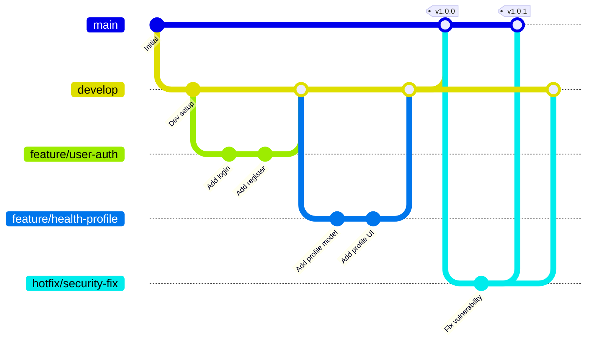
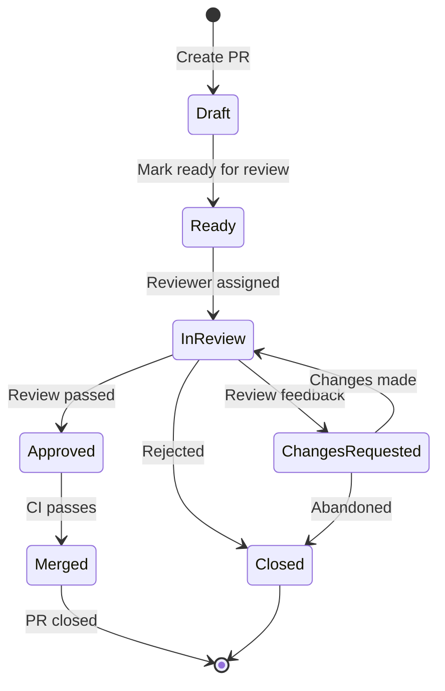

# Git Workflow Guide

**Project:** Eatsential - Precision Nutrition Platform  
**Document Type:** Git Workflow and Branching Strategy  
**Version:** 1.0  
**Date:** October 21, 2025  
**Owner:** Development Team

---

## Table of Contents

1. [Introduction](#1-introduction)
2. [Repository Structure](#2-repository-structure)
3. [Branching Strategy](#3-branching-strategy)
4. [Workflow Process](#4-workflow-process)
5. [Commit Guidelines](#5-commit-guidelines)
6. [Pull Request Process](#6-pull-request-process)
7. [Code Review Process](#7-code-review-process)
8. [Release Process](#8-release-process)
9. [Hotfix Process](#9-hotfix-process)
10. [Best Practices](#10-best-practices)

---

## 1. Introduction

### 1.1 Purpose

This document defines the Git workflow for the Eatsential project to ensure:
- Consistent development practices
- Clean project history
- Efficient collaboration
- Reliable release process
- Quick issue resolution

### 1.2 Overview

We use a modified Git Flow strategy that balances structure with agility:
- **main**: Production-ready code
- **develop**: Integration branch for features
- **feature/**: New features and enhancements
- **fix/**: Bug fixes
- **hotfix/**: Emergency production fixes
- **release/**: Release preparation

## 2. Repository Structure

### 2.1 Main Repository

```
CSC510/
├── .github/                # GitHub Actions and templates
│   ├── workflows/         # CI/CD pipelines
│   ├── ISSUE_TEMPLATE/    # Issue templates
│   └── pull_request_template.md
├── proj2/                 # Main project directory
│   ├── frontend/         # React application
│   ├── backend/          # FastAPI application
│   └── docs/            # Documentation
├── .gitignore           # Git ignore rules
├── README.md            # Project overview
└── LICENSE              # MIT License
```

### 2.2 Protected Branches

| Branch | Protection Rules |
|--------|-----------------|
| main | - Require PR reviews (2 approvals)<br>- Pass all CI checks<br>- No direct pushes<br>- Admin override only |
| develop | - Require PR reviews (1 approval)<br>- Pass all CI checks<br>- No force pushes |

## 3. Branching Strategy

### 3.1 Branch Types



### 3.2 Branch Naming Convention

```bash
# Feature branches
feature/add-payment-integration
feature/issue-123-user-dashboard
feature/enhance-search-filters

# Bug fix branches (non-urgent)
fix/incorrect-calorie-calculation
fix/issue-456-login-redirect
fix/mobile-menu-overflow

# Hotfix branches (urgent production fixes)
hotfix/critical-security-vulnerability
hotfix/payment-processing-error

# Release branches
release/1.0.0
release/1.1.0-beta

# Documentation branches
docs/api-documentation
docs/setup-guide

# Refactoring branches
refactor/database-optimization
refactor/component-structure

# Experiment branches
experiment/new-recommendation-algorithm
experiment/graphql-api
```

### 3.3 Branch Lifecycle

1. **Create** from develop (or main for hotfixes)
2. **Develop** with regular commits
3. **Test** thoroughly
4. **Review** via pull request
5. **Merge** after approval
6. **Delete** after merge

## 4. Workflow Process

### 4.1 Feature Development Workflow

```bash
# 1. Start from updated develop branch
git checkout develop
git pull origin develop

# 2. Create feature branch
git checkout -b feature/meal-recommendations

# 3. Make changes and commit regularly
git add .
git commit -m "feat(recommendations): add dietary filter logic"

# 4. Keep branch updated with develop
git fetch origin
git rebase origin/develop

# 5. Push to remote
git push origin feature/meal-recommendations

# 6. Create pull request
# Use GitHub UI or CLI

# 7. After approval and merge
git checkout develop
git pull origin develop
git branch -d feature/meal-recommendations
```

### 4.2 Bug Fix Workflow

```bash
# 1. Create fix branch from develop
git checkout develop
git pull origin develop
git checkout -b fix/issue-789-allergen-display

# 2. Fix the bug
# Make changes
git add .
git commit -m "fix(ui): correct allergen icon display logic

Fixes #789"

# 3. Test thoroughly
# Run tests locally

# 4. Push and create PR
git push origin fix/issue-789-allergen-display
```

### 4.3 Daily Development Flow

```bash
# Morning: Update your local repository
git checkout develop
git pull origin develop

# Throughout the day: Commit frequently
git add -p  # Stage changes interactively
git commit -m "feat: descriptive message"

# Before pushing: Rebase to avoid merge commits
git fetch origin
git rebase origin/develop

# End of day: Push your changes
git push origin feature/your-feature
```

## 5. Commit Guidelines

### 5.1 Commit Message Format

Follow the Conventional Commits specification:

```
<type>(<scope>): <subject>

<body>

<footer>
```

### 5.2 Types

| Type | Description | Example |
|------|-------------|---------|
| feat | New feature | `feat(auth): add password reset flow` |
| fix | Bug fix | `fix(api): handle null user profile` |
| docs | Documentation | `docs(readme): update setup instructions` |
| style | Code style | `style(frontend): fix indentation` |
| refactor | Code refactoring | `refactor(db): optimize user queries` |
| test | Test changes | `test(auth): add login edge cases` |
| chore | Maintenance | `chore(deps): update React to v18.3` |
| perf | Performance | `perf(api): add response caching` |
| ci | CI/CD changes | `ci(github): add security scanning` |

### 5.3 Commit Message Examples

```bash
# Simple feature
feat(profile): add allergy management UI

# Bug fix with issue reference
fix(recommendations): exclude allergens from results

User's allergens were not being filtered from meal recommendations.
This fix adds proper filtering in the recommendation service.

Fixes #234

# Breaking change
feat(api)!: change user endpoint response format

BREAKING CHANGE: The /api/users endpoint now returns data in a 
nested structure. Update all API clients to handle the new format.

# Multiple changes (avoid when possible)
refactor(auth): restructure authentication module

- Extract email service to separate module
- Add comprehensive error handling
- Update tests for new structure
- Improve token generation security
```

### 5.4 Commit Best Practices

1. **Atomic Commits**: One logical change per commit
2. **Present Tense**: "add feature" not "added feature"
3. **Imperative Mood**: "fix bug" not "fixes bug"
4. **No Period**: No period at end of subject line
5. **Body Details**: Explain why, not just what

## 6. Pull Request Process

### 6.1 Creating a Pull Request

```markdown
## Description
Brief description of changes and why they're needed.

## Type of Change
- [ ] 🐛 Bug fix (non-breaking change)
- [ ] ✨ New feature (non-breaking change)
- [ ] 💥 Breaking change
- [ ] 📚 Documentation update
- [ ] ♻️ Code refactoring
- [ ] 🎨 Style/UI changes

## Changes Made
- Specific change 1
- Specific change 2
- Impact on existing features

## Testing
- [ ] Unit tests pass locally
- [ ] Integration tests pass
- [ ] Manual testing completed
- [ ] No console errors

## Checklist
- [ ] Code follows project style guidelines
- [ ] Self-review completed
- [ ] Comments added for complex logic
- [ ] Documentation updated if needed
- [ ] No new warnings introduced
- [ ] Tests added/updated as needed
- [ ] All CI checks passing

## Screenshots (if UI changes)
[Add screenshots or recordings]

## Related Issues
Closes #123
Related to #456

## Reviewer Notes
Any specific areas that need attention during review.
```

### 6.2 PR Guidelines

1. **Keep PRs Small**: Aim for <400 lines of code changes
2. **Single Purpose**: One feature/fix per PR
3. **Clear Title**: Use conventional commit format
4. **Complete Description**: Fill out PR template
5. **Link Issues**: Reference related issues
6. **Update Often**: Keep PR up to date with base branch

### 6.3 PR Lifecycle



## 7. Code Review Process

### 7.1 Review Checklist

#### Functionality
- [ ] Code does what it's supposed to do
- [ ] Edge cases are handled
- [ ] No regressions introduced
- [ ] Performance impact considered

#### Code Quality
- [ ] Follows coding standards
- [ ] No code duplication
- [ ] Clear variable/function names
- [ ] Appropriate comments

#### Testing
- [ ] Adequate test coverage
- [ ] Tests are meaningful
- [ ] Edge cases tested
- [ ] Tests pass locally

#### Security
- [ ] No hardcoded secrets
- [ ] Input validation present
- [ ] SQL injection prevented
- [ ] XSS prevention in place

### 7.2 Review Comments

```typescript
// Use constructive feedback
// ❌ Bad: "This is wrong"
// ✅ Good: "Consider using a map here for O(1) lookup instead of O(n) array search"

// Prefix comments for clarity
// 🔧 MUST: Critical issues that block merge
// 💡 SHOULD: Important improvements recommended
// 💭 CONSIDER: Optional suggestions
// ❓ QUESTION: Clarification needed
// 👍 PRAISE: Positive feedback

// Example:
// 🔧 MUST: Add null check here to prevent runtime error
// 💡 SHOULD: Extract this logic to a reusable function
// 💭 CONSIDER: Using useMemo to optimize this computation
// ❓ QUESTION: Is this intentionally using loose equality?
// 👍 PRAISE: Great error handling implementation!
```

### 7.3 Responding to Reviews

1. **Address All Comments**: Respond to each review comment
2. **Push Commits**: Don't amend/force-push during review
3. **Mark Resolved**: Use GitHub's "Resolve conversation" feature
4. **Request Re-review**: After making changes

## 8. Release Process

### 8.1 Release Branch Workflow

```bash
# 1. Create release branch from develop
git checkout develop
git pull origin develop
git checkout -b release/1.2.0

# 2. Update version numbers
# Update package.json, pyproject.toml, etc.
git commit -m "chore(release): bump version to 1.2.0"

# 3. Run full test suite
npm test
pytest

# 4. Fix any issues (no new features!)
git commit -m "fix(release): correct version display"

# 5. Merge to main
git checkout main
git merge --no-ff release/1.2.0
git tag -a v1.2.0 -m "Release version 1.2.0"
git push origin main --tags

# 6. Merge back to develop
git checkout develop
git merge --no-ff release/1.2.0
git push origin develop

# 7. Delete release branch
git branch -d release/1.2.0
```

### 8.2 Semantic Versioning

We follow Semantic Versioning (MAJOR.MINOR.PATCH):

- **MAJOR**: Breaking changes (1.0.0 → 2.0.0)
- **MINOR**: New features, backwards compatible (1.0.0 → 1.1.0)
- **PATCH**: Bug fixes (1.0.0 → 1.0.1)

### 8.3 Release Checklist

- [ ] All tests passing
- [ ] Documentation updated
- [ ] CHANGELOG.md updated
- [ ] Version numbers updated
- [ ] Performance benchmarks run
- [ ] Security scan completed
- [ ] Release notes prepared
- [ ] Stakeholder approval

## 9. Hotfix Process

### 9.1 Emergency Fix Workflow

```bash
# 1. Create hotfix from main (production)
git checkout main
git pull origin main
git checkout -b hotfix/critical-security-fix

# 2. Make minimal fix
# Only fix the critical issue
git commit -m "hotfix(security): patch SQL injection vulnerability"

# 3. Test thoroughly
# Run specific tests for the fix

# 4. Merge to main
git checkout main
git merge --no-ff hotfix/critical-security-fix
git tag -a v1.2.1 -m "Hotfix: Security vulnerability"
git push origin main --tags

# 5. Merge to develop
git checkout develop
git merge --no-ff hotfix/critical-security-fix
git push origin develop

# 6. Clean up
git branch -d hotfix/critical-security-fix
```

### 9.2 Hotfix Guidelines

1. **Minimal Changes**: Fix only the critical issue
2. **Immediate Testing**: Test the specific fix thoroughly
3. **Quick Turnaround**: Deploy ASAP after testing
4. **Backport**: Ensure fix is in develop branch
5. **Document**: Update changelog and notify team

## 10. Best Practices

### 10.1 General Guidelines

```bash
# ✅ DO
- Pull before starting work
- Commit early and often
- Write descriptive commit messages
- Keep branches up to date
- Delete merged branches
- Use git aliases for efficiency

# ❌ DON'T
- Commit directly to main or develop
- Force push to shared branches
- Commit sensitive data
- Merge without review
- Leave commented code
- Commit large binary files
```

### 10.2 Useful Git Aliases

```bash
# Add to ~/.gitconfig
[alias]
    co = checkout
    br = branch
    ci = commit
    st = status
    unstage = reset HEAD --
    last = log -1 HEAD
    visual = !gitk
    
    # Show pretty log
    lg = log --color --graph --pretty=format:'%Cred%h%Creset -%C(yellow)%d%Creset %s %Cgreen(%cr) %C(bold blue)<%an>%Creset' --abbrev-commit
    
    # Show branches with last commit
    branches = for-each-ref --sort=-committerdate --format=\"%(color:blue)%(authordate:relative)\t%(color:red)%(authorname)\t%(color:white)%(color:bold)%(refname:short)\" refs/remotes
    
    # Amend last commit
    amend = commit --amend --no-edit
    
    # Undo last commit
    undo = reset HEAD~1 --mixed
    
    # Show files changed in last commit
    files = show --name-only --oneline
```

### 10.3 Handling Conflicts

```bash
# When conflicts occur during merge/rebase
git status  # See conflicted files

# Edit files to resolve conflicts
# Look for <<<<<<< HEAD markers

# After resolving
git add <resolved-files>
git rebase --continue  # or git merge --continue

# If things go wrong
git rebase --abort  # or git merge --abort
```

### 10.4 Keeping History Clean

1. **Squash Related Commits**: Before merging PR
2. **Rebase Feature Branches**: Instead of merge commits
3. **Amend Recent Commits**: For small fixes
4. **Use Interactive Rebase**: To clean up history

```bash
# Interactive rebase to clean up last 3 commits
git rebase -i HEAD~3

# In the editor, you can:
# pick - keep commit
# reword - change commit message
# squash - combine with previous
# drop - remove commit
```

### 10.5 Emergency Commands

```bash
# Undo last commit but keep changes
git reset --soft HEAD~1

# Discard all local changes
git reset --hard HEAD

# Recover deleted branch
git reflog  # Find the commit
git checkout -b recovered-branch <commit-hash>

# Cherry-pick specific commit
git cherry-pick <commit-hash>

# Stash changes temporarily
git stash save "WIP: feature description"
git stash list
git stash pop
```

---

**Document Status:** COMPLETE  
**Last Review:** October 21, 2025  
**Next Review:** When workflow changes needed

**Quick Reference Card:**
```
feature/* → develop → release/* → main
     ↑                              ↓
     └──────────── hotfix/* ────────┘
```
