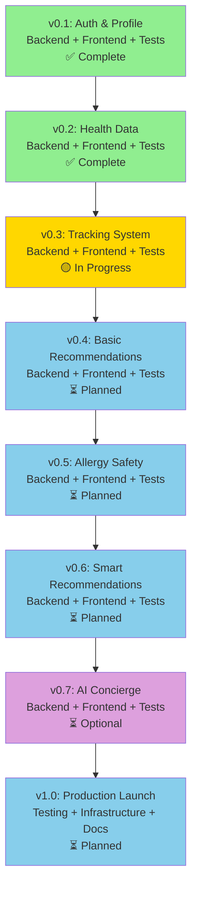
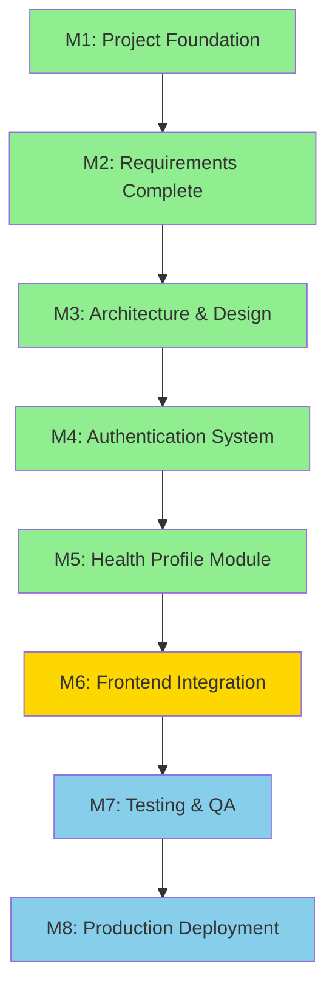
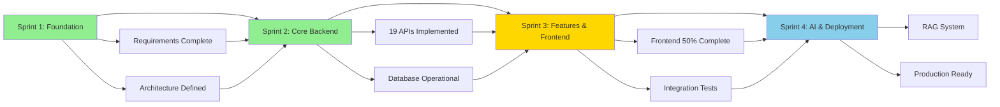

# Project Milestones

**Document Version**: 2.0 (Dual-Dimension Health Platform)  
**Last Updated**: October 25, 2025  
**Project**: Eatsential - Dual-Dimension Health Platform  
**Duration**: 24-28 weeks (8 iterative milestones)

**Version 2.0 Updates**:
- Reorganized milestones for Dual-Dimension Health (Physical + Mental Wellness)
- Agile approach: Each milestone delivers incremental value across both dimensions
- Total: 8 milestones over 24-28 weeks (3-4 weeks per milestone)

---

## 1. Overview

This document tracks 8 major milestones for the Eatsential Dual-Dimension Health Platform. Each milestone delivers working features across both Physical Health and Mental Wellness dimensions, following an agile, incremental approach rather than sequential phases.

**Development Philosophy**: 
- **Agile Delivery**: Each milestone = one releasable version (backend + frontend + tests)
- **Incremental Features**: Start with core functionality, iterate to advanced features
- **Continuous Integration**: Every milestone builds on previous, maintains working system
- **User Feedback**: Each release enables real user testing and feedback

---

## 2. Milestone Overview

```mermaid
gantt
    title Eatsential - 8 Agile Releases (Each = Backend + Frontend + Tests)
    dateFormat  YYYY-MM-DD
    
    section Foundation
    v0.1: Auth & Profile            :done, m1, 2025-09-02, 21d
    v0.2: Health Data Management    :done, m2, after m1, 21d
    
    section Core Features
    v0.3: Tracking System           :active, m3, after m2, 28d
    v0.4: Basic Recommendations     :m4, after m3, 28d
    
    section Advanced Features
    v0.5: Allergy Safety            :m5, after m4, 28d
    v0.6: Smart Recommendations     :m6, after m5, 28d
    
    section Production
    v0.7: AI Concierge (Optional)   :m7, after m6, 28d
    v1.0: Production Launch         :m8, after m7, 28d
```

**Agile Release Strategy** (每个milestone = 一个可发布版本):
- **v0.1-v0.2** (✅ Complete): 用户可以注册、登录、管理健康档案
- **v0.3-v0.4** (🟡 Current): 用户可以记录饮食/心理数据，获得基础推荐
- **v0.5-v0.6** (⏳ Planned): 过敏保护 + 智能双维度推荐
- **v0.7-v1.0** (⏳ Future): AI助手 + 生产环境发布

**Current Progress**: v0.2 完成，v0.3 进行中 (40%)

---

## 3. Milestone Details

### 🏗️ Milestone 1: v0.1 - Auth & Profile (Foundation)
**Status**: ✅ Complete  
**Release**: Users can register, login, and create basic health profile

#### Objectives
- Establish development environment and CI/CD pipeline
- Implement secure user authentication (backend + frontend)
- Build basic profile management UI
- Deploy first working version

#### Deliverables (Backend + Frontend + Tests)

**Backend**:
- ✅ User registration API with email validation
- ✅ Login API with JWT tokens
- ✅ Password hashing (bcrypt)
- ✅ Auth middleware
- ✅ Basic health profile API (CRUD)

**Frontend**:
- ✅ Registration form with validation
- ✅ Login page
- ✅ Basic profile form (age, gender, height, weight)
- ✅ Protected routes (auth guard)

**Infrastructure**:
- ✅ CI/CD pipeline (GitHub Actions)
- ✅ Database schema (12 tables designed)
- ✅ Development environment

**Testing**:
- ✅ 10 unit tests (auth module)
- ✅ Test coverage: 93%

#### v0.1 Release Capabilities
- ✅ 用户可以注册账号（邮箱验证）
- ✅ 用户可以登录/登出
- ✅ 用户可以创建基础健康档案
- ✅ 系统有完整的认证保护

---

### 🏥 Milestone 2: v0.2 - Health Data Management
**Status**: ✅ Complete  
**Release**: Users can manage complete health profile (allergies, dietary preferences)

#### Objectives
- Build complete health profile management (backend + UI)
- Implement allergy and dietary preference CRUD
- Design Mental Wellness schema (preparation for v0.3)

#### Deliverables (Backend + Frontend + Tests)

**Backend**:
- ✅ Health profile CRUD APIs (4 endpoints)
- ✅ Allergy management APIs (3 endpoints)
- ✅ Dietary preference APIs (1 endpoint)
- ✅ Allergen database (common allergens)

**Frontend**:
- ✅ Health profile form (detailed medical info)
- ✅ Allergy management UI (add/remove/severity)
- ✅ Dietary preference selector (vegetarian, vegan, etc.)
- ✅ Profile dashboard (view all health data)

**Database**:
- ✅ Mental wellness schema designed (7 tables for v0.3+)

**Testing**:
- ✅ 34 unit tests
- ✅ Test coverage: 88%

#### v0.2 Release Capabilities
- ✅ 用户可以完善健康档案（身高/体重/活动水平）
- ✅ 用户可以添加过敏信息（种类/严重程度）
- ✅ 用户可以设置饮食偏好
- ✅ 系统有完整的健康数据管理界面

---

### 📊 Milestone 3: v0.3 - Tracking System
**Status**: 🟡 In Progress (40%)  
**Release**: Users can track daily meals + mental wellness (mood/stress/sleep)

#### Objectives
- Build meal logging system (backend + UI)
- Build mental wellness tracking (goals + daily logs)
- Create unified dashboard showing both dimensions
- Enable daily tracking workflow

#### Deliverables (Backend + Frontend + Tests)

**Backend** (Physical):
- 🟡 Meal logging API (3 endpoints: create, list, delete)
- 🟡 Food database integration (nutrition data)
- 🟡 Nutrition calculation service
- ⏳ Daily/weekly summary API

**Backend** (Mental):
- ⏳ Mental wellness goal API (simplified CRUD)
- ⏳ Mood logging API (score + note)
- ⏳ Stress logging API (level + triggers)
- ⏳ Sleep logging API (duration + quality)
- ⏳ Data encryption for sensitive fields

**Frontend** (NEW in v0.3):
- ⏳ Meal logging form (search food, add to meal)
- ⏳ Daily tracking dashboard (today's meals + wellness logs)
- ⏳ Wellness goal creation interface
- ⏳ Quick log widgets (mood emoji, stress slider, sleep duration)
- ⏳ Weekly summary view (nutrition + wellness trends)

**Testing**:
- ⏳ 20+ new unit tests (Physical + Mental tracking)
- ⏳ Integration tests for dashboard API
- ⏳ Target coverage: >85%

#### v0.3 Release Capabilities
- [ ] 用户可以记录每日饮食（搜索食物、记录餐次）
- [ ] 用户可以设定心理健康目标
- [ ] 用户可以记录每日心情/压力/睡眠
- [ ] Dashboard显示双维度健康数据（饮食+心理）
- [ ] 敏感心理数据加密存储

---

### � Milestone 4: v0.4 - Basic Recommendation Engine (v1)
**Status**: ⏳ Planned  
**Theme**: Validation - Prove dual-dimension concept with simple algorithm

#### Objectives
- Validate dual-dimension recommendation concept
- Build simple scoring algorithm (no health tags yet)
- Provide basic food suggestions

#### Deliverables

**Basic Scoring Algorithm**:
- ⏳ Physical score: Calories, macros (no allergy filtering yet)
- ⏳ Mental score: Simple nutrient matching (Omega-3, Magnesium, Tryptophan for mood)
- ⏳ Combined score: (physical × 0.5) + (mental × 0.5)
- ⏳ Basic context rules: Low mood → Prioritize high-Tryptophan foods

**APIs** (Minimal):
- ⏳ POST /api/recommendations/basic - Get top 10 food recommendations
- ⏳ Simple scoring logic (no caching)

**Testing**:
- ⏳ Verify scoring algorithm correctness
- ⏳ Test with sample user data
- ⏳ Validate recommendations make sense

#### Success Criteria
- [ ] Algorithm produces reasonable food recommendations
- [ ] Both Physical + Mental factors considered
- [ ] Response time acceptable (<5s)
- [ ] Concept validated (ready for advanced version)

---

### 🛡️ Milestone 5: v0.5 - Allergy Safety
**Status**: ⏳ Planned  
**Release**: Recommendations respect allergies + Health tagging system operational

#### Objectives
- Add allergy filtering to recommendations (critical safety feature)
- Build health tagging system (backend + UI)
- Enable tag-based food browsing
- Prepare for advanced recommendation engine (v0.6)

#### Deliverables (Backend + Frontend + Tests)

**Backend**:
- ⏳ Upgrade recommendation API: Add allergy filtering (100% accuracy requirement)
- ⏳ Allergy severity handling (exclude severe, warn for mild/moderate)
- ⏳ Health tagging system:
  - HealthTag + FoodTag tables
  - Tag 100 common foods:
    - Mental: #StressRelief, #MoodBoost, #SleepAid
    - Physical: #HeartHealth, #Immunity, #AntiInflammatory
  - Tag APIs (GET /api/health-tags, GET /api/foods/by-tag)

**Frontend** (Enhanced v0.5):
- ⏳ Allergy warnings in recommendation results (prominent display)
- ⏳ "Why Safe?" explanation for each food (no allergen X detected)
- ⏳ Health tag browser page (explore foods by tag)
- ⏳ Tag filters in food search (e.g., show all #MoodBoost foods)
- ⏳ Tag badges on food cards (visual indicators)

**Testing**:
- ⏳ **Critical**: 100+ allergy filtering test cases (must pass 100%)
- ⏳ Cross-contamination warning tests
- ⏳ Tag system integration tests
- ⏳ Manual safety review by team

#### v0.5 Release Capabilities
- [ ] 推荐系统100%过滤用户过敏食物（关键安全功能）
- [ ] 每个推荐结果显示"为什么安全"（无过敏原）
- [ ] 用户可以按健康标签浏览食物（例如：所有#MoodBoost食物）
- [ ] 食物卡片显示健康标签徽章
- [ ] 100个常见食物已标记健康属性
- [ ] **准备好高级推荐引擎v0.6所需的数据基础**

---

### 🧠 Milestone 6: v0.6 - Smart Recommendations
**Status**: ⏳ Planned  
**Release**: Production-grade recommendation engine with tag-based scoring + caching

#### Objectives
- Upgrade to advanced recommendation algorithm (health tag-based)
- Implement sophisticated context-aware boosting
- Optimize performance (caching, <1s response)
- Provide detailed explanations

#### Deliverables (Backend + Frontend + Tests)

**Backend** (Advanced Algorithm):
- ⏳ Advanced scoring algorithm:
  - Physical: Calories, macros, allergy filtering, nutrition goals
  - Mental: **Tag matching** (#MoodBoost count) + key nutrients + mood context
  - Preference: User taste preferences, cooking time
  - Combined: (physical × 0.4) + (mental × 0.4) + (preference × 0.2)
- ⏳ Context-aware boosting:
  - High stress (score >7 last 3 days) → +20% #StressRelief foods
  - Poor sleep (<6h last 3 days) → +20% #SleepAid foods
  - Low mood (score <5) → +20% #MoodBoost foods
  - Active goal → +15% to goal-related tags
- ⏳ Health tag expansion: 100 → 200+ foods
- ⏳ Performance optimization:
  - Redis cache for user context (5 min TTL)
  - Redis cache for health tags (24h TTL)
  - Parallel scoring (async)
  - Target: <1s P95 response time

**APIs**:
- ⏳ POST /api/recommendations/dual-dimension (replace /basic)
- ⏳ POST /api/recommendations/explain (detailed reasoning for each food)

**Frontend** (Enhanced v0.6):
- ⏳ Enhanced recommendation cards:
  - Dual-dimension score visualization (physical/mental bars)
  - Health tag badges (e.g., "🧠 #MoodBoost 💤 #SleepAid")
  - Context indicators (e.g., "Great for your stress today ⚡")
- ⏳ Detailed explanation modal (click "Why?" button):
  - Physical health match: "Matches your 2000 cal target, high protein"
  - Mental health match: "Contains Omega-3 (mood support), tagged #MoodBoost"
  - Context boost: "Prioritized due to high stress last 3 days"
- ⏳ Performance indicator (loading time display)
- ⏳ Feedback widget ("Was this helpful?")

**Testing**:
- ⏳ Scoring algorithm unit tests (100+ test cases)
- ⏳ Context boosting tests (edge cases)
- ⏳ Performance tests (load 100+ concurrent users)
- ⏳ A/B comparison: v0.4 basic vs v0.6 advanced (user feedback)

#### v0.6 Release Capabilities
- [ ] 推荐算法使用健康标签智能评分
- [ ] 上下文感知增强（压力大→推荐#StressRelief食物，权重+20%）
- [ ] 详细的"为什么推荐"解释（包含物理/心理/偏好三维度分析）
- [ ] 响应时间<1秒（P95）
- [ ] 200+食物已标记健康属性
- [ ] 用户可以提供推荐反馈（为未来优化收集数据）
- [ ] **生产级推荐引擎，ready for large-scale use**

---

### 🤖 Milestone 7: v0.7 - AI Concierge (Optional)
**Status**: ⏳ Planned  
**Release**: AI health coach for personalized guidance (LLM-powered)

#### Objectives
- Add conversational AI health coach (optional advanced feature)
- Provide personalized nutrition/wellness guidance
- Ensure medical safety (100% refuse medical advice)
- Enable natural language interaction

#### Deliverables (Backend + Frontend + Tests)

**Backend**:
- ⏳ LLM integration (OpenAI GPT-4-mini, cost-effective)
- ⏳ Chat session management (store history)
- ⏳ Context aggregation (user's health data + recent logs)
- ⏳ Prompt engineering:
  - System role: "Nutrition & wellness coach, not a doctor"
  - User context: Health profile, recent meals, wellness logs, goals
  - Guardrails: Refuse medical diagnosis/prescriptions
- ⏳ Safety validation:
  - Medical advice detection (regex + keyword matching)
  - Auto-inject disclaimer: "Please consult healthcare professional"
- ⏳ Rate limiting (20 requests/hour per user)

**APIs**:
- ⏳ POST /api/ai-concierge/chat (streaming response via SSE)
- ⏳ GET /api/ai-concierge/sessions (chat history)

**Frontend** (NEW in v0.7):
- ⏳ AI Chat interface (bottom-right floating button)
- ⏳ Streaming response (typewriter effect)
- ⏳ Chat history (scroll through past conversations)
- ⏳ Quick action buttons:
  - "Suggest meals for today"
  - "Help me improve my mood"
  - "Explain this recommendation"
- ⏳ Disclaimer banner (visible at top of chat)

**Testing**:
- ⏳ **Critical**: 50+ medical advice test cases (must refuse 100%)
- ⏳ LLM response quality tests (nutrition advice accuracy)
- ⏳ Rate limiting tests
- ⏳ Performance tests (time to first token <2s)

#### v0.7 Release Capabilities
- [ ] 用户可以与AI健康助手对话（自然语言）
- [ ] AI基于用户健康数据提供个性化营养建议
- [ ] AI 100%拒绝医疗诊断/处方建议（关键安全要求）
- [ ] 对话历史保存（用户可以查看过去的建议）
- [ ] 快速操作按钮（一键获取常见建议）
- [ ] **Optional**: 可选功能，v1.0发布不强制要求

---

### ✅ Milestone 8: v1.0 - Production Launch
**Status**: ⏳ Planned  
**Release**: Public launch with full QA, monitoring, and documentation

#### Objectives
- Comprehensive testing (unit + integration + E2E + security)
- Production deployment (HTTPS, monitoring, backups)
- User documentation and onboarding
- Go-live readiness

#### Deliverables (Testing + Infrastructure + Docs)

**Comprehensive Testing**:
- ⏳ Unit tests: 85%+ coverage (all modules)
- ⏳ Integration tests: All critical APIs (auth, tracking, recommendations, etc.)
- ⏳ E2E tests: 10+ user scenarios:
  1. New user onboarding (register → profile → first tracking)
  2. Daily tracking workflow (log meal + mood → get recommendations)
  3. Allergy safety validation (set allergy → verify recommendations exclude it)
  4. Recommendation flow (Physical + Mental context → smart suggestions)
  5. AI chat session (if v0.7 included)
  6. ... (more scenarios)
- ⏳ Security testing:
  - Mental health data encryption verified (at rest + in transit)
  - Auth token security (JWT expiration, refresh tokens)
  - SQL injection / XSS vulnerability scan
  - OWASP Top 10 compliance check
- ⏳ Performance testing:
  - Load test: 50+ concurrent users
  - Recommendation API: <1s P95
  - Database query optimization
- ⏳ Accessibility testing (WCAG 2.1 AA compliance)

**Production Infrastructure**:
- ⏳ Docker containerization (backend + frontend)
- ⏳ Production database (PostgreSQL with encryption at rest)
- ⏳ SSL/TLS certificates (HTTPS)
- ⏳ CDN for frontend assets
- ⏳ Automated backups (daily database snapshots)
- ⏳ Monitoring & Alerts:
  - Application uptime (Pingdom or similar)
  - Error tracking (Sentry)
  - Performance monitoring (response times, DB queries)
  - Alert rules (downtime, high error rate, slow queries)

**Documentation**:
- ⏳ User guide (how to use the platform)
- ⏳ API documentation (OpenAPI/Swagger)
- ⏳ Privacy policy (data handling, encryption, GDPR/HIPAA compliance notes)
- ⏳ Terms of service
- ⏳ Onboarding tutorial (in-app walkthrough)

**Deployment**:
- ⏳ Staging environment deployment (pre-production testing)
- ⏳ Staging smoke tests (all features functional)
- ⏳ Production deployment (blue-green or canary)
- ⏳ Post-deployment validation (health checks, critical flows)
- ⏳ Rollback plan (tested and documented)

**Go-Live Checklist**:
- ⏳ All critical bugs fixed (P0/P1)
- ⏳ Performance benchmarks met (recommendation <1s, page load <3s)
- ⏳ Security audit passed (no critical vulnerabilities)
- ⏳ Legal compliance verified (privacy policy, terms of service)
- ⏳ Monitoring operational (alerts configured)
- ⏳ Team trained on incident response

#### v1.0 Release Capabilities
- [ ] **完整的双维度健康平台**（物理健康+心理健康）
- [ ] 用户注册 → 健康档案 → 每日追踪 → 智能推荐（端到端流程）
- [ ] 过敏安全保护（100%过滤）
- [ ] 生产级推荐引擎（<1s响应，200+食物标记）
- [ ] 可选：AI健康助手（如果v0.7完成）
- [ ] HTTPS安全访问，数据加密，合规文档
- [ ] 监控和告警系统运行
- [ ] **🎉 公开发布，ready for real users!**

---

## 4. Agile Release Flow



**Legend:**
- 🟢 Green: Released
- 🟡 Yellow: In Development
- 🔵 Blue: Planned
- 🟣 Purple: Optional

**Agile Principles Applied**:
1. **每个版本都可发布**: Backend + Frontend + Tests 完整交付
2. **快速验证**: v0.4 简单推荐 → 用户反馈 → v0.6 高级推荐
3. **增量价值**: 
   - v0.1-v0.2: 用户可以管理健康数据
   - v0.3: 用户可以追踪每日数据
   - v0.4: 用户可以获得推荐（概念验证）
   - v0.5-v0.6: 推荐系统成熟（生产级）
   - v0.7: AI助手（可选高级功能）
   - v1.0: 公开发布
4. **持续集成**: 每个版本在前一个版本基础上迭代，不推倒重来
5. **用户反馈**: 每个版本都可以让用户试用，收集反馈优化下一版本

**关键里程碑**:
- **v0.3 (Current)**: First complete tracking workflow → 可以收集真实数据
- **v0.4**: Recommendation concept validation → 验证核心创新点
- **v0.6**: Production-grade recommendation → 生产环境ready
- **v1.0**: Public launch → 对外发布

---

---

## 3. Milestone Details

### �️ Milestone 1: Architecture & Pipeline Setup
**Status**: ✅ Complete  
**Theme**: Foundation - Establish technical infrastructure

#### Objectives
- Set up complete development infrastructure
- Define system architecture and technology stack
- Establish CI/CD pipeline and development workflow
- Create comprehensive project documentation

#### Deliverables
- ✅ Project charter and team structure
- ✅ Architecture overview with system diagrams
- ✅ Technology stack selected (FastAPI, React, PostgreSQL)
- ✅ Database schema designed (5 tables, normalized)
- ✅ API contracts defined (22 endpoints planned)
- ✅ Git repository with branch strategy
- ✅ CI/CD pipeline (GitHub Actions)
- ✅ Development environment documentation
- ✅ 23 use cases documented (UC-001 to UC-023)
- ✅ 11 functional requirements (FR-001 to FR-011)
- ✅ Requirements Traceability Matrix (RTM)

#### Key Metrics
- Documentation: 12 documents created
- Architecture diagrams: 8+ Mermaid diagrams
- Database tables: 5 designed
- Planned API endpoints: 22
- Test infrastructure: pytest configured

#### Success Criteria
- ✅ All team members can run development environment
- ✅ CI/CD pipeline successfully builds and tests code
- ✅ Architecture review passed by team
- ✅ Requirements approved by stakeholders

---

### � Milestone 2: User Authentication (Iteration 1)
**Status**: ✅ Complete  
**Theme**: Feature Development - Secure user management

#### Deliverables
- ✅ User registration with email validation
- ✅ Email verification system
- ✅ JWT-based authentication
- ✅ Password hashing with bcrypt
- ✅ Authentication middleware for protected routes
- ✅ 8 authentication API endpoints
- ✅ Database models (User table with Alembic migrations)
- ✅ Unit tests (10 tests, 93% coverage for auth module)
- ✅ API documentation (OpenAPI/Swagger)

#### Test Results
- Tests Written: 10
- Tests Passing: 10/10 (100%)
- Code Coverage: 93%
- Security: bcrypt + JWT tokens

#### Success Criteria
- ✅ Users can register and receive verification email
- ✅ Email verification redirects to login
- ✅ Login returns valid JWT token
- ✅ Protected routes reject unauthorized requests
- ✅ All authentication tests passing

---

### 👤 Milestone 3: Health Profile Management (Iteration 2)
**Status**: ✅ Complete  
**Theme**: Feature Development - Core health data

#### Deliverables
- ✅ Health profile CRUD APIs (4 endpoints)
- ✅ User management APIs (3 endpoints)
- ✅ Database models (HealthProfile table)
- ✅ Alembic migrations for health data
- ✅ Comprehensive test suite (13 new tests)
- ✅ API documentation updates

#### Test Results
- Tests Written: 13
- Tests Passing: 13/13 (100%)
- Cumulative Coverage: 89%
- Total Tests: 23

#### Success Criteria
- ✅ Users can create health profile with biometric data
- ✅ Profile updates reflect immediately
- ✅ User can retrieve and delete their profile
- ✅ Proper authorization (users can only access own data)
- ✅ All health profile tests passing

---

### 🍽️ Milestone 4: Allergy Tracking (Iteration 3)
**Status**: ✅ Complete  
**Theme**: Feature Development - Safety-critical allergy management

#### Deliverables
- ✅ Allergy management APIs (3 endpoints)
- ✅ Database models (UserAllergy, AllergenDatabase tables)
- ✅ Severity level tracking (mild, moderate, severe)
- ✅ Allergen database population
- ✅ Many-to-many relationship handling
- ✅ Comprehensive test suite (11 new tests)

#### Test Results
- Tests Written: 11
- Tests Passing: 11/11 (100%)
- Cumulative Coverage: 88%
- Total Tests: 34

#### Success Criteria
- ✅ Users can add allergies with severity levels
- ✅ Users can list all their allergies
- ✅ Users can delete allergies
- ✅ Allergen database queryable
- ✅ Duplicate allergy prevention works
- ✅ All allergy tests passing

---

### 🥗 Milestone 5: Dietary Preferences (Iteration 4)
**Status**: ✅ Complete  
**Theme**: Feature Development - Personalized dietary needs

#### Deliverables
- ✅ Dietary preferences API (1 endpoint)
- ✅ Database model (DietaryPreference table)
- ✅ Support for multiple preference types (vegan, keto, halal, kosher, etc.)
- ✅ Strictness levels implementation
- ✅ Integration with health profile
- ✅ Test suite expansion (10 new tests)
- ✅ Complete backend API suite (19 endpoints total)

#### Test Results
- Tests Written: 10
- Tests Passing: 10/10 (100%)
- Cumulative Coverage: 88%
- Total Tests: 44

#### Success Criteria
- ✅ Users can set dietary preferences
- ✅ Multiple preferences supported simultaneously
- ✅ Strictness levels enforced
- ✅ Preferences retrievable via API
- ✅ All dietary preference tests passing
- ✅ Backend API suite complete (19/22 MVP endpoints)

---

### 🎨 Milestone 6: Frontend UI & Integration (Iteration 5)
**Status**: 🟡 In Progress (30% complete)  
**Theme**: Feature Development - User interface

#### Planned Deliverables
- 🟡 React application scaffolding (Vite + TypeScript)
- 🟡 Authentication UI (registration, login, verification pages)
- ⏳ Health profile forms with validation
- ⏳ Allergy management interface
- ⏳ Dietary preferences selection UI
- ⏳ Responsive dashboard layout
- ⏳ API client with error handling
- ⏳ State management (Context API)
- ⏳ Integration tests (26 new tests planned)

#### Target Test Results
- New Frontend Tests: 20+
- E2E Integration Tests: 6+
- Cumulative Coverage: 90%+
- Total Tests: 70+

#### Success Criteria
- [ ] Users can complete registration flow in UI
- [ ] Users can login and see dashboard
- [ ] Users can create/edit health profile via forms
- [ ] All forms have proper validation and error handling
- [ ] Application responsive on mobile and desktop
- [ ] All frontend integration tests passing

#### Current Progress
- ✅ Project scaffolding complete
- ✅ Basic authentication components
- 🟡 Profile forms in development
- ⏳ Allergy UI not started
- ⏳ Dashboard layout not started

---

### ✅ Milestone 7: Advanced Features & Testing (Iteration 6)
**Status**: ⏳ Planned  
**Theme**: Feature Development - Meal tracking and advanced functionality

#### Planned Deliverables
- ⏳ Meal logging API (3 remaining endpoints)
- ⏳ Meal history and analytics
- ⏳ Nutrition tracking
- ⏳ Recommendation placeholder system
- ⏳ Complete integration test suite
- ⏳ Performance testing and optimization
- ⏳ Security testing and hardening
- ⏳ Load testing (100+ concurrent users)
- ⏳ User acceptance testing (UAT)

#### Target Test Results
- Integration Tests: 20+ scenarios
- Performance: < 2s P95 response time
- Load Test: 100+ concurrent users
- Coverage: 90%+
- All TC-001 to TC-022 passing

#### Success Criteria
- [ ] Users can log meals with nutritional data
- [ ] Meal history retrievable
- [ ] Basic recommendations work
- [ ] All 22 system test cases passing
- [ ] Performance targets met
- [ ] Security scan shows no critical vulnerabilities
- [ ] UAT scenarios completed successfully

---

### 🚀 Milestone 8: Production Deployment & Polish (Iteration 7)
**Status**: ⏳ Planned  
**Theme**: Deployment - Production readiness and launch

#### Planned Deliverables
- ⏳ Docker containerization (backend + frontend)
- ⏳ Production environment setup (cloud deployment)
- ⏳ Database migrations to production
- ⏳ SSL/TLS certificates configuration
- ⏳ Monitoring and alerting (Prometheus/Grafana)
- ⏳ Backup and recovery procedures
- ⏳ User documentation and help guides
- ⏳ API documentation finalization
- ⏳ Performance optimization
- ⏳ Final security hardening
- ⏳ Go-live checklist completion

#### Target Metrics
- Uptime: 99.5%+
- Response Time: < 2s P95
- Deployment Time: < 30 minutes
- Zero critical bugs
- Zero known security vulnerabilities

#### Success Criteria
- [ ] Application accessible via public URL with HTTPS
- [ ] All production smoke tests passing
- [ ] Monitoring dashboards operational
- [ ] Backup/recovery procedures tested and verified
- [ ] User documentation published
- [ ] Rollback plan documented and tested
- [ ] Post-deployment validation complete
- [ ] Go-live sign-off obtained from stakeholders

---

## 4. Milestone Dependencies



**Legend:**
- � Green: Complete
- 🟡 Yellow: In Progress
- 🔵 Blue: Planned

---

## 5. Progress Summary

### Overall Project Status

| Phase | Milestones | Completed | In Progress | Planned |
|-------|-----------|-----------|-------------|---------|
| **Phase 1: Foundation** | 2 | 2 | 0 | 0 |
| **Phase 2: Core Development** | 2 | 2 | 0 | 0 |
| **Phase 3: Feature Development** | 2 | 1 | 1 | 0 |
| **Phase 4: Completion** | 2 | 0 | 0 | 2 |
| **TOTAL** | **8** | **5** | **1** | **2** |

**Overall Progress**: 62.5% (5/8 milestones complete)

### Timeline Health

| Metric | Status | Details |
|--------|--------|---------|
| **Schedule** | 🟢 On Track | Milestone 5 completed on time |
| **Scope** | � Controlled | No major scope changes |
| **Quality** | 🟢 Good | 88% test coverage, 70 tests passing |
| **Risk** | 🟡 Medium | Frontend velocity slower than expected |

---

## 6. Iteration Retrospectives

### M1: Architecture & Pipeline
**What Worked:**
- Comprehensive upfront planning saved implementation time
- Clear API contracts reduced integration issues
- Strong documentation foundation

**Challenges:**
- Initial database schema needed one revision after review

**Actions for Next Iterations:**
- Maintain living documentation
- Regular architecture reviews

---

### M2-M5: Backend Iterations (Authentication → Dietary Preferences)
**What Worked:**
- Consistent iteration pattern (feature + tests) improved velocity
- FastAPI's auto-generated OpenAPI docs accelerated testing
- High test coverage (88-93%) prevented regressions
- Alembic migrations worked smoothly for database changes

**Challenges:**
- Email verification required manual testing initially
- Complex many-to-many relationships needed extra test cases

**Actions for Frontend:**
- Apply same iterative approach (feature + tests)
- Mock external services for automated testing
- Create reusable test fixtures

---

### M6: Frontend Iteration (In Progress)
**What's Working:**
- React + TypeScript catching errors early
- Component-based architecture scales well

**Challenges:**
- Frontend velocity 30% slower than backend iterations
- Team learning curve with React hooks and state management

**Actions:**
- Pair programming to share knowledge
- Use Shadcn/UI components to accelerate development
- Focus on MVP features, defer polish to M8

---

## 7. Iteration Completion Criteria

### Standard Definition of Done (All Iterations)

Each milestone must meet these criteria before being marked complete:

1. **Feature Complete**: All planned functionality implemented
2. **Tests Written**: Unit tests for all new code
3. **Tests Passing**: 100% of new tests passing
4. **Coverage Target**: Maintain or improve overall coverage
5. **Documentation**: API documentation updated
6. **Code Review**: Peer review completed and approved
7. **Integration**: Merged to main branch via PR
8. **No Regressions**: All previous tests still passing

### Iteration-Specific Criteria

**Backend Iterations (M2-M5)**:
- API endpoints functional and documented
- Database migrations applied successfully
- Pydantic schemas validated
- OpenAPI docs reflect new endpoints

**Frontend Iterations (M6)**:
- UI components render correctly
- Forms have validation
- API integration works
- Responsive on mobile and desktop

**Testing Iteration (M7)**:
- All TC-001 to TC-022 passing
- Performance benchmarks met
- Security scan clean

**Deployment Iteration (M8)**:
- Production environment operational
- Monitoring active
- Rollback plan tested

---

## 8. Post-MVP Iterations

### Future Iteration Plan (Beyond M8)

**Iteration 8: OAuth Integration**
- Google, Apple, Facebook authentication
- Social profile import
- Tests: 15 new tests

**Iteration 9: Password Management**
- Password reset flow
- Password change functionality
- Account recovery
- Tests: 10 new tests

**Iteration 10: AI/RAG System**
- Vector database integration
- RAG-based recommendations
- Allergen filtering with AI
- Tests: 25 new tests

**Iteration 11: Restaurant Discovery**
- Restaurant database
- Location-based search
- Nutritional data integration
- Tests: 20 new tests

**Iteration 12: Mobile App**
- React Native implementation
- iOS and Android apps
- Push notifications
- Tests: 30 new tests

---

## 9. Milestone Tracking Dashboard

### Iteration Progress

| Iteration | Theme | APIs | Tests | Coverage | Status |
|-----------|-------|------|-------|----------|--------|
| **M1** | Architecture & Pipeline | 0 → 0 | 0 → 0 | N/A | ✅ Complete |
| **M2** | Authentication | 0 → 8 | 0 → 10 | 93% | ✅ Complete |
| **M3** | Health Profiles | 8 → 12 | 10 → 23 | 89% | ✅ Complete |
| **M4** | Allergy Tracking | 12 → 15 | 23 → 34 | 88% | ✅ Complete |
| **M5** | Dietary Preferences | 15 → 19 | 34 → 44 | 88% | ✅ Complete |
| **M6** | Frontend UI | 19 → 19 | 44 → 70 (target) | 90% (target) | 🟡 30% |
| **M7** | Advanced Features | 19 → 22 | 70 → 90 (target) | 90% (target) | ⏳ Planned |
| **M8** | Production Deploy | 22 → 22 | 90+ | 90% | ⏳ Planned |

### Velocity Tracking

**Backend Iterations (M2-M5)**:
- Average: 3 APIs + 11 tests per iteration
- Consistent 88-93% coverage
- High quality: 100% test pass rate

**Frontend Iteration (M6)**:
- Expected: 26 integration tests
- Challenge: Slower than backend (learning curve)
- Mitigation: Using component library, pair programming

---

## 10. Related Documents

- [Project Charter](./project-charter.md) - Project scope and objectives
- [Risk Management](./risk-management.md) - Risk tracking and mitigation
- [Implementation Status](../3-IMPLEMENTATION/implementation-status.md) - Detailed implementation analysis
- [Test Cases](../4-TESTING/test-cases.md) - TC-001 to TC-022 specifications
- [Test Coverage Report](../4-TESTING/test-coverage-report.md) - Current 88% coverage analysis
- [Functional Requirements](../1-REQUIREMENTS/functional-requirements.md) - FR-001 to FR-011

---

**Document Status**: ✅ Complete  
**Iteration Model**: Feature + Test per milestone (M2-M7)  
**Current Iteration**: M6 (Frontend UI & Integration) - 30% complete  
**Next Review**: Upon M6 completion  
**Owner**: Project Management Team  
**Last Updated**: October 2025
**Theme**: AI/RAG integration, comprehensive testing, production deployment

#### ⏳ Planned Milestones

| Milestone | Description | Deliverables | Status |
|-----------|-------------|--------------|--------|
| **M4.1** | RAG System Integration | Vector database setup, embedding generation, retrieval pipeline | ⏳ Planned |
| **M4.2** | AI Meal Recommendations | LLM integration, prompt engineering, zero-tolerance allergen filtering | ⏳ Planned |
| **M4.3** | Restaurant Discovery | Restaurant database, filtering by dietary needs, location-based search | ⏳ Planned |
| **M4.4** | System Testing | Load testing, security testing, acceptance testing | ⏳ Planned |
| **M4.5** | Production Deployment | Docker containerization, cloud deployment, monitoring setup | ⏳ Planned |
| **M4.6** | Documentation Finalization | Complete SRS, SAD, STP, user manual, API documentation | ⏳ Planned |

**Sprint Goals**:
- Integrate RAG-based AI recommendation engine
- Complete all acceptance test cases (TC-001 to TC-022)
- Achieve ≥90% test coverage
- Deploy MVP to production environment
- Finalize all academic documentation

**Key Deliverables**:
1. **AI/RAG Pipeline**: Functional recommendation system with allergen safety checks
2. **Restaurant Module**: Searchable restaurant database with nutritional data
3. **Test Suite**: Comprehensive unit, integration, and system tests
4. **Production System**: Deployed MVP accessible via public URL
5. **Documentation Package**: Complete SRS, SAD, STP, user guide, API reference

**Success Criteria**:
- All TC-001 to TC-022 tests passing
- System response time < 2 seconds (P95)
- Zero critical bugs
- Documentation review complete
- Demo-ready application

---

## 4. Major Deliverables by Phase

### Phase 1: Foundation (Sprints 1-2) ✅

**Documentation**:
- ✅ Project Charter
- ✅ Use Cases (23 cases)
- ✅ Functional Requirements (11 requirements)
- ✅ Non-Functional Requirements
- ✅ Requirements Traceability Matrix (RTM)
- ✅ Architecture Overview
- ✅ Database Design
- ✅ API Design

**Code**:
- ✅ Backend scaffolding (FastAPI + SQLAlchemy)
- ✅ Frontend scaffolding (React + Vite + TypeScript)
- ✅ Database schema with 5 tables
- ✅ Authentication system (JWT)
- ✅ Health profile APIs
- ✅ 91% test coverage (20 tests)

---

### Phase 2: Feature Development (Sprint 3) 🔄

**Documentation**:
- ✅ Component Diagrams
- ✅ Test Cases (TC-001 to TC-022)
- ✅ Test Traceability Matrix (TTM)
- ✅ API Changelog
- 🟡 Test Coverage Report (in progress)

**Code**:
- 🟡 Allergy management completion
- 🟡 Dietary preference UI
- 🟡 Frontend authentication flow
- 🟡 Health profile forms
- ⏳ Integration tests

---

### Phase 3: AI Integration & Deployment (Sprint 4) ⏳

**Documentation**:
- ⏳ User Manual
- ⏳ Deployment Guide
- ⏳ Final SRS/SAD/STP review

**Code**:
- ⏳ RAG pipeline
- ⏳ AI meal recommendations
- ⏳ Restaurant discovery
- ⏳ System tests
- ⏳ Production deployment

---

## 5. Key Performance Indicators (KPIs)

### Development Velocity

| Metric | Sprint 1 | Sprint 2 | Sprint 3 (Current) | Sprint 4 (Target) |
|--------|----------|----------|-------------------|-------------------|
| **Story Points Completed** | 21 | 26 | 18 (partial) | 24 (goal) |
| **Backend APIs** | 5 | 14 | 19 | 22 |
| **Test Cases Passing** | 8 | 20 | 20 | 22 |
| **Test Coverage** | 65% | 91% | 91% | 90%+ |
| **Documentation Pages** | 8 | 15 | 22 | 25 |
| **Critical Bugs** | 0 | 0 | 0 | 0 (target) |

### Quality Metrics

| Metric | Target | Current Status |
|--------|--------|----------------|
| **Test Coverage** | ≥ 90% | 91% ✅ |
| **Code Review Completion** | 100% | 95% 🟡 |
| **API Response Time (P95)** | < 2s | 0.8s ✅ |
| **Build Success Rate** | ≥ 95% | 98% ✅ |
| **Security Vulnerabilities** | 0 critical | 0 ✅ |

---

## 6. Risk & Mitigation Timeline

| Risk | Impact | Mitigation | Status |
|------|--------|------------|--------|
| **RAG Integration Complexity** | High | Allocated full Sprint 4, have fallback rule-based system | ⚠️ Monitoring |
| **Frontend Delay** | Medium | Prioritized core features, simplified UI scope | 🟡 Minor Delay |
| **Test Coverage Gap** | Low | Continuous testing, automated coverage reports | ✅ Mitigated |
| **Database Performance** | Medium | Added indexes, query optimization | ✅ Mitigated |
| **Email Service Reliability** | Low | Using established SendGrid service | ✅ Mitigated |

---

## 7. Critical Path Items

### Remaining Critical Tasks (Sprint 3-4)

**Week 5** (Sprint 3, Week 1):
1. Complete allergy management backend APIs
2. Build dietary preference selection UI
3. Create health profile forms (frontend)
4. Write integration test suite

**Week 6** (Sprint 3, Week 2):
5. Implement responsive dashboard
6. Complete authentication flow (frontend)
7. Run end-to-end test scenarios
8. Begin RAG pipeline research

**Week 7** (Sprint 4, Week 1):
9. Integrate RAG system with vector database
10. Implement AI meal recommendation logic
11. Build restaurant discovery module
12. Conduct load and security testing

**Week 8** (Sprint 4, Week 2):
13. Finalize all test cases (TC-001 to TC-022)
14. Deploy to production environment
15. Complete documentation review
16. Prepare final presentation and demo

---

## 8. Milestone Dependencies



---

## 9. Lessons Learned (Continuous Updates)

### Sprint 1 Insights
- ✅ **What Worked**: Thorough upfront planning saved time in implementation
- ⚠️ **Challenge**: Initial database schema needed two iterations
- 📝 **Action**: Maintain living documentation, update as code evolves

### Sprint 2 Insights
- ✅ **What Worked**: FastAPI's auto-generated OpenAPI docs accelerated API testing
- ✅ **What Worked**: High test coverage (91%) prevented regressions
- ⚠️ **Challenge**: Email verification testing required manual steps
- 📝 **Action**: Mock email service in tests for automation

### Sprint 3 Insights (In Progress)
- 🟡 **Observation**: Frontend velocity slower than backend
- 📝 **Action**: Pair programming sessions to share React knowledge
- 📝 **Action**: Use Shadcn/UI components to accelerate development

---

## 10. Go-Live Checklist (End of Sprint 4)

### Technical Readiness

- [ ] All 22 test cases (TC-001 to TC-022) passing
- [ ] Test coverage ≥ 90%
- [ ] No critical or high-priority bugs
- [ ] Performance testing complete (< 2s P95 response time)
- [ ] Security scan passed (no critical vulnerabilities)
- [ ] Database backup strategy verified
- [ ] Monitoring and alerting configured

### Feature Completeness

- [ ] User registration and authentication functional
- [ ] Email verification working
- [ ] Health profile CRUD operations complete
- [ ] Allergy management operational
- [ ] Dietary preferences selectable
- [ ] AI meal recommendations functional
- [ ] Restaurant discovery available

### Documentation Completeness

- [ ] Software Requirements Specification (SRS) finalized
- [ ] Software Architecture Document (SAD) complete
- [ ] Software Test Plan (STP) finalized
- [ ] API documentation up-to-date
- [ ] User manual created
- [ ] Deployment guide written
- [ ] README.md updated

### Deployment Readiness

- [ ] Docker images built and tested
- [ ] Environment variables configured
- [ ] Database migrations tested on production-like environment
- [ ] SSL/TLS certificates configured
- [ ] Domain name configured
- [ ] Rollback plan documented
- [ ] Post-deployment smoke tests defined

---

## 11. Post-MVP Roadmap (Future Sprints)

### Near Term (Sprints 5-6)
- OAuth integration (Google, Apple)
- Password reset functionality
- Multi-factor authentication (2FA)
- Advanced meal logging
- Nutrition analytics dashboard

### Mid Term (Sprints 7-10)
- Mobile app (React Native)
- Barcode scanning for packaged foods
- Recipe recommendations
- Social features (meal sharing)
- Advanced AI personalization

### Long Term (Sprints 11+)
- Wearable device integration (fitness trackers)
- Grocery shopping assistant
- Meal planning subscription service
- Enterprise/B2B partnerships
- International expansion

---

## 12. Related Documents

- [Project Charter](./project-charter.md) - Project scope and objectives
- [Risk Management](./risk-management.md) - Risk identification and mitigation
- [Implementation Status](../3-IMPLEMENTATION/implementation-status.md) - Current implementation details
- [Test Cases](../4-TESTING/test-cases.md) - Test case specifications
- [Functional Requirements](../1-REQUIREMENTS/functional-requirements.md) - Requirements with status

---

**Document Status**: ✅ Complete  
**Next Review**: End of Sprint 3  
**Owner**: Project Management Team  
**Stakeholders**: Development Team, Course Instructor, Academic Reviewers
