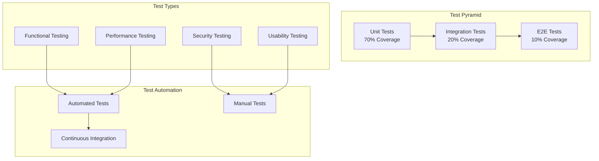
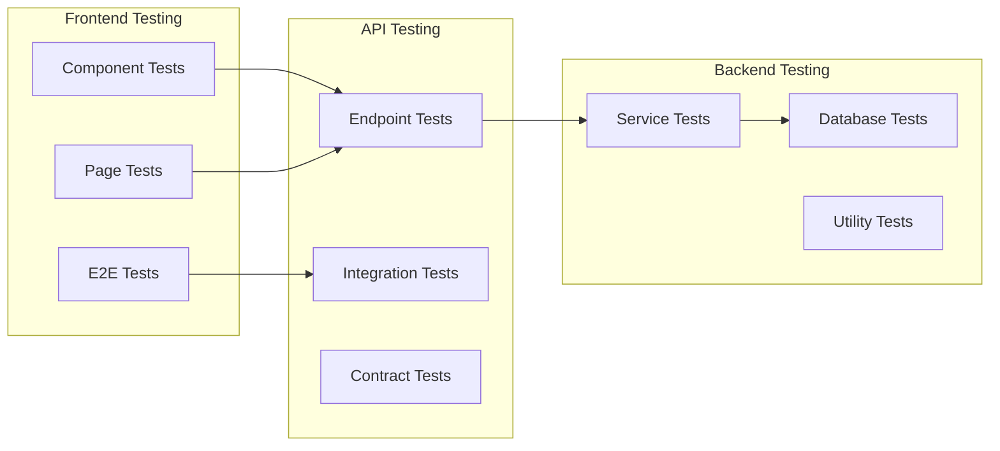

# System Test Plan (STP) - Master Document

**Project:** Eatsential - Precision Nutrition Platform  
**Document Type:** System Test Plan (IEEE 829)  
**Version:** 1.0  
**Date:** October 21, 2025  
**QA Lead:** Quality Assurance Team

---

## Document Information

**Related Documents:**

- [Test Traceability Matrix](./test-traceability-matrix.md)
- [SRS Master](../2-SRS/SRS-MASTER.md)
- [SAD Master](../3-DESIGN/3.1-SAD/SAD-MASTER.md)
- [SDD Master](../3-DESIGN/3.2-SDD/SDD-MASTER.md)

---

## Table of Contents

1. [Introduction](#1-introduction)
2. [Test Strategy](#2-test-strategy)
3. [Test Scope](#3-test-scope)
4. [Test Levels](#4-test-levels)
5. [Test Types](#5-test-types)
6. [Test Environment](#6-test-environment)
7. [Test Schedule](#7-test-schedule)
8. [Test Deliverables](#8-test-deliverables)
9. [Risk Management](#9-risk-management)
10. [Approval](#10-approval)

---

## 1. Introduction

### 1.1 Purpose

This System Test Plan (STP) defines the overall testing strategy, approach, and execution plan for the Eatsential MVP. It ensures comprehensive testing coverage across all system components and validates that the system meets specified requirements.

### 1.2 Document Scope

This master document provides:

- Overall testing strategy and methodology
- Test level definitions and objectives
- Resource and environment requirements
- Risk assessment and mitigation strategies
- Test execution and reporting procedures

### 1.3 Testing Philosophy

Our testing approach follows these principles:

1. **Shift-Left Testing:** Test early and often in the development cycle
2. **Risk-Based Testing:** Prioritize testing based on risk assessment
3. **Automation First:** Automate repetitive tests for efficiency
4. **Continuous Testing:** Integrate testing into CI/CD pipeline
5. **User-Centric:** Focus on real user scenarios and experiences

---

## 2. Test Strategy

### 2.1 Overall Approach



### 2.2 Testing Methodology

1. **Test-Driven Development (TDD)**
   - Write tests before code
   - Red-Green-Refactor cycle
   - Maintain high unit test coverage

2. **Behavior-Driven Development (BDD)**
   - User story based test scenarios
   - Gherkin syntax for acceptance tests
   - Collaboration between QA, Dev, and Product

3. **Continuous Integration Testing**
   - Automated test execution on every commit
   - Fast feedback loop
   - Prevent regression issues

### 2.3 Test Coverage Goals

| Test Level  | Coverage Target | Current Status | Priority |
| ----------- | --------------- | -------------- | -------- |
| Unit Tests  | 80%             | 75%            | High     |
| Integration | 70%             | 60%            | High     |
| E2E Tests   | Critical Paths  | In Progress    | Medium   |
| Security    | OWASP Top 10    | Planned        | High     |
| Performance | Load Testing    | Planned        | Medium   |

---

## 3. Test Scope

### 3.1 In Scope

**Current Sprint (Authentication):**

1. User Registration
   - Input validation
   - Duplicate user prevention
   - Password security
   - Email verification

2. Authentication Flow
   - Login functionality
   - JWT token management
   - Session handling
   - Logout functionality

3. Security Features
   - Password hashing
   - Rate limiting
   - CORS policies
   - Input sanitization

**Future Sprints:**

4. Health Profile Management
5. Meal Recommendations
6. Restaurant Integration
7. AI/ML Features

### 3.2 Out of Scope

1. Third-party payment systems (deferred)
2. Mobile app testing (web only for MVP)
3. Localization testing (English only)
4. Load testing beyond 100 concurrent users
5. Disaster recovery testing

### 3.3 Test Boundaries



---

## 4. Test Levels

### 4.1 Unit Testing

**Objective:** Verify individual components work correctly in isolation

**Scope:**

- Frontend: React components, utilities, hooks
- Backend: Services, utilities, validators
- Database: Models, queries

**Tools:**

- Frontend: Vitest, React Testing Library
- Backend: Pytest, pytest-asyncio
- Mocking: Jest mocks, unittest.mock

**Example Test Cases:**

```python
# Backend Unit Test
def test_password_hashing():
    password = "SecurePass123!"
    hashed = hash_password(password)
    assert verify_password(password, hashed) == True
    assert verify_password("WrongPass", hashed) == False

# Frontend Unit Test
test('SignupField validates email format', () => {
    const { getByLabelText, getByText } = render(<SignupField />);
    const emailInput = getByLabelText('Email');
    fireEvent.change(emailInput, { target: { value: 'invalid-email' } });
    fireEvent.blur(emailInput);
    expect(getByText('Invalid email address')).toBeInTheDocument();
});
```

### 4.2 Integration Testing

**Objective:** Verify components work together correctly

**Scope:**

- API endpoint integration
- Database operations
- Service interactions
- External service mocks

**Tools:**

- Backend: FastAPI TestClient
- Database: Test database instances
- Mocking: Responses for external services

**Example Test Cases:**

```python
# API Integration Test
async def test_user_registration_flow():
    # Test complete registration flow
    response = await client.post("/api/auth/register", json={
        "username": "testuser",
        "email": "test@example.com",
        "password": "Test123!@#"
    })
    assert response.status_code == 201

    # Verify user in database
    user = db.query(User).filter_by(email="test@example.com").first()
    assert user is not None
    assert user.is_email_verified == False

    # Verify email was sent (mocked)
    assert mock_email_service.send_email.called
```

### 4.3 System Testing

**Objective:** Verify the complete system meets requirements

**Scope:**

- End-to-end user workflows
- Cross-browser compatibility
- Performance requirements
- Security requirements

**Tools:**

- E2E: Playwright, Cypress
- Performance: Locust, k6
- Security: OWASP ZAP

**Test Scenarios:**

1. Complete user registration and verification flow
2. Login with various credential combinations
3. Password reset workflow
4. Session timeout handling
5. Concurrent user testing

### 4.4 Acceptance Testing

**Objective:** Validate system meets business requirements

**Scope:**

- User acceptance criteria
- Business workflow validation
- Usability testing
- Accessibility testing

**Approach:**

- Manual testing by QA team
- Beta testing with selected users
- Accessibility audit (WCAG 2.1)
- Performance perception testing

---

## 5. Test Types

### 5.1 Functional Testing

**Categories:**

1. **Positive Testing**
   - Valid inputs
   - Expected workflows
   - Happy path scenarios

2. **Negative Testing**
   - Invalid inputs
   - Error conditions
   - Edge cases

3. **Boundary Testing**
   - Min/max values
   - Character limits
   - Rate limits

**Test Matrix:**

| Feature        | Positive | Negative | Boundary | Status      |
| -------------- | -------- | -------- | -------- | ----------- |
| User Signup    | ✅       | ✅       | ✅       | Complete    |
| Email Verify   | ✅       | ✅       | ⏳       | In Progress |
| Password Rules | ✅       | ✅       | ✅       | Complete    |
| Rate Limiting  | ✅       | ✅       | ✅       | Complete    |

### 5.2 Security Testing

**OWASP Top 10 Coverage:**

| Vulnerability                               | Test Coverage      | Status       |
| ------------------------------------------- | ------------------ | ------------ |
| Injection                                   | SQL, NoSQL         | ✅ Tested    |
| Broken Authentication                       | JWT, Sessions      | ✅ Tested    |
| Sensitive Data Exposure                     | Encryption         | ✅ Tested    |
| XML External Entities                       | N/A                | N/A          |
| Broken Access Control                       | RBAC               | ⏳ Planned   |
| Security Misconfiguration                   | Headers            | ✅ Tested    |
| Cross-Site Scripting                        | Input sanitization | ✅ Tested    |
| Insecure Deserialization                    | JSON validation    | ✅ Tested    |
| Using Components with Known Vulnerabilities | Dependency scan    | ✅ Automated |
| Insufficient Logging                        | Audit logs         | ⏳ Planned   |

### 5.3 Performance Testing

**Metrics and Targets:**

| Metric              | Target      | Test Method         |
| ------------------- | ----------- | ------------------- |
| Page Load Time      | < 2s        | Lighthouse          |
| API Response Time   | < 200ms p95 | Load testing        |
| Concurrent Users    | 100         | Stress testing      |
| Database Query Time | < 50ms      | Query profiling     |
| Memory Usage        | < 512MB     | Resource monitoring |

### 5.4 Usability Testing

**Focus Areas:**

1. **Onboarding Flow**
   - Time to complete signup
   - Error message clarity
   - Help text effectiveness

2. **Navigation**
   - Intuitive flow
   - Clear CTAs
   - Consistent design

3. **Accessibility**
   - Keyboard navigation
   - Screen reader support
   - Color contrast

---

## 6. Test Environment

### 6.1 Development Environment

```yaml
Frontend:
  - Node.js: 18.x
  - React: 18.3
  - Browsers: Chrome (latest), Firefox (latest), Safari (latest)

Backend:
  - Python: 3.11+
  - FastAPI: 0.115
  - Database: SQLite (development)

Tools:
  - Git: Version control
  - VS Code: IDE
  - Postman: API testing
```

### 6.2 Test Environment

```yaml
CI/CD:
  - GitHub Actions: Automated testing
  - Docker: Containerization
  - Test Database: PostgreSQL 15

Test Data:
  - Fixtures: Predefined test data
  - Factories: Dynamic test data generation
  - Mocks: External service simulation
```

### 6.3 Staging Environment

```yaml
Infrastructure:
  - Cloud Provider: AWS (planned)
  - Database: PostgreSQL RDS
  - Application: Docker containers

Configuration:
  - Environment variables
  - Feature flags
  - Monitoring: Datadog (planned)
```

---

## 7. Test Schedule

### 7.1 Sprint 1 (Current - Authentication)

| Week | Activities                   | Deliverables             |
| ---- | ---------------------------- | ------------------------ |
| 1    | Unit test development        | 80% unit test coverage   |
| 1-2  | Integration test development | API test suite           |
| 2    | Security testing             | Security test report     |
| 2    | E2E test automation          | Critical path automation |

### 7.2 Sprint 2 (Health Profile)

| Week | Activities                      | Deliverables           |
| ---- | ------------------------------- | ---------------------- |
| 3    | Unit tests for profile features | Profile test suite     |
| 3-4  | Integration tests               | API integration tests  |
| 4    | Accessibility testing           | WCAG compliance report |
| 4    | Performance baseline            | Performance metrics    |

### 7.3 Release Testing

| Phase         | Duration | Activities           |
| ------------- | -------- | -------------------- |
| Alpha Testing | 1 week   | Internal testing     |
| Beta Testing  | 1 week   | Limited user testing |
| UAT           | 3 days   | Business acceptance  |
| Go-Live       | 1 day    | Final smoke tests    |

---

## 8. Test Deliverables

### 8.1 Test Documentation

1. **Test Plans**
   - Unit Test Plan
   - Integration Test Plan
   - System Test Plan
   - UAT Plan

2. **Test Cases**
   - Test case repository
   - Test data sets
   - Expected results

3. **Test Reports**
   - Daily test execution reports
   - Defect reports
   - Test coverage reports
   - Final test summary

### 8.2 Test Artifacts

```
test-artifacts/
├── test-plans/
│   ├── unit-test-plan.md
│   ├── integration-test-plan.md
│   └── system-test-plan.md
├── test-cases/
│   ├── authentication/
│   ├── health-profile/
│   └── recommendations/
├── test-data/
│   ├── fixtures/
│   └── mock-data/
├── test-reports/
│   ├── daily/
│   ├── sprint/
│   └── release/
└── defects/
    ├── open/
    ├── closed/
    └── deferred/
```

### 8.3 Metrics and KPIs

| Metric                | Target | Measurement Method       |
| --------------------- | ------ | ------------------------ |
| Test Coverage         | 80%    | Coverage tools           |
| Defect Detection Rate | 90%    | Defects found in testing |
| Test Execution Rate   | 95%    | Tests run vs planned     |
| Automation Rate       | 70%    | Automated vs manual      |
| Defect Escape Rate    | <5%    | Production defects       |

---

## 9. Risk Management

### 9.1 Testing Risks

| Risk                     | Probability | Impact | Mitigation                  |
| ------------------------ | ----------- | ------ | --------------------------- |
| Incomplete test coverage | Medium      | High   | Prioritize critical paths   |
| Environment instability  | Low         | High   | Environment monitoring      |
| Test data issues         | Medium      | Medium | Automated data generation   |
| Resource availability    | Medium      | High   | Cross-training team         |
| Timeline pressure        | High        | High   | Risk-based testing approach |

### 9.2 Product Risks

| Risk                     | Test Strategy                     |
| ------------------------ | --------------------------------- |
| Security vulnerabilities | Automated security scanning       |
| Performance degradation  | Continuous performance monitoring |
| Data integrity issues    | Database validation tests         |
| User experience problems | Usability testing sessions        |
| Integration failures     | Contract testing                  |

### 9.3 Contingency Plans

1. **Critical Defects Found Late**
   - Hotfix process defined
   - Rollback procedures ready
   - Communication plan activated

2. **Test Environment Failure**
   - Backup environment available
   - Local testing capabilities
   - Cloud-based alternatives

3. **Resource Constraints**
   - Prioritized test execution
   - Risk-based test selection
   - Automated test focus

---

## 10. Approval

### 10.1 Review and Approval

| Role             | Name   | Signature        | Date         |
| ---------------- | ------ | ---------------- | ------------ |
| QA Lead          | [Name] | ******\_\_****** | ****\_\_**** |
| Development Lead | [Name] | ******\_\_****** | ****\_\_**** |
| Product Manager  | [Name] | ******\_\_****** | ****\_\_**** |
| Project Manager  | [Name] | ******\_\_****** | ****\_\_**** |

### 10.2 Distribution List

- Development Team
- QA Team
- Product Management
- Project Management
- Stakeholders

### 10.3 Version History

| Version | Date       | Author  | Changes         |
| ------- | ---------- | ------- | --------------- |
| 1.0     | 2025-10-21 | QA Team | Initial version |

---

## Appendices

### Appendix A: Test Case Template

```gherkin
Feature: User Registration
  As a new user
  I want to create an account
  So that I can access personalized meal recommendations

  Scenario: Successful registration with valid data
    Given I am on the signup page
    When I enter "john_doe" as username
    And I enter "john@example.com" as email
    And I enter "SecurePass123!" as password
    And I click the signup button
    Then I should see "Please check your email"
    And an email should be sent to "john@example.com"
```

### Appendix B: Defect Report Template

```markdown
**Defect ID:** BUG-001
**Date:** 2025-10-21
**Reporter:** QA Tester
**Severity:** High
**Priority:** P1

**Summary:** Password validation allows weak passwords

**Steps to Reproduce:**

1. Go to signup page
2. Enter valid username and email
3. Enter "password" as password
4. Submit form

**Expected Result:** Error message about password requirements
**Actual Result:** Form submits successfully

**Environment:** Development
**Attachments:** screenshot.png
```

### Appendix C: Test Metrics Dashboard

```
┌─────────────────────────────────────────┐
│          Test Execution Summary          │
├─────────────────────┬───────────────────┤
│ Total Tests         │ 245               │
│ Passed              │ 232 (94.7%)       │
│ Failed              │ 8 (3.3%)          │
│ Skipped             │ 5 (2.0%)          │
├─────────────────────┼───────────────────┤
│ Code Coverage       │ 78.5%             │
│ Branch Coverage     │ 72.3%             │
├─────────────────────┼───────────────────┤
│ Open Defects        │ 12                │
│ Closed This Sprint  │ 45                │
│ Deferred            │ 3                 │
└─────────────────────┴───────────────────┘
```

---

**Document Status:** COMPLETE  
**Last Review:** October 21, 2025  
**Next Review:** Sprint 2 Planning
