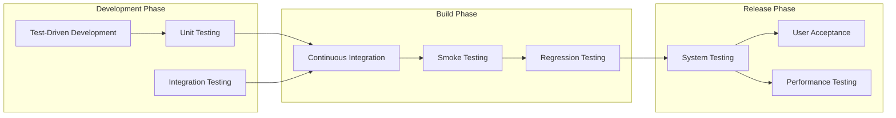
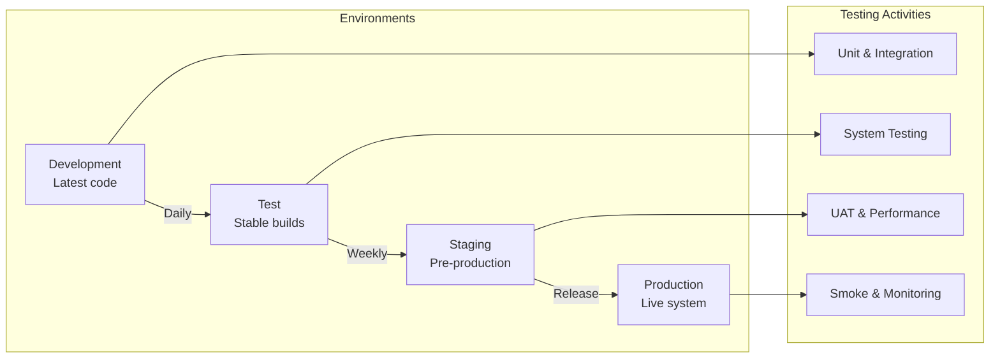
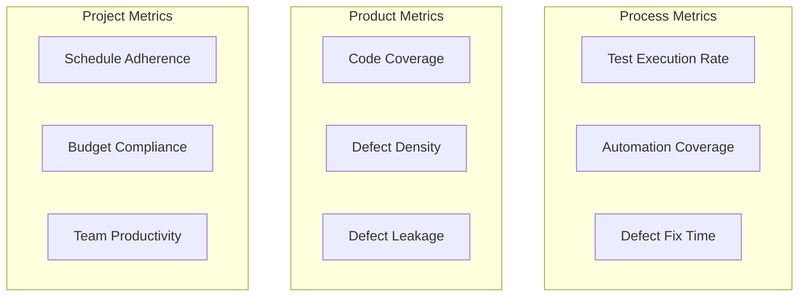
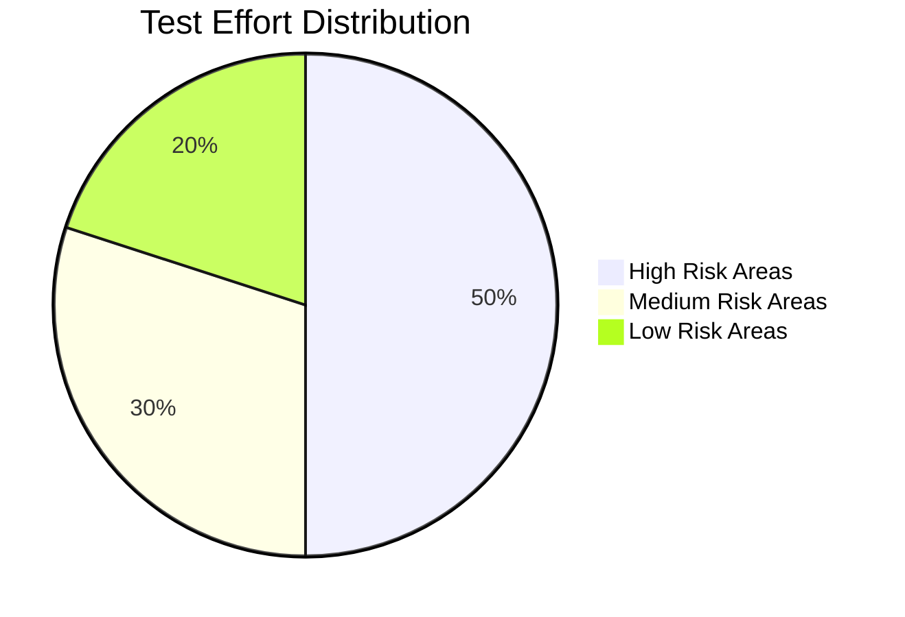

# Test Strategy Document

**Project:** Eatsential - Precision Nutrition Platform  
**Document Type:** Test Strategy  
**Version:** 1.0  
**Date:** October 21, 2025  
**Author:** QA Team

---

## Table of Contents

1. [Introduction](#1-introduction)
2. [Test Objectives](#2-test-objectives)
3. [Test Approach](#3-test-approach)
4. [Test Levels](#4-test-levels)
5. [Test Types](#5-test-types)
6. [Test Design Techniques](#6-test-design-techniques)
7. [Test Environment](#7-test-environment)
8. [Test Tools](#8-test-tools)
9. [Test Metrics](#9-test-metrics)
10. [Risk Analysis](#10-risk-analysis)

---

## 1. Introduction

### 1.1 Purpose

This Test Strategy document defines the overall approach, methodologies, and standards for testing the Eatsential platform. It serves as a guide for all testing activities throughout the project lifecycle.

### 1.2 Scope

This strategy covers:

- All testing levels from unit to acceptance
- Functional and non-functional testing
- Manual and automated testing approaches
- Testing tools and environments
- Quality metrics and reporting

### 1.3 Testing Philosophy

Our testing approach is based on:

- **Prevention over Detection**: Find defects early
- **Automation First**: Automate repetitive tests
- **Risk-Based Testing**: Focus on critical areas
- **Continuous Testing**: Integrate with CI/CD
- **Collaborative Testing**: Involve all stakeholders

## 2. Test Objectives

### 2.1 Primary Objectives

1. **Ensure Safety**: Zero tolerance for allergen-related defects
2. **Validate Requirements**: 100% requirement coverage
3. **Ensure Quality**: Meet all quality standards
4. **Enable Confidence**: Provide deployment confidence
5. **Support Agility**: Enable rapid iterations

### 2.2 Specific Goals

| Goal                | Target  | Measurement                      |
| ------------------- | ------- | -------------------------------- |
| Code Coverage       | 80%     | Coverage tools                   |
| Defect Detection    | 90%     | Pre-production vs production     |
| Test Automation     | 70%     | Automated vs manual tests        |
| Critical Defects    | 0       | Severity 1 defects in production |
| Test Execution Time | <30 min | CI/CD pipeline duration          |

## 3. Test Approach

### 3.1 Testing Methodology



### 3.2 Test Process

1. **Test Planning**
   - Analyze requirements
   - Identify test scenarios
   - Create test plans
   - Allocate resources

2. **Test Design**
   - Create test cases
   - Prepare test data
   - Design test scripts
   - Review test artifacts

3. **Test Execution**
   - Execute test cases
   - Log defects
   - Track progress
   - Update results

4. **Test Closure**
   - Analyze metrics
   - Create reports
   - Archive artifacts
   - Lessons learned

### 3.3 Entry and Exit Criteria

#### Entry Criteria

- Requirements approved and baselined
- Test environment available
- Test data prepared
- Code deployed to test environment
- Smoke test passed

#### Exit Criteria

- All planned tests executed
- Critical defects resolved
- Test coverage targets met
- Performance criteria satisfied
- Stakeholder approval obtained

## 4. Test Levels

### 4.1 Unit Testing

**Objective**: Verify individual components work correctly

**Approach**:

- Developer-driven testing
- TDD methodology
- Automated execution
- Mock external dependencies

**Coverage Targets**:

- Statements: 80%
- Branches: 75%
- Functions: 90%

**Tools**:

- Frontend: Vitest, React Testing Library
- Backend: Pytest, pytest-asyncio
- Mocking: Jest mocks, unittest.mock

### 4.2 Integration Testing

**Objective**: Verify component interactions

**Approach**:

- API contract testing
- Database integration testing
- Service integration testing
- Message flow testing

**Focus Areas**:

```python
# API Integration Test Example
async def test_user_registration_integration():
    # Test complete flow: API -> Service -> Database -> Email
    response = await client.post("/api/auth/register", json={...})
    assert response.status_code == 201
    assert user_exists_in_database()
    assert email_was_sent()
```

### 4.3 System Testing

**Objective**: Verify complete system functionality

**Approach**:

- End-to-end scenarios
- Cross-browser testing
- Mobile responsiveness
- Data flow validation

**Test Scenarios**:

1. Complete user journey
2. Multi-user interactions
3. System boundaries
4. Error handling
5. Recovery procedures

### 4.4 Acceptance Testing

**Objective**: Validate business requirements

**Approach**:

- User acceptance testing (UAT)
- Beta testing
- Stakeholder demos
- Production-like environment

**Acceptance Criteria**:

- All user stories accepted
- No critical defects
- Performance SLAs met
- Security requirements validated

## 5. Test Types

### 5.1 Functional Testing

#### 5.1.1 Smoke Testing

- **Purpose**: Verify basic functionality
- **Frequency**: Every build
- **Duration**: <5 minutes
- **Automation**: 100%

#### 5.1.2 Regression Testing

- **Purpose**: Verify existing functionality
- **Frequency**: Every release
- **Coverage**: Critical paths
- **Automation**: 80%

#### 5.1.3 Exploratory Testing

- **Purpose**: Find unexpected issues
- **Frequency**: Weekly
- **Approach**: Session-based
- **Documentation**: Session notes

### 5.2 Non-Functional Testing

#### 5.2.1 Performance Testing

**Load Testing Targets**:
| Metric | Target | Test Method |
|--------|--------|-------------|
| Response Time | <200ms (p95) | JMeter/Locust |
| Throughput | 1000 req/sec | Load simulation |
| Concurrent Users | 100 | Gradual ramp-up |
| Resource Usage | <70% CPU | Monitoring |

#### 5.2.2 Security Testing

**Security Test Areas**:

- Authentication/Authorization
- Input validation
- SQL injection
- XSS prevention
- CSRF protection
- Data encryption
- Session management

#### 5.2.3 Usability Testing

**Usability Metrics**:

- Task completion rate: >90%
- Error rate: <5%
- Time to complete: Per persona
- User satisfaction: >4/5

#### 5.2.4 Accessibility Testing

**WCAG 2.1 Compliance**:

- Level AA compliance
- Screen reader testing
- Keyboard navigation
- Color contrast validation
- ARIA attributes

## 6. Test Design Techniques

### 6.1 Black Box Techniques

1. **Equivalence Partitioning**

   ```
   Password Length:
   - Invalid: <8 characters
   - Valid: 8-48 characters
   - Invalid: >48 characters
   ```

2. **Boundary Value Analysis**

   ```
   Username Length:
   - Test values: 2, 3, 4, 19, 20, 21
   - Boundaries: min=3, max=20
   ```

3. **Decision Table Testing**
   | Has Allergy | Meal Contains Allergen | Show Meal |
   |-------------|------------------------|-----------|
   | Yes | Yes | No |
   | Yes | No | Yes |
   | No | Yes | Yes |
   | No | No | Yes |

### 6.2 White Box Techniques

1. **Statement Coverage**
   - Every line of code executed
   - Minimum 80% coverage

2. **Branch Coverage**
   - All decision paths tested
   - If/else, switch cases

3. **Path Coverage**
   - Critical paths identified
   - Happy path + error paths

### 6.3 Experience-Based Techniques

1. **Error Guessing**
   - Common user mistakes
   - Historical defects
   - Edge cases

2. **Exploratory Testing**
   - Charter-based sessions
   - Time-boxed exploration
   - Defect clustering

## 7. Test Environment

### 7.1 Environment Strategy



### 7.2 Test Data Management

**Data Categories**:

1. **Static Test Data**
   - Predefined users
   - Standard test cases
   - Reference data

2. **Dynamic Test Data**
   - Generated on-demand
   - Realistic variations
   - Volume testing

3. **Sensitive Data**
   - Anonymized production data
   - Synthetic PII
   - Encrypted storage

**Data Refresh Strategy**:

- Daily: Development environment
- Weekly: Test environment
- On-demand: Staging environment

## 8. Test Tools

### 8.1 Testing Tools Matrix

| Category             | Tool           | Purpose              | Environment |
| -------------------- | -------------- | -------------------- | ----------- |
| Unit Test (Frontend) | Vitest         | Component testing    | Local/CI    |
| Unit Test (Backend)  | Pytest         | Python testing       | Local/CI    |
| E2E Testing          | Playwright     | Browser automation   | Test/Stage  |
| API Testing          | Postman/Newman | API validation       | All         |
| Load Testing         | Locust         | Performance testing  | Stage       |
| Security             | OWASP ZAP      | Security scanning    | Test/Stage  |
| Code Coverage        | Coverage.py/C8 | Coverage tracking    | CI          |
| Test Management      | GitHub Issues  | Test case management | All         |

### 8.2 CI/CD Integration

```yaml
# GitHub Actions Test Pipeline
name: Test Pipeline
on: [push, pull_request]

jobs:
  test:
    steps:
      - Unit Tests
      - Integration Tests
      - Code Coverage
      - Security Scan
      - Build Artifacts
      - Deploy to Test
      - Smoke Tests
      - Report Results
```

### 8.3 Test Automation Framework

**Frontend Framework**:

```typescript
// Test Structure
describe('Component', () => {
  beforeEach(() => {
    // Setup
  });

  it('should behavior description', () => {
    // Arrange
    // Act
    // Assert
  });

  afterEach(() => {
    // Cleanup
  });
});
```

**Backend Framework**:

```python
# Test Structure
class TestFeature:
    @pytest.fixture
    def setup(self):
        # Setup code
        yield
        # Teardown code

    def test_scenario(self, setup):
        # Given
        # When
        # Then
```

## 9. Test Metrics

### 9.1 Quality Metrics



### 9.2 Key Performance Indicators

| KPI                   | Formula                                                   | Target  | Frequency |
| --------------------- | --------------------------------------------------------- | ------- | --------- |
| Test Coverage         | (Tested Requirements / Total Requirements) × 100          | 100%    | Sprint    |
| Defect Detection Rate | (Defects Found in Testing / Total Defects) × 100          | >90%    | Release   |
| Test Automation ROI   | (Manual Effort Saved - Automation Cost) / Automation Cost | >200%   | Quarterly |
| Mean Time to Detect   | Average time from defect introduction to detection        | <2 days | Sprint    |
| Test Effectiveness    | (Defects Found by Tests / Total Test Cases) × 100         | >10%    | Sprint    |

### 9.3 Reporting

**Test Reports**:

1. **Daily Status**
   - Tests executed
   - Pass/fail rate
   - Blockers

2. **Sprint Report**
   - Coverage achieved
   - Defect trends
   - Velocity

3. **Release Report**
   - Quality gates
   - Risk assessment
   - Go/no-go recommendation

## 10. Risk Analysis

### 10.1 Testing Risks

| Risk                       | Impact | Probability | Mitigation                  |
| -------------------------- | ------ | ----------- | --------------------------- |
| Insufficient test coverage | High   | Medium      | Automated coverage tracking |
| Late requirement changes   | High   | High        | Agile test approach         |
| Environment instability    | Medium | Medium      | Environment monitoring      |
| Test data issues           | Medium | Low         | Data generation tools       |
| Resource constraints       | High   | Medium      | Test prioritization         |

### 10.2 Product Risks

**High-Risk Areas** (Require extensive testing):

1. Allergen detection and filtering
2. User authentication and security
3. Payment processing
4. Health data privacy
5. AI recommendation accuracy

**Risk-Based Test Allocation**:



### 10.3 Mitigation Strategies

1. **Allergen Safety**
   - 100% test coverage
   - Multiple validation layers
   - Manual verification
   - Production monitoring

2. **Security Vulnerabilities**
   - Automated security scans
   - Penetration testing
   - Code reviews
   - Security training

3. **Performance Issues**
   - Early performance testing
   - Continuous monitoring
   - Capacity planning
   - Optimization sprints

---

**Document Status:** COMPLETE  
**Last Review:** October 21, 2025  
**Next Review:** Sprint Planning

**Approval:**

- QA Lead: ******\_\_\_****** Date: **\_\_\_\_**
- Development Lead: ******\_\_\_****** Date: **\_\_\_\_**
- Product Manager: ******\_\_\_****** Date: **\_\_\_\_**
