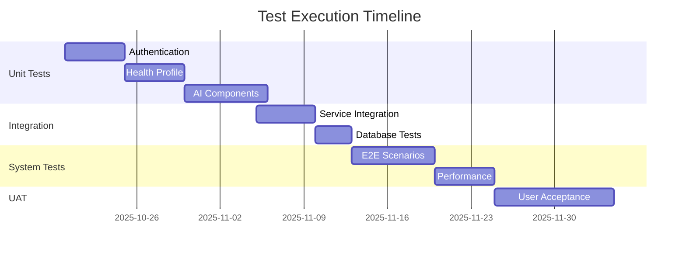

# Test Traceability Matrix (TTM)

**Project:** Eatsential - Precision Nutrition Platform  
**Document Type:** Test Traceability Matrix  
**Version:** 1.0  
**Date:** October 19, 2025  
**Test Lead:** QA Manager

---

## Document Information

**Related Documents:**
- [Requirements Traceability Matrix](../2-SRS/requirements-traceability-matrix.md)
- [STP Master](./STP-MASTER.md)
- [Functional Requirements](../2-SRS/3-specific-requirements/3.1-functional-requirements.md)
- [Use Cases](../2-SRS/3-specific-requirements/3.4-use-cases.md)

---

## 1. Introduction

### 1.1 Purpose

This Test Traceability Matrix ensures:
- **Complete test coverage** of all requirements
- **Bi-directional traceability** between requirements and tests
- **Risk-based testing** prioritization
- **Compliance validation** for health-critical features
- **Test gap identification** and remediation

### 1.2 Test Categories

| Category | Code | Description | Priority |
|----------|------|-------------|----------|
| **Unit Tests** | UT | Individual component testing | HIGH |
| **Integration Tests** | IT | Service interaction testing | HIGH |
| **System Tests** | ST | End-to-end functionality | CRITICAL |
| **Performance Tests** | PT | Load and stress testing | HIGH |
| **Security Tests** | SEC | Vulnerability testing | CRITICAL |
| **Acceptance Tests** | AT | Business validation | CRITICAL |
| **Accessibility Tests** | ACC | WCAG compliance | MEDIUM |
| **Usability Tests** | UST | User experience | MEDIUM |

### 1.3 Test Status Legend

| Symbol | Status | Description |
|--------|--------|-------------|
| ✅ | Passed | Test executed successfully |
| ❌ | Failed | Test failed, defect logged |
| ⚠️ | Blocked | Cannot execute due to dependency |
| 🔄 | In Progress | Currently being executed |
| 📝 | Planned | Test case written, not executed |
| ➖ | Not Applicable | Not relevant for this requirement |

---

## 2. Critical Test Scenarios

### 2.1 Allergy Safety Test Suite (ZERO TOLERANCE)

| Test ID | Test Scenario | Requirement | Priority | Status | Defects |
|---------|--------------|-------------|----------|--------|---------|
| **STC-001** | Detect common allergens (Big 8) | FR-032 | CRITICAL | 📝 | - |
| **STC-002** | Detect hidden allergens in ingredients | FR-032 | CRITICAL | 📝 | - |
| **STC-003** | Cross-contamination warnings | FR-032 | CRITICAL | 📝 | - |
| **STC-004** | Multi-allergen combinations | FR-032 | CRITICAL | 📝 | - |
| **STC-005** | Regional allergen variations | FR-032 | HIGH | 📝 | - |
| **STC-006** | Allergen synonym detection | FR-032 | HIGH | 📝 | - |
| **STC-007** | Restaurant preparation warnings | FR-032 | CRITICAL | 📝 | - |
| **STC-008** | Emergency contact activation | FR-032 | CRITICAL | 📝 | - |

**Test Data Requirements:**
```yaml
allergen_test_data:
  common_allergens:
    - milk: ["dairy", "lactose", "casein", "whey"]
    - eggs: ["albumin", "globulin", "lecithin", "mayonnaise"]
    - peanuts: ["groundnuts", "arachis oil"]
    - tree_nuts: ["almonds", "cashews", "pecans", "walnuts"]
    - soy: ["edamame", "tofu", "tempeh", "miso"]
    - wheat: ["gluten", "semolina", "spelt", "kamut"]
    - fish: ["anchovies", "bass", "cod", "salmon"]
    - shellfish: ["crab", "lobster", "shrimp", "mollusks"]
    
  hidden_allergens:
    - natural_flavoring: "may contain milk"
    - caramel_color: "may contain gluten"
    - vitamin_e: "may be derived from soy"
```

### 2.2 Performance Test Suite

| Test ID | Test Scenario | Requirement | Target | Status | Result |
|---------|--------------|-------------|--------|--------|--------|
| **PTC-001** | API response time (normal load) | NFR-001 | <200ms | 📝 | - |
| **PTC-002** | API response time (peak load) | NFR-001 | <500ms | 📝 | - |
| **PTC-003** | Recommendation generation time | NFR-005 | <1s | 📝 | - |
| **PTC-004** | Database query performance | NFR-004 | <50ms | 📝 | - |
| **PTC-005** | Concurrent user handling | NFR-008 | 10K users | 📝 | - |
| **PTC-006** | Memory usage under load | NFR-008 | <4GB/pod | 📝 | - |
| **PTC-007** | Cache hit ratio | NFR-004 | >80% | 📝 | - |
| **PTC-008** | Search response time | NFR-007 | <200ms | 📝 | - |

**Load Test Scenarios:**
```javascript
// K6 Load Test Script Example
import http from 'k6/http';
import { check, sleep } from 'k6';

export let options = {
  stages: [
    { duration: '5m', target: 100 },   // Ramp up
    { duration: '10m', target: 1000 },  // Stay at 1000
    { duration: '5m', target: 5000 },   // Peak load
    { duration: '10m', target: 5000 },  // Sustained peak
    { duration: '5m', target: 0 },      // Ramp down
  ],
  thresholds: {
    http_req_duration: ['p(95)<200'], // 95% under 200ms
    http_req_failed: ['rate<0.1'],    // Error rate under 10%
  },
};
```

---

## 3. Functional Test Coverage

### 3.1 User Authentication & Management

| Test ID | Test Case | Requirement | Type | Priority | Status | 
|---------|-----------|-------------|------|----------|--------|
| **UTC-001** | Register with valid email | FR-001 | UT | HIGH | 📝 |
| **UTC-002** | Register with invalid email | FR-001 | UT | HIGH | 📝 |
| **UTC-003** | Password strength validation | FR-001 | UT | HIGH | 📝 |
| **UTC-004** | Duplicate email prevention | FR-001 | UT | HIGH | 📝 |
| **UTC-005** | Email verification flow | FR-001 | UT | HIGH | 📝 |
| **ITC-001** | OAuth2 Google login | FR-003 | IT | MEDIUM | 📝 |
| **ITC-002** | OAuth2 Apple login | FR-003 | IT | MEDIUM | 📝 |
| **ITC-003** | Session timeout handling | FR-005 | IT | HIGH | 📝 |
| **STC-009** | Complete registration flow | UC-001 | ST | HIGH | 📝 |
| **STC-010** | Password recovery E2E | UC-003 | ST | HIGH | 📝 |

### 3.2 Health Profile Management

| Test ID | Test Case | Requirement | Type | Priority | Status |
|---------|-----------|-------------|------|----------|--------|
| **UTC-006** | Add single allergy | FR-016 | UT | CRITICAL | 📝 |
| **UTC-007** | Add multiple allergies | FR-016 | UT | CRITICAL | 📝 |
| **UTC-008** | Remove allergy | FR-016 | UT | CRITICAL | 📝 |
| **UTC-009** | Invalid allergy input | FR-016 | UT | HIGH | 📝 |
| **UTC-010** | Medical condition validation | FR-017 | UT | HIGH | 📝 |
| **ITC-004** | Profile data persistence | FR-016 | IT | CRITICAL | 📝 |
| **ITC-005** | Profile update propagation | FR-016 | IT | HIGH | 📝 |
| **STC-011** | Complete health profile setup | UC-005 | ST | CRITICAL | 📝 |
| **STC-012** | Biometric data tracking | UC-007 | ST | MEDIUM | 📝 |

### 3.3 AI Recommendation Engine

| Test ID | Test Case | Requirement | Type | Priority | Status |
|---------|-----------|-------------|------|----------|--------|
| **UTC-011** | Generate basic recommendation | FR-031 | UT | HIGH | 📝 |
| **UTC-012** | Apply allergy filters | FR-032 | UT | CRITICAL | 📝 |
| **UTC-013** | Calculate confidence score | FR-035 | UT | HIGH | 📝 |
| **UTC-014** | Nutrition matching algorithm | FR-033 | UT | HIGH | 📝 |
| **ITC-006** | RAG pipeline integration | FR-031 | IT | HIGH | 📝 |
| **ITC-007** | LLM explanation generation | FR-034 | IT | MEDIUM | 📝 |
| **ITC-008** | Safety validator integration | FR-032 | IT | CRITICAL | 📝 |
| **STC-013** | End-to-end recommendation | UC-009 | ST | HIGH | 📝 |
| **STC-014** | Allergen-free meal finding | UC-010 | ST | CRITICAL | 📝 |

### 3.4 Restaurant Discovery

| Test ID | Test Case | Requirement | Type | Priority | Status |
|---------|-----------|-------------|------|----------|--------|
| **UTC-015** | Search by location | FR-046 | UT | HIGH | 📝 |
| **UTC-016** | Filter by cuisine type | FR-046 | UT | MEDIUM | 📝 |
| **UTC-017** | Parse menu data | FR-048 | UT | HIGH | 📝 |
| **ITC-009** | Geolocation service | FR-047 | IT | HIGH | 📝 |
| **ITC-010** | Real-time availability | FR-049 | IT | MEDIUM | 📝 |
| **STC-015** | Find nearby restaurants | UC-014 | ST | HIGH | 📝 |
| **STC-016** | Check menu allergens | UC-016 | ST | CRITICAL | 📝 |

---

## 4. Non-Functional Test Coverage

### 4.1 Security Test Suite

| Test ID | Test Case | Requirement | Type | Tool | Status |
|---------|-----------|-------------|------|------|--------|
| **SEC-001** | SQL injection prevention | NFR-002 | SEC | SQLMap | 📝 |
| **SEC-002** | XSS vulnerability scan | NFR-002 | SEC | OWASP ZAP | 📝 |
| **SEC-003** | Authentication bypass | NFR-002 | SEC | Burp Suite | 📝 |
| **SEC-004** | API rate limiting | NFR-002 | SEC | Custom | 📝 |
| **SEC-005** | Data encryption validation | NFR-003 | SEC | OpenSSL | 📝 |
| **SEC-006** | Session hijacking | NFR-002 | SEC | Burp Suite | 📝 |
| **SEC-007** | HTTPS enforcement | NFR-003 | SEC | SSL Labs | 📝 |
| **SEC-008** | Sensitive data exposure | NFR-003 | SEC | Manual | 📝 |

### 4.2 Compliance Test Suite

| Test ID | Test Case | Requirement | Regulation | Status | Evidence |
|---------|-----------|-------------|------------|--------|----------|
| **CMP-001** | Health data encryption | NFR-003 | HIPAA | 📝 | - |
| **CMP-002** | Access control audit | NFR-003 | HIPAA | 📝 | - |
| **CMP-003** | Data portability | FR-065 | GDPR | 📝 | - |
| **CMP-004** | Right to deletion | NFR-011 | GDPR/CCPA | 📝 | - |
| **CMP-005** | Consent management | NFR-012 | GDPR | 📝 | - |
| **CMP-006** | No medical claims | NFR-013 | FDA | 📝 | - |
| **CMP-007** | Privacy policy | NFR-012 | CCPA | 📝 | - |

### 4.3 Accessibility Test Suite

| Test ID | Test Case | Standard | Tool | Status |
|---------|-----------|----------|------|--------|
| **ACC-001** | Screen reader compatibility | WCAG 2.1 A | NVDA | 📝 |
| **ACC-002** | Keyboard navigation | WCAG 2.1 A | Manual | 📝 |
| **ACC-003** | Color contrast ratio | WCAG 2.1 AA | aXe | 📝 |
| **ACC-004** | Alt text for images | WCAG 2.1 A | aXe | 📝 |
| **ACC-005** | Form label association | WCAG 2.1 A | WAVE | 📝 |
| **ACC-006** | Focus indicators | WCAG 2.1 AA | Manual | 📝 |

---

## 5. Test Execution Matrix

### 5.1 Sprint Test Plan

| Sprint | Test Focus | Test Types | Requirements | Target Coverage |
|--------|------------|------------|--------------|-----------------|
| **Sprint 1** | Authentication | UT, IT | FR-001 to FR-005 | 80% |
| **Sprint 2** | Health Profile | UT, IT, ST | FR-016 to FR-020 | 85% |
| **Sprint 3** | AI Safety | UT, IT, ST, SEC | FR-032, NFR-006 | 95% |
| **Sprint 4** | Recommendations | All types | FR-031 to FR-035 | 90% |
| **Sprint 5** | Performance | PT, ST | NFR-001, NFR-005 | 100% |
| **Sprint 6** | Integration | IT, ST, AT | All | 85% |
| **Sprint 7** | Security | SEC, CMP | NFR-002, NFR-003 | 100% |
| **Sprint 8** | UAT | AT, UST | All critical | 100% |

### 5.2 Test Environment Matrix

| Environment | Purpose | Data | Users | Tests |
|-------------|---------|------|-------|-------|
| **Local** | Developer testing | Mock | 1 | UT |
| **CI/CD** | Automated testing | Synthetic | N/A | UT, IT |
| **Dev** | Integration testing | Test DB | 5 | IT, ST |
| **Staging** | Pre-production | Prod-like | 20 | All |
| **Performance** | Load testing | Generated | 10K | PT |
| **Security** | Penetration testing | Isolated | N/A | SEC |
| **Production** | Smoke testing | Real | Limited | Smoke |

---

## 6. Risk-Based Testing

### 6.1 Risk Priority Matrix

| Risk Level | Requirements | Test Coverage Target | Test Frequency |
|------------|--------------|---------------------|----------------|
| **CRITICAL** | Allergy safety | 100% | Every build |
| **HIGH** | Authentication, Performance | 95% | Daily |
| **MEDIUM** | Restaurant features | 85% | Per sprint |
| **LOW** | Analytics, Reports | 70% | Per release |

### 6.2 Critical Test Paths

```mermaid
graph TD
    subgraph "Critical Path 1: Allergy Safety"
        A1[User adds allergy]
        A2[System stores allergy]
        A3[User searches meals]
        A4[System filters allergens]
        A5[Safe meals displayed]
        
        A1 --> A2
        A2 --> A3
        A3 --> A4
        A4 --> A5
    end
    
    subgraph "Critical Path 2: AI Recommendations"
        B1[User profile complete]
        B2[Request recommendations]
        B3[AI processes request]
        B4[Safety validation]
        B5[Results delivered]
        
        B1 --> B2
        B2 --> B3
        B3 --> B4
        B4 --> B5
    end
    
    style A4 fill:#ff6b6b
    style B4 fill:#ff6b6b
```



---

## 7. Test Data Management

### 7.1 Test Data Categories

| Category | Description | Source | Refresh Rate |
|----------|-------------|--------|--------------|
| **User Profiles** | Synthetic user data | Generator | Daily |
| **Allergen Data** | Comprehensive allergen list | FARE Database | Monthly |
| **Restaurant Data** | Sample menus and info | Scraped/Mock | Weekly |
| **Nutrition Data** | USDA nutrition facts | USDA API | Monthly |
| **Health Conditions** | Medical condition list | ICD-10 subset | Quarterly |

### 7.2 Test Data Requirements

```sql
-- Critical test data for allergy testing
CREATE TABLE test_allergen_scenarios (
    id SERIAL PRIMARY KEY,
    scenario_name VARCHAR(255),
    user_allergies JSONB,
    meal_ingredients JSONB,
    expected_result VARCHAR(50),
    risk_level VARCHAR(20)
);

-- Example test scenarios
INSERT INTO test_allergen_scenarios VALUES
(1, 'Direct milk allergy', '["milk"]', '["milk", "butter"]', 'BLOCKED', 'CRITICAL'),
(2, 'Hidden gluten', '["gluten"]', '["soy sauce", "rice"]', 'WARNING', 'HIGH'),
(3, 'Cross contamination', '["peanuts"]', '["almonds"]', 'CAUTION', 'MEDIUM'),
(4, 'Safe meal', '["shellfish"]', '["chicken", "rice"]', 'SAFE', 'LOW');
```

---

## 8. Defect Tracking

### 8.1 Defect Categories

| Severity | Response Time | Example | Escalation |
|----------|--------------|---------|------------|
| **CRITICAL** | < 2 hours | Allergen not detected | Executive |
| **HIGH** | < 8 hours | Login failure | PM/Tech Lead |
| **MEDIUM** | < 24 hours | Slow search | Dev Lead |
| **LOW** | < 1 week | UI alignment | Developer |

### 8.2 Current Defect Summary

| Category | Critical | High | Medium | Low | Total |
|----------|----------|------|--------|-----|-------|
| **Authentication** | 0 | 0 | 0 | 0 | 0 |
| **Health Profile** | 0 | 0 | 0 | 0 | 0 |
| **AI/Safety** | 0 | 0 | 0 | 0 | 0 |
| **Performance** | 0 | 0 | 0 | 0 | 0 |
| **Security** | 0 | 0 | 0 | 0 | 0 |
| **TOTAL** | **0** | **0** | **0** | **0** | **0** |

---

## 9. Test Automation Strategy

### 9.1 Automation Pyramid

```
         /\
        /AT\        5% - Manual Acceptance Tests
       /----\
      / UST  \      10% - Manual Usability Tests
     /--------\
    /   E2E    \    15% - Automated E2E Tests
   /------------\
  / Integration  \  25% - Automated Integration Tests
 /----------------\
/   Unit Tests     \ 45% - Automated Unit Tests
--------------------
```

### 9.2 Automation Framework

**Frontend Testing:**
```javascript
// Jest + React Testing Library
describe('AllergyInput', () => {
  test('should validate allergen selection', async () => {
    render(<AllergyInput />);
    const input = screen.getByRole('combobox');
    
    await userEvent.type(input, 'peanuts');
    await userEvent.click(screen.getByText('Peanuts'));
    
    expect(screen.getByText('Peanuts')).toBeInTheDocument();
    expect(mockOnAllergyAdd).toHaveBeenCalledWith('peanuts');
  });
});
```

**Backend Testing:**
```python
# Pytest + FastAPI
@pytest.mark.asyncio
async def test_allergy_filter():
    # Setup
    user_allergies = ["milk", "peanuts"]
    meal = {"ingredients": ["chicken", "rice", "peanut oil"]}
    
    # Execute
    result = await safety_validator.check_allergens(user_allergies, meal)
    
    # Assert
    assert result.is_safe == False
    assert "peanuts" in result.detected_allergens
    assert result.risk_level == "HIGH"
```

---

## 10. Test Metrics & Reporting

### 10.1 Key Test Metrics

| Metric | Target | Current | Status |
|--------|--------|---------|--------|
| **Test Coverage** | >80% | 0% | 🔴 |
| **Defect Detection Rate** | >90% | - | - |
| **Test Execution Rate** | 100/day | 0 | 🔴 |
| **Automation Coverage** | >70% | 0% | 🔴 |
| **Critical Path Coverage** | 100% | 0% | 🔴 |
| **Test Pass Rate** | >95% | - | - |

### 10.2 Test Progress Dashboard



---

## 11. Test Exit Criteria

### 11.1 MVP Release Criteria

**Must Pass (100%):**
- [ ] All CRITICAL allergy detection tests
- [ ] Authentication flow tests
- [ ] Health data encryption tests
- [ ] Performance baseline tests

**Should Pass (>90%):**
- [ ] Core recommendation tests
- [ ] Integration tests
- [ ] Security vulnerability tests

**Nice to Pass (>80%):**
- [ ] UI/UX tests
- [ ] Edge case scenarios
- [ ] Accessibility tests

### 11.2 Go/No-Go Decision Matrix

| Area | Pass Rate | Defects | Decision |
|------|-----------|---------|----------|
| **Allergy Safety** | 100% | 0 Critical | GO |
| **Core Features** | >95% | <5 High | GO |
| **Performance** | Meets SLA | <10 Medium | GO |
| **Security** | No Critical | <5 High | GO |
| **Overall** | >90% | 0 Critical | **GO** |

---

## Appendices

### Appendix A: Test Case Template

```yaml
test_case:
  id: TC-XXX
  title: "Descriptive test title"
  requirement: FR-XXX
  priority: CRITICAL|HIGH|MEDIUM|LOW
  type: UT|IT|ST|PT|SEC|AT
  
  preconditions:
    - "User must be logged in"
    - "Health profile completed"
    
  test_data:
    - user: "test_user_001"
    - allergies: ["milk", "peanuts"]
    
  steps:
    - step: 1
      action: "Navigate to recommendations"
      expected: "Page loads successfully"
    - step: 2
      action: "Click 'Get Recommendations'"
      expected: "Loading indicator appears"
      
  postconditions:
    - "User remains logged in"
    - "No data corruption"
    
  automation:
    automated: true|false
    script: "test_recommendations.py::test_basic_flow"
```

### Appendix B: Test Tools

| Tool | Purpose | License |
|------|---------|---------|
| **Jest** | JavaScript unit testing | MIT |
| **Pytest** | Python testing framework | MIT |
| **Cypress** | E2E testing | MIT |
| **K6** | Load testing | AGPL |
| **OWASP ZAP** | Security testing | Apache 2.0 |
| **SonarQube** | Code quality | Community |
| **TestRail** | Test management | Commercial |

---

**Document Status:** ACTIVE  
**Test Coverage:** 0% (0/180 test cases executed)  
**Last Updated:** October 19, 2025  
**Next Review:** Start of Sprint 1 Testing
