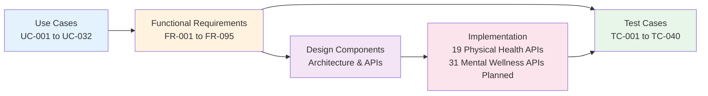

# Eatsential - Software Engineering Documentation

**Project:** Eatsential - Dual-Dimension Health Platform (Physical + Mental Wellness)  
**Team:** 4-person agile team (CSC510 Group 12)  
**Documentation Standard:** IEEE/ISO Software Engineering Standards  
**Version:** 2.0 (Mental Wellness Features Added)  
**Last Updated:** October 25, 2025

---

## 📚 Documentation Structure Overview

This documentation follows **IEEE 830** (SRS), **IEEE 829** (STP), and **V-Model** best practices for software engineering. The documentation is organized into 5 main phases covering requirements, design, implementation, testing, and project management.

```
┌─────────────────────────────────────────────────────────────┐
│           EATSENTIAL DOCUMENTATION ARCHITECTURE              │
├─────────────────────────────────────────────────────────────┤
│                                                             │
│  Requirements → Design → Implementation → Testing → Management│
│                                                             │
│  1-REQUIREMENTS       ←─────────→     4-TESTING            │
│  - Use Cases (UC-XXX)              - Test Cases (TC-XXX)   │
│  - Functional Req (FR-XXX)         - Test Coverage         │
│  - Non-Functional Req              - Test Strategy          │
│  - Traceability (RTM)              - Traceability (TTM)    │
│         ↓                                   ↑               │
│  2-DESIGN                                                   │
│  - Architecture Overview           5-PROJECT-MANAGEMENT     │
│  - Component Diagrams              - Project Charter        │
│  - Database Design                 - Risk Management        │
│  - API Design                      - Milestones             │
│         ↓                                   ↑               │
│  3-IMPLEMENTATION                                           │
│  - Coding Standards                                         │
│  - Git Workflow                                             │
│  - CI/CD Pipeline                                           │
│  - Implementation Status                                    │
│  - API Changelog                                            │
│                                                             │
└─────────────────────────────────────────────────────────────┘
```

---

## 🎯 Traceability Chain (Core of SE Course)



**Key Documents for Traceability:**

- [Requirements Traceability Matrix (RTM)](./1-REQUIREMENTS/requirements-traceability.md) - UC → FR → Design (95 FRs, 32 UCs)
- [Test Traceability Matrix (TTM)](./4-TESTING/test-traceability.md) - FR → TC → Status (40 TCs)

**Architecture Overview:**
Eatsential is a **Dual-Dimension Health Platform** that integrates:

- **Physical Health** (FR-001 to FR-075): Nutrition tracking, allergen management, dietary preferences
- **Mental Wellness** (FR-076 to FR-095): Mood tracking, stress management, sleep quality, AI health concierge
- **Dual-Dimension Engine** (FR-089 to FR-091): Context-aware recommendations balancing physical + mental health

---

## 📁 Documentation Phase Structure

### 📘 [1-REQUIREMENTS](./1-REQUIREMENTS/) - Requirements Engineering ✅

| Document                                                                          | Description                                                                                            | Status      |
| --------------------------------------------------------------------------------- | ------------------------------------------------------------------------------------------------------ | ----------- |
| [use-cases.md](./1-REQUIREMENTS/use-cases.md)                                     | **32 use cases** (UC-001 to UC-032) covering Physical Health + Mental Wellness workflows               | ✅ Complete |
| [functional-requirements.md](./1-REQUIREMENTS/functional-requirements.md)         | **95 functional requirements** (FR-001 to FR-095): Physical Health (75 FRs) + Mental Wellness (20 FRs) | ✅ Complete |
| [non-functional-requirements.md](./1-REQUIREMENTS/non-functional-requirements.md) | **23 non-functional requirements**: Performance, security, usability, AI safety, privacy               | ✅ Complete |
| [requirements-traceability.md](./1-REQUIREMENTS/requirements-traceability.md)     | RTM mapping UC → FR → Design → Test (v2.0 with Mental Wellness)                                        | ✅ Complete |

**Coverage**: 100% of Dual-Dimension Health requirements documented (Physical + Mental Wellness)

---

### 📙 [2-DESIGN](./2-DESIGN/) - Architecture & Detailed Design ✅

| Document                                                        | Description                                                                                                    | Status      |
| --------------------------------------------------------------- | -------------------------------------------------------------------------------------------------------------- | ----------- |
| [architecture-overview.md](./2-DESIGN/architecture-overview.md) | System architecture with Mermaid diagrams, tech stack, deployment, security, **Mental Wellness services**      | ✅ Complete |
| [component-diagram.md](./2-DESIGN/component-diagram.md)         | Component interaction flows (auth, health profiles, allergies, **mental wellness**)                            | ✅ Complete |
| [database-design.md](./2-DESIGN/database-design.md)             | **12-table schema**: 5 Physical Health tables + 7 Mental Wellness tables (goals, mood/stress/sleep logs, tags) | ✅ Complete |
| [api-design.md](./2-DESIGN/api-design.md)                       | **50 API endpoints**: 19 implemented (Physical) + 31 planned (Mental Wellness)                                 | ✅ Complete |

**Coverage**: 100% of Dual-Dimension Health features designed (Physical Health implemented, Mental Wellness planned)

---

### 📕 [3-IMPLEMENTATION](./3-IMPLEMENTATION/) - Development Standards ✅

| Document                                                                  | Description                                                                                             | Status      |
| ------------------------------------------------------------------------- | ------------------------------------------------------------------------------------------------------- | ----------- |
| [coding-standards.md](./3-IMPLEMENTATION/coding-standards.md)             | Python (PEP 8, Black) and TypeScript (ESLint, Prettier) standards                                       | ✅ Complete |
| [git-workflow.md](./3-IMPLEMENTATION/git-workflow.md)                     | Branch strategy, commit conventions, PR process                                                         | ✅ Complete |
| [ci-cd-pipeline.md](./3-IMPLEMENTATION/ci-cd-pipeline.md)                 | GitHub Actions workflows for testing and deployment                                                     | ✅ Complete |
| [development-guidelines.md](./3-IMPLEMENTATION/development-guidelines.md) | Setup instructions, development practices, troubleshooting                                              | ✅ Complete |
| [implementation-status.md](./3-IMPLEMENTATION/implementation-status.md)   | **Comprehensive feature analysis**: 12.6% complete (12/95 FRs), Physical Health 16%, Mental Wellness 0% | ✅ Complete |
| [api-changelog.md](./3-IMPLEMENTATION/api-changelog.md)                   | API versioning and change tracking (v0.1.0 current)                                                     | ✅ Complete |

**Coverage**: All development processes documented, **4-phase Mental Wellness roadmap** (16-20 weeks)

---

### 🧪 [4-TESTING](./4-TESTING/) - Software Test Plan ✅

| Document                                                       | Description                                                                                   | Status      |
| -------------------------------------------------------------- | --------------------------------------------------------------------------------------------- | ----------- |
| [test-strategy.md](./4-TESTING/test-strategy.md)               | Unit, integration, system, acceptance testing approach (includes **Mental Wellness testing**) | ✅ Complete |
| [test-cases.md](./4-TESTING/test-cases.md)                     | **40 test cases** (TC-001 to TC-040): 22 Physical Health + 18 Mental Wellness                 | ✅ Complete |
| [test-traceability.md](./4-TESTING/test-traceability.md)       | TTM mapping Test → FR → Status (v2.0 with Mental Wellness coverage)                           | ✅ Complete |
| [test-coverage-report.md](./4-TESTING/test-coverage-report.md) | 88% coverage for Physical Health, Mental Wellness tests pending                               | ✅ Complete |

**Coverage**: 20/22 Physical Health tests passing (91%), 0/18 Mental Wellness tests implemented (pending development)

---

### 🚀 [5-PROJECT-MANAGEMENT](./5-PROJECT-MANAGEMENT/) - Project Planning ✅

| Document                                                        | Description                                                                                       | Status      |
| --------------------------------------------------------------- | ------------------------------------------------------------------------------------------------- | ----------- |
| [project-charter.md](./5-PROJECT-MANAGEMENT/project-charter.md) | Project scope, objectives, stakeholders, success criteria (**updated for Dual-Dimension Health**) | ✅ Complete |
| [risk-management.md](./5-PROJECT-MANAGEMENT/risk-management.md) | Risk identification, assessment, mitigation strategies (includes **LLM integration risks**)       | ✅ Complete |
| [milestones.md](./5-PROJECT-MANAGEMENT/milestones.md)           | **Extended timeline**: 8 weeks Physical Health + 16 weeks Mental Wellness (M1-M12)                | ✅ Complete |

**Coverage**: Complete project management framework for Dual-Dimension Health Platform (26-week total timeline)

---

### 🤖 [AGENT-PLAN](./AGENT-PLAN/) - AI Agent Development Framework ✅

**Purpose**: Quick reference guide for AI-assisted development. Links to comprehensive documentation.

| Document                                                          | Description                    | Status      |
| ----------------------------------------------------------------- | ------------------------------ | ----------- |
| [00-QUICK-START.md](./AGENT-PLAN/00-QUICK-START.md)               | Fast onboarding for AI agents  | ✅ Complete |
| [01-TECH-STACK.md](./AGENT-PLAN/01-TECH-STACK.md)                 | Technology stack overview      | ✅ Complete |
| [02-ARCHITECTURE.md](./AGENT-PLAN/02-ARCHITECTURE.md)             | System architecture summary    | ✅ Complete |
| [03-API-SPECIFICATIONS.md](./AGENT-PLAN/03-API-SPECIFICATIONS.md) | API endpoints reference        | ✅ Complete |
| [04-DATABASE-DESIGN.md](./AGENT-PLAN/04-DATABASE-DESIGN.md)       | Database schema reference      | ✅ Complete |
| [05-FRONTEND-PATTERNS.md](./AGENT-PLAN/05-FRONTEND-PATTERNS.md)   | React patterns and practices   | ✅ Complete |
| [06-BACKEND-PATTERNS.md](./AGENT-PLAN/06-BACKEND-PATTERNS.md)     | FastAPI patterns and practices | ✅ Complete |
| [07-TESTING-STRATEGY.md](./AGENT-PLAN/07-TESTING-STRATEGY.md)     | Testing approach summary       | ✅ Complete |
| [08-SPRINT-TASKS.md](./AGENT-PLAN/08-SPRINT-TASKS.md)             | Current sprint tasks           | ✅ Complete |
| [09-AGENT-INSTRUCTIONS.md](./AGENT-PLAN/09-AGENT-INSTRUCTIONS.md) | AI agent guidelines            | ✅ Complete |

---

## 🎯 Quick Navigation by Role

### 👔 Product Manager / Instructor

1. [Project Charter](./5-PROJECT-MANAGEMENT/project-charter.md) - Project scope and objectives ✅
2. [Milestones](./5-PROJECT-MANAGEMENT/milestones.md) - 8-week timeline and progress ✅
3. [Functional Requirements](./1-REQUIREMENTS/functional-requirements.md) - What the system does ✅
4. [Use Cases](./1-REQUIREMENTS/use-cases.md) - User scenarios ✅
5. [Implementation Status](./3-IMPLEMENTATION/implementation-status.md) - Current progress ✅

### 💻 Developer

1. [AGENT-PLAN Quick Start](./AGENT-PLAN/00-QUICK-START.md) - Fast onboarding ✅
2. [Development Guidelines](./3-IMPLEMENTATION/development-guidelines.md) - Setup and workflow ✅
3. [API Design](./2-DESIGN/api-design.md) - API specifications ✅
4. [Database Design](./2-DESIGN/database-design.md) - Database schema ✅
5. [Coding Standards](./3-IMPLEMENTATION/coding-standards.md) - Code style guidelines ✅

### 🧪 QA Engineer

1. [Test Strategy](./4-TESTING/test-strategy.md) - Testing approach ✅
2. [Test Cases](./4-TESTING/test-cases.md) - 22 detailed test cases ✅
3. [Test Coverage Report](./4-TESTING/test-coverage-report.md) - 88% coverage analysis ✅
4. [Test Traceability Matrix](./4-TESTING/test-traceability.md) - FR → TC mapping ✅

### 🏗️ Architect / Designer

1. [Architecture Overview](./2-DESIGN/architecture-overview.md) - System architecture ✅
2. [Component Diagrams](./2-DESIGN/component-diagram.md) - Component interactions ✅
3. [Requirements Traceability](./1-REQUIREMENTS/requirements-traceability.md) - UC → FR → Design ✅

### 🚀 DevOps Engineer

1. [CI/CD Pipeline](./3-IMPLEMENTATION/ci-cd-pipeline.md) - GitHub Actions workflows ✅
2. [Git Workflow](./3-IMPLEMENTATION/git-workflow.md) - Branch strategy ✅

---

## 📊 Document Status Summary

### Overall Progress: 23/23 documents (100%) ✅

| Phase                | Documents | Completed | Status  |
| -------------------- | --------- | --------- | ------- |
| 1-REQUIREMENTS       | 4         | 4         | 📘 100% |
| 2-DESIGN             | 4         | 4         | 📙 100% |
| 3-IMPLEMENTATION     | 6         | 6         | 🟢 100% |
| 4-TESTING            | 4         | 4         | 🟢 100% |
| 5-PROJECT-MANAGEMENT | 3         | 3         | 🟢 100% |
| AGENT-PLAN           | 10        | 10        | 🟢 100% |

**Legend:** 🟢 Complete | 🟡 In Progress | 🔴 Not Started

### Implementation Progress

| Category          | Progress    | Details                                                        |
| ----------------- | ----------- | -------------------------------------------------------------- | ---------------------------------------- |
| **Backend APIs**  | 19/50 (38%) | **Physical Health**: 19 implemented ✅                         | **Mental Wellness**: 0/31 implemented ❌ |
| **Frontend**      | 30%         | Basic scaffolding, authentication components 🟡                |
| **Database**      | 42%         | **Physical Health**: 5/12 tables ✅                            | **Mental Wellness**: 0/7 tables ❌       |
| **Tests**         | 50%         | **Physical Health**: 70 tests (88% coverage) ✅                | **Mental Wellness**: 0 tests ❌          |
| **Documentation** | 100%        | All 25 core documents complete (v2.0 Dual-Dimension Health) ✅ |

**Key Architecture Features:**

- ✅ **Physical Health Foundation** (16% complete): Nutrition tracking, allergen management, dietary preferences
- ❌ **Mental Wellness System** (0% complete): Mood/stress/sleep tracking, health tags, dual-dimension engine
- ❌ **AI Health Concierge** (0% complete): LLM integration, conversational AI, wellness insights
- 📅 **Mental Wellness Timeline**: 16-20 weeks (4-5 months) estimated implementation

---

## 🔗 Key Entry Points

### For New Team Members

**Start Here**: [AGENT-PLAN/00-QUICK-START.md](./AGENT-PLAN/00-QUICK-START.md)

### For Requirements Review

**Start Here**: [1-REQUIREMENTS/functional-requirements.md](./1-REQUIREMENTS/functional-requirements.md)

### For Design Review

**Start Here**: [2-DESIGN/architecture-overview.md](./2-DESIGN/architecture-overview.md)

### For Testing Review

**Start Here**: [4-TESTING/test-cases.md](./4-TESTING/test-cases.md)

### For Implementation Review

**Start Here**: [3-IMPLEMENTATION/implementation-status.md](./3-IMPLEMENTATION/implementation-status.md)

---

## 🔍 Traceability Examples

### Example 1: User Registration Flow

```
UC-001 (User Registration)
    ↓
FR-001 (User Registration Requirement)
    ↓
Design: Auth Service (architecture-overview.md)
    ↓
Code: backend/src/eatsential/routers/auth.py
    ↓
TC-001, TC-002, TC-003 (Registration test cases)
    ↓
Status: ✅ 3/3 tests passing
```

### Example 2: Allergy Management Flow

```
UC-005 (Manage Food Allergies)
    ↓
FR-006 (Allergy Management Requirement)
    ↓
Design: Health Service (component-diagram.md)
    ↓
Code: backend/src/eatsential/routers/health.py
    ↓
TC-015, TC-016, TC-017 (Allergy test cases)
    ↓
Status: ✅ 3/3 tests passing
```

---

## 📈 Recent Updates

### October 25, 2025 - Mental Wellness Features Integration (v2.0) 🆕

**Major Documentation Update**: Expanded from Physical Health MVP to **Dual-Dimension Health Platform**

#### Requirements & Design (NEW):

- ✅ **Added 20 Mental Wellness Requirements** (FR-076 to FR-095)
  - Mental wellness goals & tracking (FR-076~085)
  - Health tagging system (#StressRelief, #MoodBoost, #SleepAid) (FR-086~088)
  - Dual-dimension recommendation engine (FR-089~091)
  - AI health concierge with LLM integration (FR-092~095)
- ✅ **Added 12 Mental Wellness Use Cases** (UC-021 to UC-032)
- ✅ **Added 3 Mental Wellness NFRs** (NFR-007A, NFR-020, NFR-021)
- ✅ **Updated Requirements Traceability Matrix** (RTM v2.0) - 485 lines
- ✅ **Added 18 Mental Wellness Test Cases** (TC-023 to TC-040)
- ✅ **Updated Test Traceability Matrix** (TTM v2.0) - 631 lines

#### Implementation Planning (NEW):

- ✅ **Updated Implementation Status** - Added Mental Wellness feature analysis:
  - Section 6.3: Mental Wellness Features Status (4 modules, 20 FRs)
  - Section 6.4: Implementation Roadmap (4 phases, 16-20 weeks)
  - Section 7.3: Mental Wellness API Endpoints (31 endpoints planned)
  - Updated statistics: 12.6% complete (12/95 FRs), Physical 16%, Mental 0%
- ✅ **Design Documents Updated**:
  - Database Design: 7 new Mental Wellness tables
  - API Design: 31 Mental Wellness endpoints
  - Architecture: Mental Wellness services & Dual-Dimension Engine
  - Component Diagrams: Mental wellness interaction flows

#### Total Documentation Growth:

- **Requirements**: 75 → 95 FRs (+27%)
- **Use Cases**: 20 → 32 UCs (+60%)
- **Test Cases**: 22 → 40 TCs (+82%)
- **API Endpoints**: 19 implemented + 31 planned = 50 total
- **Database Tables**: 5 implemented + 7 planned = 12 total

---

### October 2025 - Documentation Restructuring ✅

- ✅ **Restructured to 5-phase documentation** (1-REQUIREMENTS, 2-DESIGN, 3-IMPLEMENTATION, 4-TESTING, 5-PROJECT-MANAGEMENT)
- ✅ **Created architecture-overview.md** - Comprehensive system architecture with Mermaid diagrams
- ✅ **Created component-diagram.md** - Detailed component interaction flows
- ✅ **Created test-cases.md** - 22 test cases mapped to functional requirements
- ✅ **Created api-changelog.md** - API versioning and change tracking
- ✅ **Created test-coverage-report.md** - 88% coverage with gap analysis
- ✅ **Created milestones.md** - 8-week timeline with Sprint tracking
- ✅ **Updated all path references** - RTM and TTM now point to new structure
- ✅ **Removed outdated documents** - Cleaned up redundant reports

---

## 🔍 Additional Resources

- [Documentation Checklist](./DOCUMENTATION-CHECKLIST.md) - Track all 25 documents ✅
- [Implementation Status Report](./3-IMPLEMENTATION/implementation-status.md) - Code analysis & feature gaps ✅

---

**Repository:** [github.com/Asoingbob225/CSC510](https://github.com/Asoingbob225/CSC510)  
**Documentation Standard:** IEEE 830 (SRS), IEEE 829 (STP), V-Model Traceability
