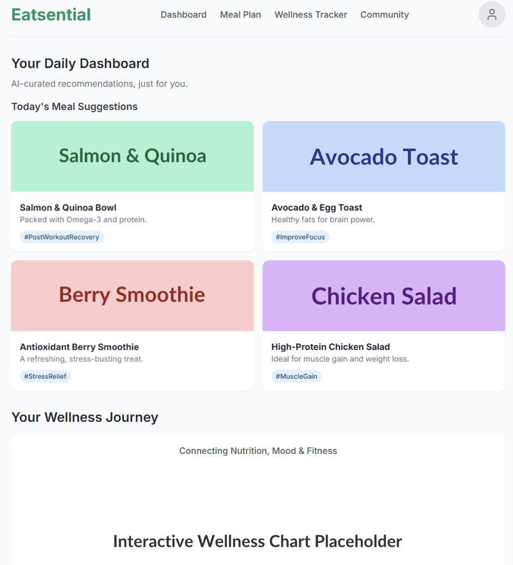

# Introduction
Eatsential is a LLM-powered platform that connects users to food options with unprecedented precision. By creating a holistic profile that
includes allergies, fitness goals (muscle gain, weight loss, endurance), dietary preferences (vegan, keto), and even mental wellness
objectives (e.g., mood-boosting foods, stress reduction), our system delivers hyper-personalized meal recommendations, recipes, and
restaurant suggestions.

# Slogan
YOUR PLATE, YOUR RULES. PRECISION NUTRITION FOR BODY AND MIND.

# Challenge
In an era of information overload, finding food that truly meets our unique needs is a daily struggle. Consumers with specific dietary requirements—from severe allergies to nuanced fitness goals or mental wellness objectives—are often left navigating a maze of conflicting advice and generic meal plans. This gap leads to frustration, health risks, and the feeling that our food isn't supporting our well-being.

# Core Features
- Dual-Dimension Health Profile: We pioneer support for both your physical and mental well-being. Whether your goal is building muscle or managing weight, or you're seeking to reduce stress and improve focus, our platform provides precisely tailored nutritional plans.
- Scientific Nutrition Engine: Our powerful recommendation system is built on a vast nutritional database and a proprietary health-tagging system (e.g., #PostWorkoutRecovery, #StressRelief, #SleepAid). Every recommendation is scientifically calculated to ensure a perfect nutritional match. 
- Curated Healthy Restaurants: We partner exclusively with restaurants that prioritize high-quality ingredients and provide transparent nutritional information. Our platform strictly vets every partner, so you can eat healthily and with total confidence.
- Visual Wellness Journey: Track every bit of your progress with beautiful charts and timelines. Clearly review your journey—from weight changes and calorie intake to mood fluctuations—and witness your growth, making wellness an enjoyable experience.
- AI Health Concierge: Powered by a cutting-edge LLM, your personal concierge understands your real-time needs through simple conversation. Ask questions, adjust your plan, or get insights on a meal anytime for expert, human-like support and companionship.

# Benefits
With Eatsential, users can finally eat with confidence and purpose. We empower them to take control of their health, save time, reduce the anxiety of meal planning, and discover a world of food that is not just safe, but truly nourishing for both body and mind.

# Stakeholders
- Users with Medical Needs: (e.g., Celiacs, Diabetics, Allergy Sufferers)
- Fitness Enthusiasts: (e.g., Bodybuilders, Runners, Yoga Practitioners)
- Lifestyle Eaters: (e.g., Vegans, Vegetarians, Paleo)
- The Health-Conscious Public: (e.g., Families, Busy Professionals)
- Nutritionists & Dietitians: (As potential professional users to manage clients)
- Restaurants & Food Vendors: (As partners to be featured on the platform)

# Milestones
- Core User Accounts: Implement the foundational user system, enabling secure sign-up, login, and creation of the Dual-Dimension Health Profile.
- First AI Recommendations: Deploy the V1 Scientific Nutrition Engine using a RAG pipeline to deliver AI-powered meal recommendations to the user dashboard.
- Interactive AI Concierge: Launch the AI Health Concierge, featuring a full chat interface with conversational memory for personalized, real-time nutritional advice.
- Restaurant Discovery & Reviews: Implement the Restaurant Discovery module with map integration and a community review system to complete the MVP.
- Dynamic Meal Planner: Launch the Dynamic Meal Planner, allowing users to generate and modify complete, AI-curated weekly meal plans tailored to their goals.
- Smart Grocery Lists: Deploy the Smart Grocery List feature, which automatically generates an aisle-categorized, shareable shopping list from any meal plan.
- Community & Social Hub: Implement the Community Hub, enabling users to follow others, share their wellness journey, and engage via a social activity feed.
- The Personalization Loop: Close the Personalization Loop with an advanced feedback system that uses user input to intelligently refine all future AI recommendations.

# System Mockup
